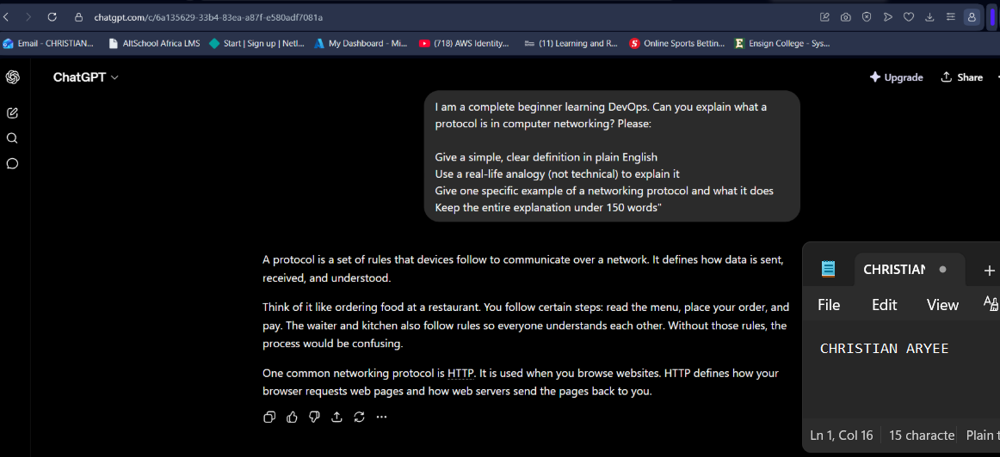
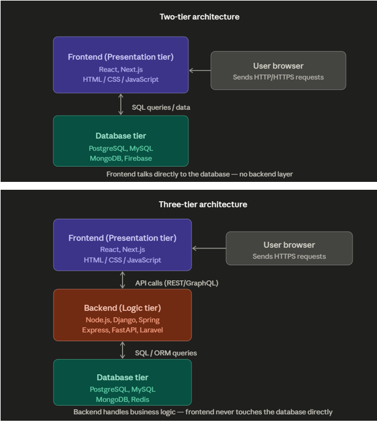
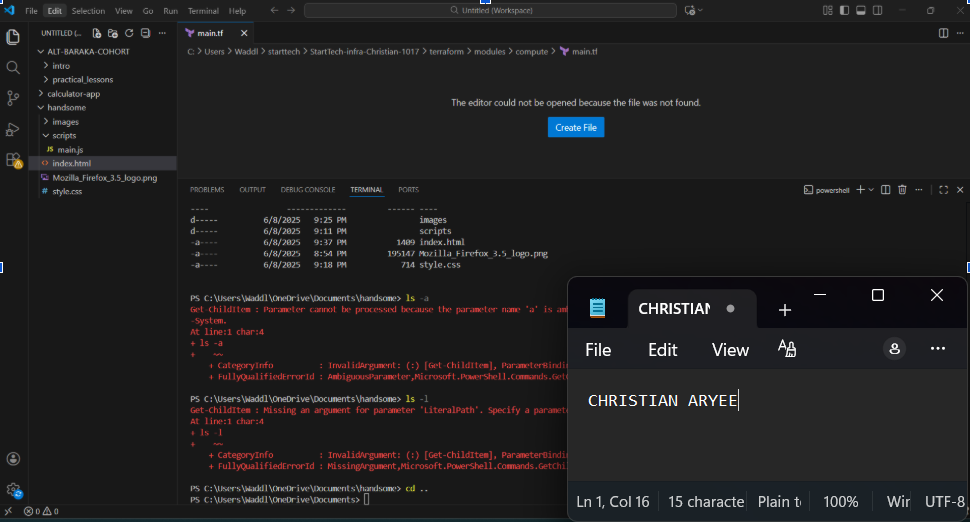

# Week 00 - Internet and Networking

Part of the DevOps Micro Internship (DMI) Cohort 3 with Agentic AI

---

# 🧑‍💻 Task 1: Using ChatGPT as Your Learning Assistant

## Scenario

You're new to DevOps and will frequently encounter technical questions. ChatGPT can be your learning companion.

## Your Task

Write a clear ChatGPT prompt to help you understand:

> "What is a protocol in networking? Explain with a simple real-life example."

Take a screenshot of your interaction showing:

* Your detailed prompt (with clear expectations)
* ChatGPT's simplified response with an example

## Screenshot

Save your screenshot in the `screenshots` folder and update the file name below.



Replace `task-1-chatgpt.png` with your actual screenshot file name.

---

## What I Learned (2–3 lines)

Using an analogy made an abstract networking concept click instantly — comparing a protocol to the shared "rules" of ordering food at a restaurant made it obvious why devices need agreed-upon rules to communicate at all. It also showed me how useful AI is as a first-pass explainer before diving into more technical documentation, especially when I'm completely new to a concept.
---

# 🌐 Task 2: Internet and Networking

## Scenario

Your friend is launching an online bookstore named **EpicReads**.

He asked you to explain how users globally can access his website hosted in Finland.

## Your Task

Write a short explanation (**100–150 words**) that includes:

* Packet Switching
* IP Address
* TCP/IP
* HTTP/HTTPS

💡 **Tip:** You may use ChatGPT (as demonstrated in Task 1) to refine your explanation.

## Answer

How Users Globally Access EpicReads (Hosted in Finland)

When someone in Ghana visits EpicReads, their request travels across the internet through a process called packet switching. The request is broken into small data packets, each taking the fastest available route to Finland, then reassembled at the destination.
Every device on the internet has a unique IP address, like a postal address. EpicReads' server in Finland has its own IP (e.g., 185.34.12.10), and your device has one too, so data knows exactly where to go and where to return.
TCP/IP is the ruleset that manages this communication TCP ensures all packets arrive correctly and in order, while IP handles the routing between countries.
Finally, HTTPS (a secure version of HTTP) is the protocol your browser uses to request EpicReads' web pages, encrypting the data so your connection to the Finnish server is safe from hackers.

---

# 🏗️ Task 3: Application Architecture & Stack

## Scenario

EpicReads bookstore has two application versions:

### Two-Tier Application

* Frontend
* Database

### Three-Tier Application

* Frontend
* Backend
* Database

## Your Task

* Draw simple diagrams (hand-drawn or tool-based such as draw.io)
* Label each layer clearly
* List at least two common technologies or tools used for each layer
* Submit a screenshot or photo clearly showing your own drawing

## Diagram Screenshot / Photo

Save your diagram image in the `screenshots` folder and update the file name below.



Replace `task-3-diagram.png` with your actual diagram file name.

---

## Technologies Used

### Frontend

* React
* Next.js

### Backend

* Node.js
* Django

### Database

* PostgreSQL
* MongoDB

---

# 🌍 Task 4: Domain Name & DNS (Basic Concepts)

## Scenario

Your friend's bookstore **EpicReads** is currently accessible through:

```text
52.172.142.222:3000
```

He purchased the domain:

```text
epicreads.com
```

## Your Task

In **50–100 words**, explain in your own words:

1. What is DNS (Domain Name System)?
2. Which DNS record type should be used to connect the domain to the given IP, and why?

## Answer

## What is DNS?

DNS (Domain Name System) is like the internet's phone book. When you type `epicreads.com` into your browser, DNS translates that human-friendly name into the actual IP address (`52.172.142.222`) that computers use to locate the server. Without DNS, users would have to memorize raw IP addresses to visit any website.

## Which DNS record type should be used?

My friend should use an **A Record** (Address Record). An A Record directly maps a domain name to an IPv4 address — which is exactly what's needed here: pointing `epicreads.com` → `52.172.142.222`. It's the most fundamental DNS record type and the correct choice whenever you're linking a domain to a specific server's IP address.

The configuration would look like this:

| Record Type | Host | Value | TTL |
|---|---|---|---|
| A | epicreads.com | 52.172.142.222 | 3600 |

---

# 💻 Task 5: Visual Studio Code Setup (Hands-on)

## Your Task

Install Visual Studio Code (if not already installed).

Take a screenshot of your VS Code environment showing:

* Terminal open inside VS Code
* Running a basic command:

### Windows

```powershell
dir
```

### Linux / macOS

```bash
pwd
ls
```

* Your selected VS Code theme clearly visible

⚠️ **Important:** The screenshot must show your username or another identifiable detail to confirm it is your environment.

## Screenshot

Save your screenshot in the `screenshots` folder and update the file name below.




Replace `task-5-vscode.png` with your actual screenshot file name.

---

# 🔗 Task 6: Publish Your Assignment as a LinkedIn Post

## Objective

Publishing on LinkedIn helps you:

* Build your professional online presence
* Reinforce your learning
* Document your DevOps journey publicly

## Your Task

Summarize your answers from Tasks 1–5 into a LinkedIn post.

Clearly structure your post into the following sections:

* ChatGPT
* Internet & Networking
* App Architecture
* DNS
* VS Code Setup

Add the following credit note at the end of your post:

> **P.S. This post is part of the DevOps Micro Internship (DMI) with Agentic AI — Cohort 3 — by Pravin Mishra. My graded progress is public: https://dmi.pravinmishra.com/s/YOUR-GITHUB-USERNAME.html · Start your DevOps journey: https://dmi.pravinmishra.com/?utm_source=student&utm_medium=ps-linkedin&utm_campaign=cohort3**

---

## LinkedIn Post URL

Paste your LinkedIn post URL here:

```text
'https://www.linkedin.com/posts/caryee_devops-micro-internship-dmi-by-pravin-activity-7464410084220157952-WrTw?utm_source=share&utm_medium=member_desktop&rcm=ACoAACP6ElcBF7-kOglrea_3V5oUhVp4NSh-Trc'
```

---

## LinkedIn Post Backup Copy

Paste the full text of your LinkedIn post here:

to first principles as many times and as much times as you can.

I'm currently completing the FREE DevOps Micro Internship alongside my Systems Admin degree at Ensign College and Week 1 was a solid reminder that strong fundamentals are what separate good engineers from great ones.

For starters we visted

🤖 AI AS A LEARNING TOOL
Used AI to break down networking concepts with real-life analogies a great technique I now use regularly to explain complex infrastructure concepts to non-technical stakeholders. Communicating clearly is just as important as building well.

🌐 INTERNET & NETWORKING
Revisited the full request lifecycle of the internet : Packet Switching, IP addressing, TCP/IP, and HTTPS through the lens of a globally hosted app. Having worked with IPv4 subnetting, CIDR, and packet analysis before, it was a great exercise connecting theory to real deployment scenarios again.

🏗️ APPLICATION ARCHITECTURE
Documented Two-tier vs Three-tier architectures for a bookstore app (EpicReads). In practice, I've worked with multi-tier cloud architectures on AWS, GCP and Azure but mapping them out cleanly is a skill worth sharpening. Clear architecture diagrams are the foundation of every solid infrastructure design.

Two-tier: Frontend (React / Next.js) → Database (PostgreSQL)
Three-tier: Frontend → Backend (Node.js / Django) → Database

🔗 DNS — DOMAIN NAME SYSTEM

Connected epicreads.com to its server IP (52.172.142.222) using an A Record. Having configured DNS, VLANs, and network routing before, I appreciate how often these "basics" come up in real infrastructure work especially during cloud migrations and domain transitions.

💻 VS CODE & DEV ENVIRONMENT
Dev environment confirmed and running. VS Code, integrated terminal, PowerShell the same setup I use daily working with Terraform, Bash scripts, and CI/CD pipelines.

The fundamentals never go out of style and are very critical whether you're provisioning EC2 instances, writing IaC with Terraform, or debugging a Kubernetes cluster it all traces back to networking, architecture, and clear thinking.

hashtag#DevOps hashtag#CloudEngineering hashtag#AWS hashtag#Azure hashtag#Terraform hashtag#Networking hashtag#SystemsAdministration hashtag#LearningInPublic hashtag#CloudComputing hashtag#Infrastructure hashtag#MicroInternship hashtag#AltSchoolAfrica

───
P.S. This post is part of the DevOps Micro Internship (DMI) with Agentic AI — Cohort 3 — by Pravin Mishra. My graded progress is public: https://dmi.pravinmishra.com/s/chrispok18.html · Start your DevOps journey: https://dmi.pravinmishra.com/?utm_source=student&utm_medium=ps-blog&utm_campaign=cohort3

---

# Reflection – Week 0

### What did you find easy?

Explaining concepts I already had hands-on experience with — DNS, packet switching, and the two-tier vs three-tier architecture split all felt familiar since I've configured DNS records and worked with multi-tier cloud setups before. The exercise was less about learning something new and more about re-articulating it clearly from first principles.

---

### What was difficult?

Formatting things cleanly for a markdown file was trickier than expected  my DNS table didn't render properly at first because I wrote it as plain text instead of using proper markdown table syntax. It was a good reminder that knowing the content isn't the same as presenting it correctly.

---

### What will you improve next week?

I want to be more deliberate about double-checking formatting (tables, checklists, image links) before considering a task done, rather than assuming it looks right just because the content is correct. I'd also like to lean into the diagrams more — visualizing architecture before writing about it made the explanation much clearer.
---

## 📌 About DMI & CloudAdvisory

DevOps Micro Internship (DMI) is a project-based DevOps program run by Pravin Mishra (The CloudAdvisory) focused on real-world execution, systems thinking, and career readiness.

It helps learners build strong DevOps foundations with hands-on experience.


## 📌 Resources

- 🌐 **DMI Official Website:** https://pravinmishra.com/dmi  
- 🎓 **DevOps for Beginners (Udemy):** https://www.udemy.com/course/devops-for-beginners-docker-k8s-cloud-cicd-4-projects/  
- 🎓 **Ultimate Agentic AI DevOps with Clude Code** https://www.udemy.com/course/ultimate-agentic-ai-devops-with-claude-code/?referralCode=448389767BC96284087B
- 🎓 **DevOps with Claude Code: Terraform, EKS, ArgoCD & Helm** https://www.udemy.com/course/devops-with-claude-code-terraform-eks-argocd-helm/?referralCode=1C5B734505D65A010FA3
- ▶️ **YouTube Playlist (DMI Cohort 3):** https://www.youtube.com/playlist?list=PLFeSNDtI4Cho  
- 🔗 **Pravin Mishra (LinkedIn):** https://www.linkedin.com/in/pravin-mishra-aws-trainer/  
- 🏢 **CloudAdvisory (LinkedIn):** https://www.linkedin.com/company/thecloudadvisory/

---

*This submission is part of DevOps Micro Internship (DMI) Cohort 3 — Agentic AI Track*