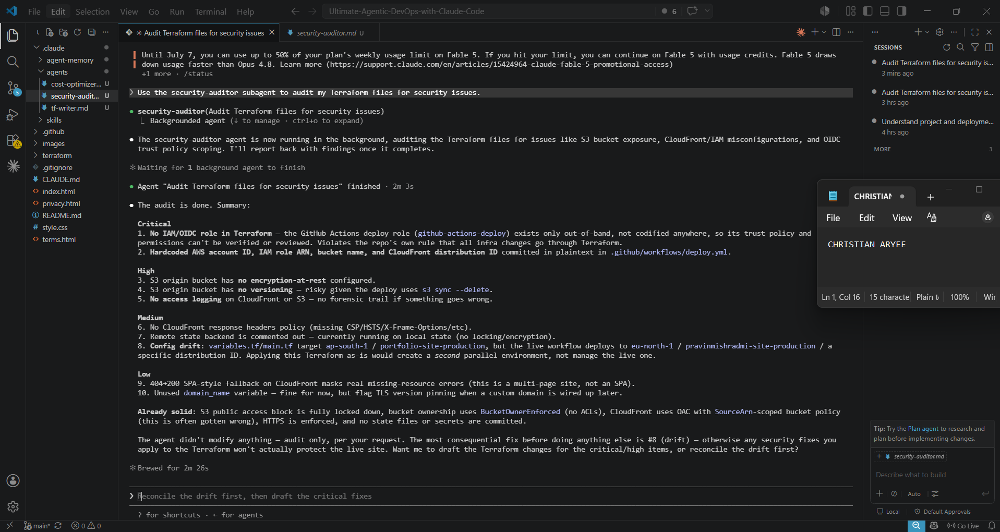
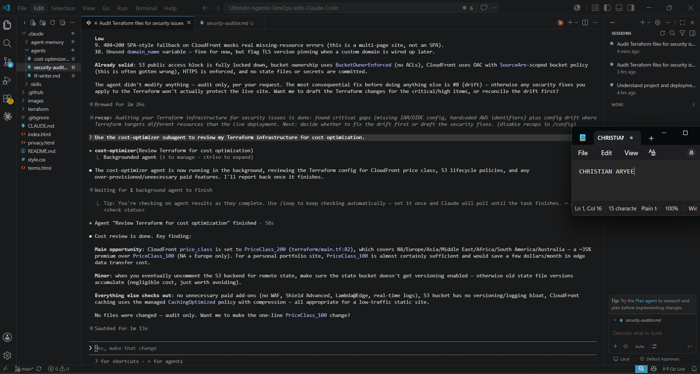

# Assignment 4 — Building Your AI Team

Part of the DevOps Micro Internship (DMI) Cohort 3 with Agentic AI

---

## Purpose

In this assignment, you will build and configure a set of specialized AI subagents inside your project. You will learn how different models and tool permissions define agent behavior, and you will trigger two real agent delegations to analyze security and cost aspects of your Terraform infrastructure.

---

# Task 1 — Create the Agents Folder and Add Files

## Goal

Create the `.claude/agents/` directory and add all required agent files.

### Evidence

#### Screenshot 1 — VS Code sidebar showing `.claude/agents/` with all 3 files

---

# Task 2 — Compare the Agent Configurations

## Goal

Analyze the configuration differences between the three agents and demonstrate understanding of model and tool selection.

### Written Answers

#### 1. Why does the cost optimizer use Haiku instead of Sonnet?

Cost analysis is largely a pattern-matching and arithmetic task — scanning Terraform files for instance types, storage classes, and idle resources, then comparing them against known pricing tiers or flagging obvious inefficiencies (like an oversized instance or an unattached EBS volume). This doesn't require deep reasoning or nuanced judgment calls the way security analysis does — it's closer to a structured checklist. Haiku is faster and cheaper, and since this agent will likely be triggered often (cost reviews are routine, repeatable work), using a lighter model keeps the workflow efficient without sacrificing the quality of the output.

---

#### 2. Why does the security auditor NOT have Write in its tools list?

A security auditor's job is to find and report problems, not to fix them automatically. Giving it Write access would mean an AI agent could unilaterally modify live infrastructure configuration based on its own judgment — which is exactly the kind of unchecked authority the Hooks & Permissions assignment was built to prevent. By restricting it to read-only tools, the agent can flag a misconfigured security group or an overly permissive IAM policy, but a human still has to review the findings and make the actual change. This keeps a human in the loop for anything security-sensitive, rather than letting the agent self-authorize edits.

---

#### 3. Why does the tf-writer use `inherit` instead of a specific model?

inherit means this agent uses whatever model the main Claude Code session is currently running, rather than being locked to one specific model. This makes sense for a Terraform-writing agent because generating actual infrastructure code is a complex, context-heavy task — it benefits from the same reasoning capability as the primary session, and locking it to a fixed model (especially a cheaper one like Haiku) could produce lower-quality or inconsistent code. inherit also future-proofs the agent: if the primary session gets upgraded to a stronger model later, the tf-writer automatically benefits without needing its config edited.

---

### Evidence

#### Screenshot 2 — `security-auditor.md` frontmatter showing model and tools configuration

---

#### Screenshot 3 — `cost-optimizer.md` frontmatter showing the model and tools configuration

---

# Task 3 — Run the Security Auditor

## Goal

Trigger the security auditor agent and analyze the generated security report for your Terraform infrastructure.

### Evidence

#### Screenshot 4 — The delegation message showing Claude launched the security-auditor

---

#### Screenshot 5 — Security audit report output

---

# Task 4 — Run the Cost Optimizer

## Goal

Trigger the cost optimizer agent and review the generated cost optimization report.

### Evidence

#### Screenshot 6 — The full cost optimization report

---

# Submission Instructions

- Ensure all agent files are committed in `.claude/agents/`
- Complete all written answers in your GitHub Repo
- Push final changes to your forked GitHub repository

---

## GitHub Repository URL

Paste your forked repository URL here:

`https://github.com/chrispok18/devops-micro-internship-pravinmishra`

---

# Completion Checklist

- [x] `.claude/agents/` folder contains all 3 agent files
- [x] Screenshot 2 shows correct `security-auditor.md` configuration
- [x] Screenshot 3 shows correct `cost-optimizer.md` configuration
- [x] All 3 written answers completed 
- [x] Security auditor executed successfully
- [x] Cost optimizer executed successfully
- [x] Security report is visible with findings
- [x] Cost report is visible with recommendations
- [x] All required screenshots added
- [x] GitHub repo updated with agents

---

## 📌 About DMI & CloudAdvisory

DevOps Micro Internship (DMI) is a project-based DevOps program run by Pravin Mishra (The CloudAdvisory) focused on real-world execution, systems thinking, and career readiness.

It helps learners build strong DevOps foundations with hands-on experience.

---

## 📌 Resources

- 🌐 DMI Official Website: https://pravinmishra.com/dmi  
- 🎓 DevOps for Beginners (Udemy): https://www.udemy.com/course/devops-for-beginners-docker-k8s-cloud-cicd-4-projects/  
- 🎓 Agentic AI DevOps with Claude Code: https://www.udemy.com/course/ultimate-agentic-ai-devops-with-claude-code/  
- 🎓 DevOps with Claude Code: Terraform, EKS, ArgoCD & Helm: https://www.udemy.com/course/devops-with-claude-code-terraform-eks-argocd-helm/  
- ▶️ YouTube Playlist: https://www.youtube.com/playlist?list=PLFeSNDtI4Cho  
- 🔗 Pravin Mishra (LinkedIn): https://www.linkedin.com/in/pravin-mishra-aws-trainer/  
- 🏢 CloudAdvisory (LinkedIn): https://www.linkedin.com/company/thecloudadvisory/

---

*This submission is part of DevOps Micro Internship (DMI) Cohort 3 — Agentic AI Track.*