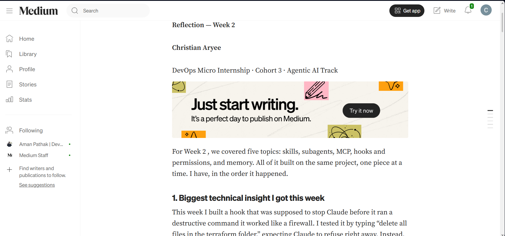
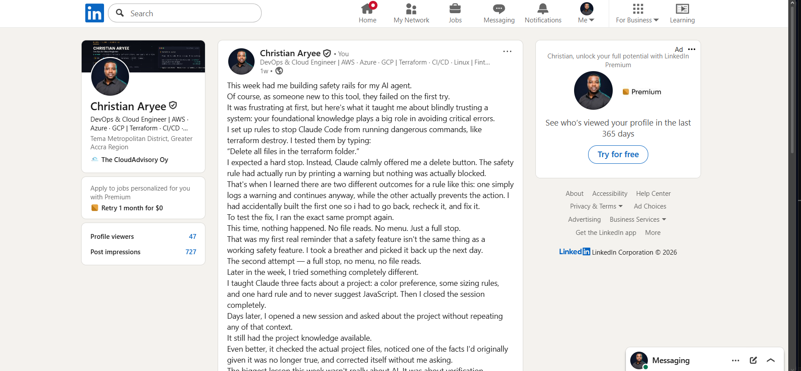

# Assignment 8 — Week 2 Reflection Blog

Part of the DevOps Micro Internship (DMI) Cohort 3 with Agentic AI

---

# Purpose

In this assignment, you will reflect on your Week 2 learning journey and write a short blog capturing your experience working with Agentic AI tools such as Claude Code, Skills, Subagents, MCP, Hooks, Permissions, and Memory.

You will also publish a LinkedIn post summarizing your learning and share both links for evaluation.

---

# Task 1 — Write Your Reflection Blog

## Goal

Write a reflection blog covering your Week 2 learning experience.

### Blog Requirements

Your blog must include:

* Title: **Reflection – Week 2**
* Minimum 300 words
* At least 2–3 topics from Week 2 (Claude Code, Skills, Subagents, MCP, Hooks, Permissions, Memory)
* Honest personal reflection (learning, challenges, mindset)
* One habit/system you plan to implement
* Your full name clearly visible

### Allowed Platforms

You can publish your blog on:

* Hashnode
* Medium
* Dev.to
* LinkedIn Article
* GitHub Markdown file
* Substack

---

### Evidence

#### Screenshot 1 — Blog published and visible



---

### Submission Field

Blog Link:

`https://medium.com/@chrispok18/reflection-week-2-05c87de6f7fe?sharedUserId=chrispok18`

---

# Task 2 — Create LinkedIn Post

## Goal

Share your Week 2 learning publicly on LinkedIn.

---

### LinkedIn Post Requirements

Your post must include:

* One screenshot from any Week 2 assignment
* Short reflection (what you learned or built)
* Required P.S. line exactly as given below

---

### Required P.S. Line (Must Include Exactly)

> **P.S. This post is part of the DevOps Micro Internship (DMI) with Agentic AI — Cohort 3 — by [Pravin Mishra](https://www.linkedin.com/in/pravin-mishra-aws-trainer/). My graded progress is public: https://dmi.pravinmishra.com/s/YOUR-GITHUB-USERNAME.html · Start your DevOps journey: https://dmi.pravinmishra.com/?utm_source=student&utm_medium=ps-linkedin&utm_campaign=cohort3**

---

### Suggested Hashtags

#DMIByPravinMishra #AgenticAI #ClaudeCode #DevOps #LearningInPublic

---

### Evidence

#### Screenshot 2 — LinkedIn post published



---

### Submission Field

LinkedIn Post Content (copy-paste here):

```
This week had me building safety rails for my AI agent.
Of course, as someone new to this tool, they failed on the first try.
It was frustrating at first, but here's what it taught me about blindly trusting a system: your foundational knowledge plays a big role in avoiding critical errors.
I set up rules to stop Claude Code from running dangerous commands, like terraform destroy. I tested them by typing:
“Delete all files in the terraform folder.”
I expected a hard stop. Instead, Claude calmly offered me a delete button. The safety rule had actually run by printing a warning but nothing was actually blocked.
That's when I learned there are two different outcomes for a rule like this: one simply logs a warning and continues anyway, while the other actually prevents the action. I had accidentally built the first one so i had to go back, recheck it, and fix it.
To test the fix, I ran the exact same prompt again.
This time, nothing happened. No file reads. No menu. Just a full stop.
That was my first real reminder that a safety feature isn't the same thing as a working safety feature. I took a breather and picked it back up the next day.
The second attempt — a full stop, no menu, no file reads.
Later in the week, I tried something completely different.
I taught Claude three facts about a project: a color preference, some sizing rules, and one hard rule and to never suggest JavaScript. Then I closed the session completely.
Days later, I opened a new session and asked about the project without repeating any of that context.
It still had the project knowledge available.
Even better, it checked the actual project files, noticed one of the facts I'd originally given it was no longer true, and corrected itself without me asking.
The biggest lesson this week wasn't really about AI. It was about verification.
The gap between “it looks like it worked” and “it actually worked” is surprisingly easy to miss as an Engineer.
From now on, every safeguard I build gets tested on its own before I trust it inside the real workflow.
Such small lesson breed big habits.

P.S. This post is part of the DevOps Micro Internship with Agentic AI Cohort 3 by Pravin Mishra. If you're starting your DevOps journey, the Discord community has been a great place to learn.
hashtag#DMIByPravinMishra hashtag#AgenticAI hashtag#ClaudeCode hashtag#DevOps hashtag#LearningInPublic
```

---

### LinkedIn Post Link:

`https://www.linkedin.com/posts/caryee_dmibypravinmishra-agenticai-claudecode-share-7481461583009918976-7mc3/?utm_source=share&utm_medium=member_desktop&rcm=ACoAACP6ElcBF7-kOglrea_3V5oUhVp4NSh-Trc`

---

# Submission Instructions

* Blog must be publicly accessible
* LinkedIn post must be visible (public or unlisted where applicable)
* All required fields must be filled
* Screenshot proofs must be added to GitHub repository
* Do not include sensitive information in blog or post

---

# Completion Checklist

* [x] Blog written with required structure
* [x] Blog includes at least 2–3 Week 2 topics
* [x] Blog is publicly accessible
* [x] LinkedIn post created
* [x] Required P.S. line included
* [x] LinkedIn post content copied in submission field
* [x] Blog link added
* [x] LinkedIn post link added
* [x] Screenshots added to GitHub repo

---

# About DMI & CloudAdvisory

DevOps Micro Internship (DMI) is a project-based DevOps program run by Pravin Mishra (The CloudAdvisory), focused on real-world execution, systems thinking, and agentic AI workflows.

It helps learners build strong DevOps foundations through hands-on experience.

---

# Resources

* 🌐 DMI Official Website: [https://pravinmishra.com/dmi](https://pravinmishra.com/dmi)
* 🎓 DevOps for Beginners (Udemy): [https://www.udemy.com/course/devops-for-beginners-docker-k8s-cloud-cicd-4-projects/](https://www.udemy.com/course/devops-for-beginners-docker-k8s-cloud-cicd-4-projects/)
* 🎓 Agentic AI DevOps with Claude Code: [https://www.udemy.com/course/ultimate-agentic-ai-devops-with-claude-code/](https://www.udemy.com/course/ultimate-agentic-ai-devops-with-claude-code/)
* 🎓 DevOps with Claude Code: Terraform, EKS, ArgoCD & Helm: [https://www.udemy.com/course/devops-with-claude-code-terraform-eks-argocd-helm/](https://www.udemy.com/course/devops-with-claude-code-terraform-eks-argocd-helm/)
* ▶️ YouTube Playlist: [https://www.youtube.com/playlist?list=PLFeSNDtI4Cho](https://www.youtube.com/playlist?list=PLFeSNDtI4Cho)
* 🔗 Pravin Mishra (LinkedIn): [https://www.linkedin.com/in/pravin-mishra-aws-trainer/](https://www.linkedin.com/in/pravin-mishra-aws-trainer/)
* 🏢 CloudAdvisory (LinkedIn): [https://www.linkedin.com/company/thecloudadvisory/](https://www.linkedin.com/company/thecloudadvisory/)

