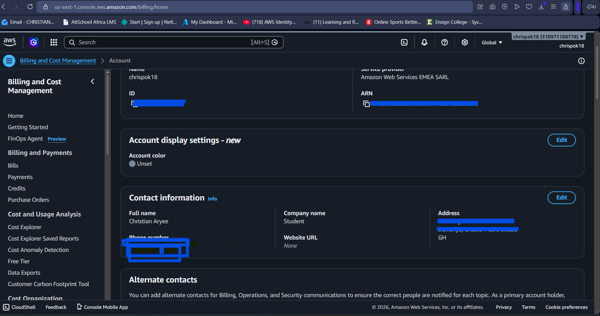

# Assignment 1 — AWS Free Tier Account Setup (EpicReads Cloud Onboarding)

Part of the DevOps Micro Internship (DMI) Cohort 3 with Agentic AI

---

## Purpose

In this assignment, you will create and verify an AWS Free Tier account as part of onboarding EpicReads — an online bookstore moving to the cloud. You will demonstrate an understanding of AWS fundamentals, Free Tier services, and account setup by answering conceptual questions and capturing proof of a working AWS Console login.

---

# Task 1 — Understanding AWS & Free Tier

## Goal

Demonstrate understanding of AWS basics and Free Tier usage by answering the following questions in your own words (3–4 lines each).

### Answers

#### Question 1 — What is an AWS account, and why do you need it at this stage?

An AWS account is your personal entry point into Amazon's cloud platform — it's tied to a unique email/payment method and gives you access to all AWS services (compute, storage, networking, etc.) under one billing identity. At this stage, EpicReads needs an AWS account to actually provision the infrastructure (servers, storage, databases) that will host the online bookstore, instead of relying on physical on-premises hardware.

---

#### Question 2 — What is AWS Free Tier, and how long does it last?

AWS Free Tier lets new accounts use a limited amount of certain AWS services at no cost, so you can learn and experiment without immediate billing risk. It has three types: always free (permanent, limited usage e.g. Lambda), 12-months free (available for a year after account creation, e.g. EC2 t2.micro), and trials (short-term, service-specific). The 12-month tier is the one most commonly referenced and starts counting from your account creation date.

---

#### Question 3 — Name three AWS Free Tier services and their free usage limits.

1. EC2: 750 hours/month of a t2.micro or t3.micro instance (enough to run one instance continuously) for 12 months.
2. S3: 5GB of standard storage, 20,000 GET requests, and 2,000 PUT requests per month for 12 months.
3. RDS: 750 hours/month of a db.t2.micro or db.t3.micro instance, plus 20GB of storage, for 12 months.

---

# Task 2 — Create AWS Free Tier Account

## Goal

Create a valid AWS Free Tier account and sign in to the AWS Management Console.

> No screenshots required for this task. Completion is verified through Task 3.

---

# Task 3 — Verify AWS Account

## Goal

Confirm that your AWS account setup is complete by navigating to the Account section and capturing proof.

### Evidence

#### Screenshot 1 — AWS Account page showing account name (email may be blurred)

---

# Submission Instructions

- Add all required screenshots in your GitHub repository submission
- Full name must be visible in required screenshots
- Do not expose sensitive information (keys, passwords, account IDs)

---

# Completion Checklist

- [x] Task 1 answers written in own words
- [x] AWS Free Tier account created successfully
- [x] Signed in to AWS Management Console
- [x] Screenshot of AWS Account page captured (full name visible, no sensitive data)
- [x] All required screenshots added to repository

---

## 📌 About DMI & CloudAdvisory

DevOps Micro Internship (DMI) is a project-based DevOps program run by Pravin Mishra (The CloudAdvisory) focused on real-world execution, systems thinking, and career readiness.

It helps learners build strong DevOps foundations with hands-on experience.

---

## 📌 Resources

- 🌐 DMI Official Website: https://pravinmishra.com/dmi  
- 🎓 DevOps for Beginners (Udemy): https://www.udemy.com/course/devops-for-beginners-docker-k8s-cloud-cicd-4-projects/  
- 🎓 Agentic AI DevOps with Claude Code: https://www.udemy.com/course/ultimate-agentic-ai-devops-with-claude-code/  
- 🎓 DevOps with Claude Code: Terraform, EKS, ArgoCD & Helm: https://www.udemy.com/course/devops-with-claude-code-terraform-eks-argocd-helm/  
- ▶️ YouTube Playlist: https://www.youtube.com/playlist?list=PLFeSNDtI4Cho  
- 🔗 Pravin Mishra (LinkedIn): https://www.linkedin.com/in/pravin-mishra-aws-trainer/  
- 🏢 CloudAdvisory (LinkedIn): https://www.linkedin.com/company/thecloudadvisory/

---

*This submission is part of DevOps Micro Internship (DMI) Cohort 3 — Agentic AI Track.*