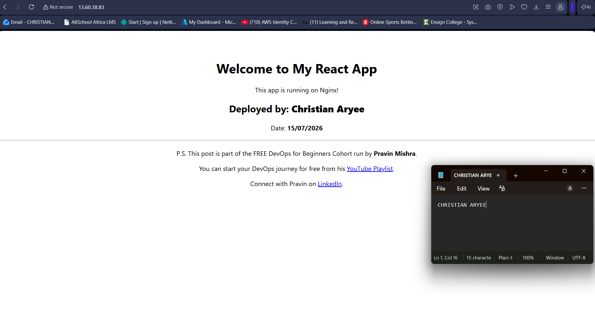
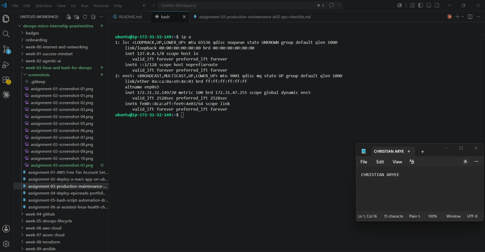
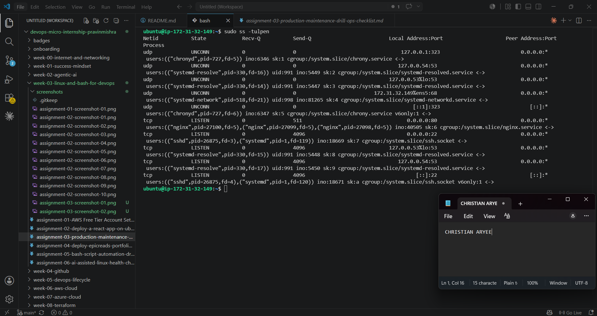
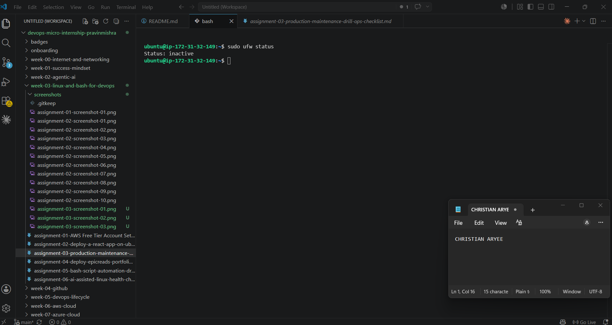
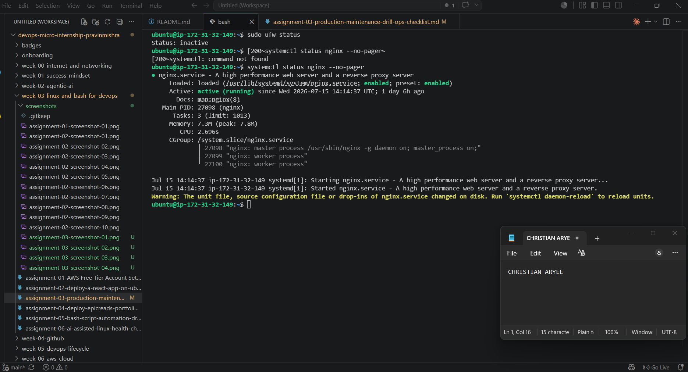
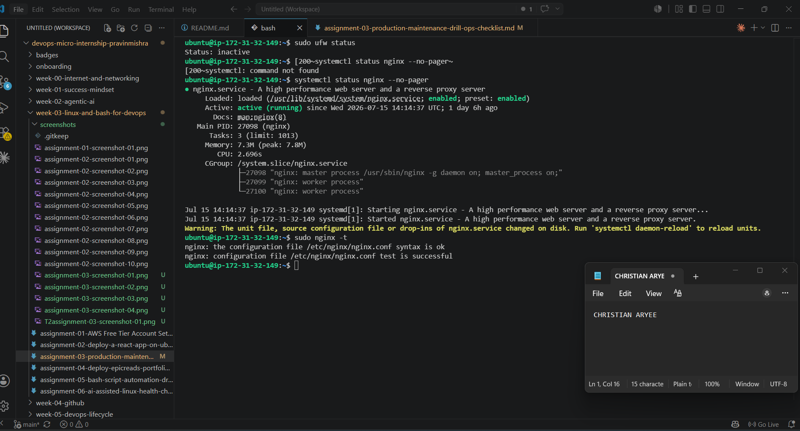
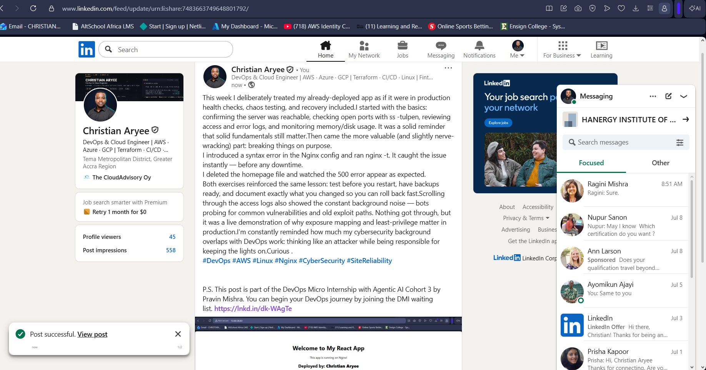

# Assignment 3 — Production Maintenance Drill (OPS Checklist)

Part of the DevOps Micro Internship (DMI) Cohort 3 with Agentic AI

---

## Purpose

In this assignment, you will treat your already deployed React application (on Ubuntu VM with Nginx) as a live production system. You will perform structured operational checks covering network validation, service health, log analysis, resource monitoring, configuration verification, and incident simulation with recovery — mirroring real on-call DevOps responsibilities.

---

# Task 1 — Server Access & Networking Validation

## Goal

Verify that the deployed React application is reachable from the browser and confirm basic network connectivity of the Ubuntu VM.

### Evidence

#### Screenshot 1 — Browser showing the React app with your Full Name visible on the UI

---

#### Screenshot 2 — Output of `ip a`

---

#### Screenshot 3 — Output of `sudo ss -tulpen`

---

#### Screenshot 4 — Output of `sudo ufw status`

---

### Notes

Answer the following in your own words:

**1. What proves Nginx is listening on 0.0.0.0:80?**

The ss -tulpen output shows a LISTEN entry on 0.0.0.0:80 with the process name nginx attached to it.

---

**2. What proves SSH is active on port 22?**

The output shows LISTEN on 0.0.0.0:22 with process sshd.

---

**3. Did you find any unexpected open ports? Explain briefly.**

No — everything else listening is either loopback-only (127.0.0.1) or link-local ([::1]), meaning it's not reachable from outside the server.

---

# Task 2 — Service Health & Systemd Validation (Nginx)

## Goal

Verify that Nginx is properly installed, running, enabled at boot, and safely configured.

### Evidence

#### Screenshot 1 — Output of `systemctl status nginx --no-pager`

---

#### Screenshot 2 — Output of `sudo nginx -t`

---

#### Screenshot 3 — Output of `sudo ss -lptn '( sport = :80 )'`

---

### Notes

Answer the following in your own words:

**1. What happens if Nginx fails to restart in production?**

Your website goes down immediately — nothing else is serving requests on port 80, so users get connection errors or timeouts until it's fixed.

---

**2. What's your basic rollback plan?**

i need to keep a backup of the last known-good Nginx config before editing like sudo cp /etc/nginx/sites-available/default /etc/nginx/sites-available/default.bak, and if a change breaks things, i will have to restore that file and restart the service.

---

# Task 3 — Logs & Request Trace

## Goal

Verify real traffic flow and analyze logs to understand system behavior and errors.

### Evidence

#### Screenshot 1 — Output of `sudo tail -n 30 /var/log/nginx/access.log`

---

#### Screenshot 2 — Output of `sudo tail -n 30 /var/log/nginx/error.log`

---

#### Screenshot 3 — Output of `sudo journalctl -u nginx --no-pager -n 50`

---

### Notes

Answer the following in your own words:

**1. Were there any errors in the logs?**

- If yes, mention 1–2 example error lines from the logs and explain what each one means in simple terms.
- If no, explain what it means if the error log is empty or shows no recent errors during your check.

 No true errors were found the only "error.log" entry is an informational notice about socket inheritance during a service restart, not a failure.

---

**2. If there were no errors, what does that indicate about the system?**

The web server itself is stable and hasn't encountered internal issues; whatever's hitting it (including some suspicious scans) isn't breaking anything.

---

**3. Based on the access logs, were your curl requests visible in the log entries? What does that prove about traffic flow?**

Yes — actually more interesting, your own browser's real page load requests appear in the log (the 41.210.17.225 lines pulling /, /static/css/main..., /static/js/main...), proving traffic really flows from a request to Nginx to a logged entry. It also shows the log is genuinely capturing all traffic, including background internet noise you didn't generate.

---

# Task 4 — System Resource Health Check (Capacity Red Flags)

## Goal

Assess server capacity and detect potential performance or failure risks.

### Evidence

#### Screenshot 1 — Output of `uptime`

---

#### Screenshot 2 — Output of `free -h`

---

#### Screenshot 3 — Output of `df -h`

---

#### Screenshot 4 — Output of `sudo du -sh /var/* | sort -h`

---

### Notes

Answer the following in your own words:

**1. Which resource looks most critical right now? (CPU/load, memory, or disk) Explain why.**

Write your answer here.

---

**2. What happens if disk becomes 100% full in a production server?**

Write your answer here.

---

# Task 5 — Configuration & Deployment Verification

## Goal

Ensure the correct React build is deployed and Nginx is serving it properly.

### Evidence

#### Screenshot 1 — Output of `ls -lah /var/www/html | head -n 20`

---

#### Screenshot 2 — Output of `grep -R "Deployed by" -n /var/www/html 2>/dev/null | head`

---

#### Screenshot 3 — Output of `grep -n "try_files" /etc/nginx/sites-available/default`

---

### Notes

Answer the following in your own words:

**1. How do you confirm that the correct version of the application is deployed?**

By grepping the deployed static JS bundle for a unique string i personally added ("Deployed by: Christian Aryee") and confirming it's present — this proves the exact build i created is what's actually being served, not a stale or default copy.

---

# Task 6 — Nginx Configuration Failure Simulation

## Goal

Simulate a real-world Nginx misconfiguration and recover the service safely.

### Evidence

#### Screenshot 1 — Output of `sudo nginx -t` showing the syntax error (broken config)

---

#### Screenshot 2 — Output of `sudo nginx -t` showing syntax ok (fixed config)

---

#### Screenshot 3 — Output of `curl -I http://<public-ip>` confirming recovery (200 OK)

---

### Notes

Answer the following in your own words:

**1. What caused the configuration failure?**

I added a random line of text into the Nginx config file that wasn't valid Nginx syntax. Nginx reads that file almost like a script, and it expects everything to follow a strict format — so that one random line broke the structure it was expecting.

---

**2. How did you fix the issue?**

Before I broke anything, I'd already made a backup copy of the working config file. So once I saw the error, I just copied that backup back over the broken file, checked it was valid again with nginx -t, and then restarted Nginx.

---

**3. How can you avoid this kind of issue in real production systems?**

Always save a backup before editing a config file — that way if something goes wrong, you can undo it in seconds instead of trying to fix broken syntax under pressure. Also, always run nginx -t to check the file before restarting the service — that way you catch mistakes before they actually take the site down.

---

# Task 7 — Web Application Failure Simulation

## Goal

Simulate missing deployment content and recover the application safely.

### Evidence

#### Screenshot 1 — Output of `curl -I http://<public-ip>` showing failure (non-200 response)

---

#### Screenshot 2 — Output of `curl -I http://<public-ip>` confirming recovery (200 OK)

---

### Notes

Answer the following in your own words:

**1. What caused the application to break in this scenario?**

I moved the site's main file (index.html) out of the way, simulating a real deployment mistake where a key file goes missing. It came back as a 500 error instead of a simple 404, because our Nginx setup tries to fall back to index.html for any missing page — and since that file itself was gone, there was nowhere left to fall back to.
---

**2. How did you fix the issue and restore the application?**

Just renamed the file back to its original name, which restored it instantly.

---

**3. What steps would you take to prevent this kind of issue in real production systems?**

Don't make live changes directly on the server while it's running — that's how you end up with the site half-working and half-broken, like we just saw. A better approach is to prepare the whole new version somewhere else first, then swap it in all at once, so the site is either fully old or fully new — never stuck in between. It also helps to have something watching the site that alerts you the moment it starts throwing errors, so a problem gets caught in minutes instead of sitting broken for hours before anyone notices.

---

# Task 8 — Security & Reliability Review

## Goal

Review and reflect on the security and reliability practices applied during this assignment.

### Security & Reliability Notes

Answer the following in your own words:

**1. Why is SSH key-based authentication more secure than sharing passwords?**

A password is something you can guess, steal, or accidentally leak — and if someone gets it, they're in. An SSH key is a matching pair of files: one stays private on your computer, and the other sits on the server. Even if someone sees the public half, it's useless without the private half, which never leaves your machine. That makes it much harder to break into than just guessing or stealing a password.

---

**2. Why should only required ports be open on a production server?**

Every open port is basically an open door. If a service is listening on a port you don't actually need, that's one more door someone could try to break through — even if you don't remember it's open. Keeping only the ports you actually use (like 22 for SSH and 80 for web traffic) keeps the number of ways in as small as possible.

---

**3. Why is it important for Nginx to be enabled on boot?**

If the server ever restarts — because of a crash, a scheduled reboot, or AWS doing maintenance — you want your website to come back online automatically, without you having to manually log in and start it yourself. Enabling it on boot means the server takes care of that on its own.

---

**4. What are the risks of sharing secrets, keys, or credentials publicly?**

If a key or password ends up somewhere public — a screenshot, a GitHub repo, a chat message — anyone who sees it can use it to get into your systems, your data, or run up costs on your account. It's like leaving your house key taped to the front door. This is exactly why we were careful to blur out account IDs and access keys during this project.

---

**5. Why should cloud resources be stopped or terminated when they are no longer needed?**

Cloud servers cost money for every hour they're running, whether you're using them or not. Leaving things running that you don't need anymore just quietly burns through your Free Tier credits or your budget. It also reduces your exposed "attack surface" — a server nobody's watching is a server nobody's patching either.

---

# LinkedIn Post (Required)

## Evidence

#### LinkedIn Post URL

Paste your LinkedIn post URL here:

`https://www.linkedin.com/posts/caryee_devops-aws-linux-activity-7483663750915608577-Ky3m?utm_source=share&utm_medium=member_desktop&rcm=ACoAACP6ElcBF7-kOglrea_3V5oUhVp4NSh-Trc`

---

#### Screenshot — Published LinkedIn post

---

# Submission Instructions

- Add all required screenshots in your submission
- Full name must be visible in required screenshots
- Do not expose sensitive information (keys, passwords, account IDs)

---

# Completion Checklist

- [x] Task 1: Screenshots (browser, ip a, ss -tulpen, ufw status) + Notes answered
- [x] Task 2: Screenshots (nginx status, nginx -t, ss port 80) + Notes answered
- [x] Task 3: Screenshots (access log, error log, journalctl) + Notes answered
- [x] Task 4: Screenshots (uptime, free -h, df -h, du -sh) + Notes answered
- [x] Task 5: Screenshots (ls html, grep deployed by, grep try_files) + Notes answered
- [x] Task 6: Screenshots (nginx -t fail, nginx -t pass, curl recovery) + Notes answered
- [x] Task 7: Screenshots (curl failure, curl recovery) + Notes answered
- [x] Task 8: Security & Reliability Notes answered
- [x] LinkedIn post published and URL submitted
- [x] Full Name visible in all required screenshots
- [x] No sensitive data exposed

---

## 📌 About DMI & CloudAdvisory

DevOps Micro Internship (DMI) is a project-based DevOps program run by Pravin Mishra (The CloudAdvisory) focused on real-world execution, systems thinking, and career readiness.

It helps learners build strong DevOps foundations with hands-on experience.

---

## 📌 Resources

- 🌐 DMI Official Website: https://pravinmishra.com/dmi  
- 🎓 DevOps for Beginners (Udemy): https://www.udemy.com/course/devops-for-beginners-docker-k8s-cloud-cicd-4-projects/  
- 🎓 Agentic AI DevOps with Claude Code: https://www.udemy.com/course/ultimate-agentic-ai-devops-with-claude-code/  
- 🎓 DevOps with Claude Code: Terraform, EKS, ArgoCD & Helm: https://www.udemy.com/course/devops-with-claude-code-terraform-eks-argocd-helm/  
- ▶️ YouTube Playlist: https://www.youtube.com/playlist?list=PLFeSNDtI4Cho  
- 🔗 Pravin Mishra (LinkedIn): https://www.linkedin.com/in/pravin-mishra-aws-trainer/  
- 🏢 CloudAdvisory (LinkedIn): https://www.linkedin.com/company/thecloudadvisory/

---

*This submission is part of DevOps Micro Internship (DMI) Cohort 3 — Agentic AI Track.*