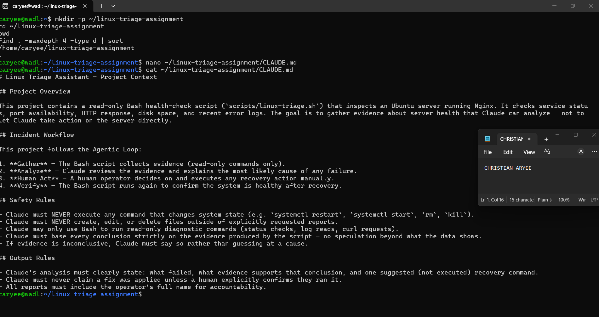
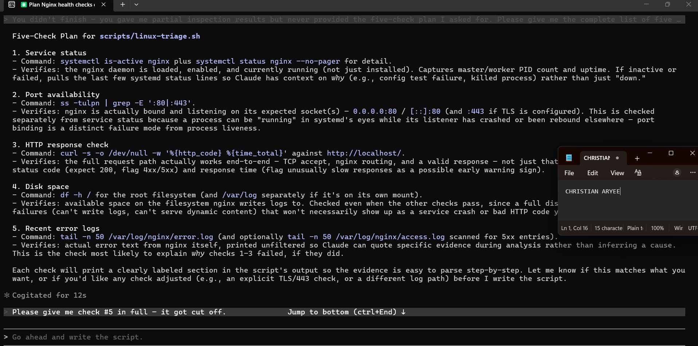
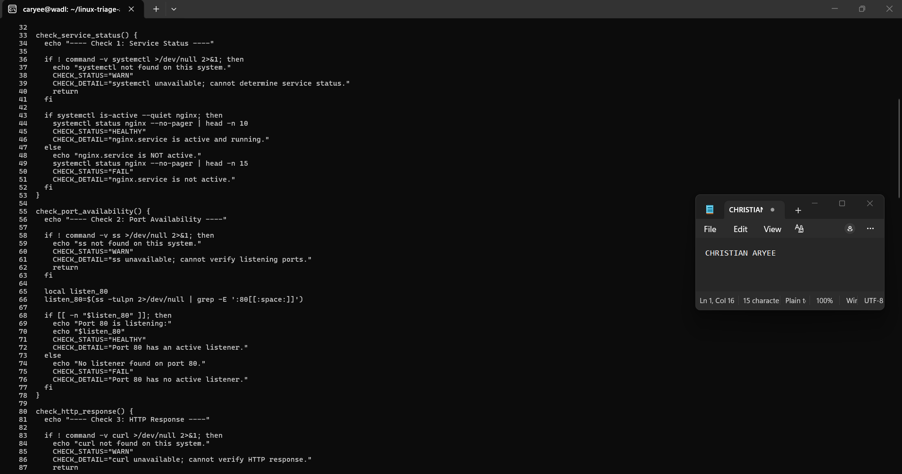
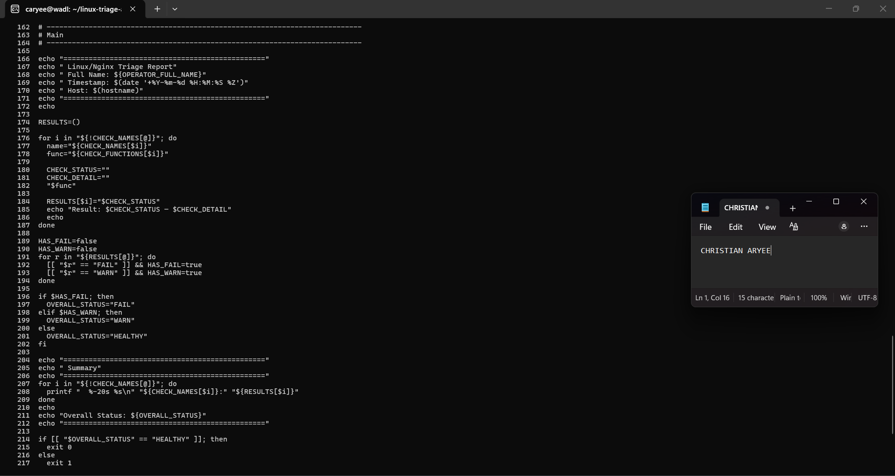
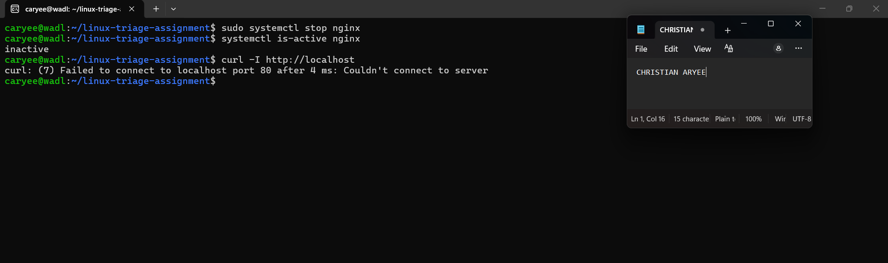

# Assignment 6 — Build an AI-Assisted Linux Health Check (AI-Assisted Linux Incident Triage)

Part of the DevOps Micro Internship (DMI) Cohort 3 with Agentic AI

---

## Purpose

In this assignment, you will build a read-only Bash triage script that checks the health of your Ubuntu server and Nginx application, connect it to Claude Code as a reusable `/linux-triage` skill, simulate a controlled Nginx incident, use the skill to gather and analyze evidence, recover the service manually, and verify recovery. The workflow follows the Agentic Loop: Gather → Analyze → Human Act → Verify.

---

# Task 1 — Confirm the Healthy Baseline and Create the Workspace

## Goal

Confirm that Nginx and the React application are healthy before building the automation.

### Evidence

#### Screenshot 1 — Output of `systemctl is-active nginx`, `ss -ltn | grep ':80'`, and `curl -I http://localhost`

---

#### Screenshot 2 — Output of `pwd` and `find . -maxdepth 4 -type d | sort` showing the workspace folder structure

---

### Notes

Answer the following in your own words:

**1. What proves that Nginx is running?**

The systemctl is-active nginx command returned active — this checks the actual state of the systemd service, confirming the Nginx process is currently running, not just installed.
---

**2. What proves that the server is listening for HTTP traffic?**

The ss -ltn | grep ':80' output showed two LISTEN entries on port 80 — one for IPv4 (0.0.0.0:80) and one for IPv6 ([::]:80). This proves the operating system has a socket actively listening for incoming connections on the standard HTTP port, which is different from just the process running — a process could be running but not actually bound to a port.
---

**3. Why must you capture a healthy baseline before simulating an incident?**

Without a documented "before" state, there's no way to prove what changed when something breaks — you'd be guessing whether a failure is new or was always there. Capturing the baseline first gives a clear point of comparison, so when we simulate the Nginx incident later, we can point to specific evidence (like "port 80 was listening before, now it isn't") rather than relying on assumption.
---

# Task 2 — Create Project Context and Safety Rules in CLAUDE.md

## Goal

Tell Claude exactly what this project does and what it is not allowed to do.

### Evidence

#### Screenshot 3 — CLAUDE.md open in VS Code showing all four sections (Project Overview, Incident Workflow, Safety Rules, Output Rules)

---

### Notes

Answer the following in your own words:

**1. Why should Claude receive project-specific operational rules?**

Without explicit rules, Claude has no way of knowing what's safe to do in this specific environment — it might reasonably assume it's helpful to just restart a failing service itself. Writing the rules down in CLAUDE.md removes ambiguity: Claude knows upfront exactly what it can and cannot touch, before it ever encounters a real incident.
---

**2. Why is the human required to execute the recovery command?**

Because an AI agent, no matter how confident its diagnosis, doesn't carry accountability or full context the way a human operator does. If Claude restarted the service automatically and something else was actually wrong (or the restart caused a different issue), there's no human judgment in the loop to catch it. Keeping recovery as a manual, human-executed step means every fix is a deliberate, accountable decision — not an autonomous action.
---

**3. Which rule prevents Claude from making an unsupported diagnosis?**

The rule stating "Claude must base every conclusion strictly on the evidence produced by the script — no speculation beyond what the data shows" — combined with "If evidence is inconclusive, Claude must say so rather than guessing at a cause." Together these force Claude to tie every claim back to actual collected evidence, rather than making a plausible-sounding guess.
---

# Task 3 — Use Agentic AI to Plan Before Writing the Script

## Goal

Use Claude Code to inspect the environment and produce a read-only plan before creating any Bash code.

### Evidence

#### Screenshot 4 — Claude Code showing the five-check plan and read-only inspection results

---

### Notes

Answer the following in your own words:

**1. Which part of this task represents the Gather phase?**

The inspection step — Claude running read-only commands (systemctl status, ss -tulpn, curl, df -h, log reads) to collect real evidence about the server's current state, before any analysis or planning happened. This is the "Gather" step of the Agentic Loop in action.
---

**2. Did Claude follow the instruction not to create files? How did you verify this?**

Yes — Claude only ran read commands (status checks, port checks, curl, disk checks, log reads) and produced its plan as chat output, not as a written file. I can verify this by checking that no new files appeared in the linux-triage-assignment folder after this step — running ls or find . -maxdepth 2 would show nothing new was created.
---

**3. Why is planning before coding useful in DevOps automation?**

Writing the script blind, without first understanding the actual environment, risks building checks that don't match reality — for example, assuming TLS is configured when it isn't, or checking the wrong log path. By inspecting first, the resulting script is grounded in what the server actually looks like, not a generic template, which makes it both more accurate and more trustworthy when it's later used to diagnose a real incident.
---

# Task 4 — Build the Linux Triage Bash Script

## Goal

Create one Bash script that gathers consistent Linux and Nginx health evidence.

### Evidence

#### Screenshot 5 — Top section of `linux-triage.sh` showing variables, thresholds, and the checks array

---

#### Screenshot 6 — Middle section showing check functions and conditionals

---

#### Screenshot 7 — Bottom section showing the loop, summary function, and exit behavior

---

#### Screenshot 8 — Output of `bash -n scripts/linux-triage.sh` (no syntax errors) and `ls -l scripts/linux-triage.sh` showing executable permission

---

### Notes

Answer the following in your own words:

**1. What is stored in the checks array?**

Two parallel arrays are used — CHECK_NAMES holds human-readable labels ("Service Status", "Port Availability", etc.), and CHECK_FUNCTIONS holds the actual function names to call for each one (check_service_status, check_port_availability, etc.). Keeping them as matched pairs by index lets the script loop through both at once.
---

**2. How does the `for` loop use that array?**

The loop for i in "${!CHECK_NAMES[@]}" goes through the index numbers of the array — 0 through 4 — rather than the values themselves. On each pass, it uses that same index to pull the matching name from CHECK_NAMES and the matching function name from CHECK_FUNCTIONS. It then runs "$func", which tells Bash to treat that stored string as an actual command and execute it — this is what actually calls each check_* function in turn.
---

**3. Why are the health checks separated into functions?**

Each check is self-contained — it has its own logic for what "healthy" looks like, its own commands to run, and its own way of reporting status. Splitting them into functions keeps each check readable and testable on its own, and makes it trivial to add a sixth check later without touching the existing five.
---

**4. What is the purpose of `$(...)` in this script?**

Command substitution — written as a dollar sign followed by parentheses around a command — runs that command and captures its output as a string, which then gets stored in a variable. For example, the script runs the disk usage command inside that syntax and saves the resulting text into a variable called output, so it can parse the percentage used afterward instead of just printing the raw output directly to the screen.
---

**5. Why does the script use different exit codes for HEALTHY, WARN, and FAIL?**

Exit codes are how scripts communicate success or failure to whatever calls them — 0 conventionally means everything's fine, anything nonzero means something needs attention. By exiting 0 only when every single check is HEALTHY, and exiting 1 for any WARN or FAIL, this script can be plugged into other automation, like a monitoring system or the /linux-triage skill built later, that checks the exit code to decide whether to alert someone, without needing to parse the full text output.
---

# Task 5 — Run and Understand the Healthy-State Report

## Goal

Run the Bash script against the healthy server and verify that it creates a report.

### Evidence

#### Screenshot 9 — Output of `./scripts/linux-triage.sh` showing your Full Name and all five check results

---

#### Screenshot 10 — Output showing the captured exit code and final summary

---

### Notes

Answer the following in your own words:

**1. What is the overall status of your healthy baseline?**

All five checks — Service Status, Port Availability, HTTP Response, Disk Space, and Error Logs — returned HEALTHY, giving an Overall Status of HEALTHY.
---

**2. Which exact Linux evidence proves the application is serving traffic?**

Check 3 shows an HTTP 200 response received in 0.073358s, which confirms Nginx actually served a request rather than just being installed or listening. That pairs with Check 2, which shows port 80 has active LISTEN entries on both 0.0.0.0:80 and [::]:80 — so there's a listener that's also responding correctly.
---

**3. Did your script return exit code 0 or 1? Explain why.**

Exit code 0. The script only exits 0 when every check reports HEALTHY, and in this run all five checks (service, port, HTTP, disk, logs) came back HEALTHY with no WARN or FAIL results.
---

**4. What is the difference between a warning and a failure in this script?**

A warning means a metric crossed a soft threshold that's worth watching but isn't broken yet (e.g. disk usage climbing high but still with free space) — the service is technically still working. A failure means the check found something actually broken (e.g. Nginx inactive, port not listening, an HTTP error, or a critical/emerg line in the error log) — something that needs a human to act, not just monitor.
---

# Task 6 — Create and Run the /linux-triage Skill

## Goal

Turn the Bash script into a reusable, manually invoked Agentic AI workflow.

### Evidence

#### Screenshot 11 — `SKILL.md` showing the frontmatter, allowed tool restrictions, and safety rules

---

#### Screenshot 12 — `/linux-triage` output for the healthy server

---

### Notes

Answer the following in your own words:

**1. Why does this skill have Bash, Read, and Grep, but not Write?**

The skill only needs to gather and read evidence — running the triage script (Bash), reading its output or related files (Read), and searching log content (Grep). It has no legitimate reason to create or modify files, so leaving Write out of allowed-tools makes it structurally impossible for the skill to alter anything on the server, even by accident.
---

**2. Why is `disable-model-invocation: true` useful for this skill?**

It stops Claude from deciding on its own, mid-conversation, to run the triage script — the skill only fires when I explicitly type /linux-triage. That matters for something that touches server state: triage should happen on a human's deliberate call, not because Claude inferred it might be a good idea.
---

**3. What part is performed by Bash, and what part is performed by Claude?**

Bash does all the actual evidence-gathering — running linux-triage.sh, which directly queries systemd, the network stack, HTTP, disk, and logs, and produces a fixed, factual report. Claude's job starts only after that: reading the report and explaining it in plain language — summarizing which checks passed, calling out the overall status, and (if something failed) suggesting a likely cause and recovery command without executing it.
---

**4. Why is this better than asking Claude "Is my server healthy?" without giving it evidence?**

Without the script, Claude would have no way to actually check anything — it could only guess or repeat generic advice. Here, every claim Claude makes ("nginx.service active and running, PID 1539, up 23h") is tied to a real command's real output, so the answer is grounded in verifiable facts about this specific machine at this specific moment, not a plausible-sounding guess.
---

# Task 7 — Simulate an Nginx Incident and Let the Skill Diagnose It

## Goal

Create a controlled service failure, gather evidence through Bash, and let Claude analyze the evidence without taking recovery action.

### Evidence

#### Screenshot 13 — Output showing Nginx is inactive and the HTTP request fails

---

#### Screenshot 14 — `/linux-triage` output showing failed evidence, most likely cause, and a suggested recovery command

---

#### Screenshot 15 — `incident-failure-report.txt` showing the failed checks and your Full Name

---

### Notes

Answer the following in your own words:

**1. Which three checks failed?**

Service Status, Port Availability, and HTTP Response all returned FAIL.
---

**2. What evidence supports the conclusion that Nginx is unavailable?**

systemctl status nginx showed Active: inactive (dead), with the systemd journal showing a clean Stopping nginx.service... → Deactivated successfully → Stopped sequence and 0/SUCCESS exit codes. Port 80 had no listener as a direct consequence, and curl to http://localhost/ got no HTTP response at all — both failures trace back to the same root cause rather than being separate problems.
---

**3. Did Claude execute the recovery command? Why is that important?**

No — Claude only suggested sudo systemctl start nginx and explicitly stated it would not run it, leaving execution to the human operator. This matters because an AI acting autonomously on a live server removes human judgment from a decision that could have side effects; keeping recovery manual means every state-changing action is a deliberate, accountable choice.
---

**4. Which phase of the Agentic Loop is represented by the Bash report?**

The Gather phase — the script itself just collects raw evidence (service status, port state, HTTP response, disk, logs) with no interpretation attached.
---

**5. Which phase is represented by Claude's explanation?**

The Analyze phase — Claude took that raw evidence and reasoned about what it means (a clean shutdown, not a crash) and what it implies for next steps, without taking any action itself.
---

# Task 8 — Recover Manually, Verify Again, and Write the Incident Summary

## Goal

Recover the service as the human operator and prove that the system is healthy again.

### Evidence

#### Screenshot 16 — Output showing Nginx is active and `curl -I http://localhost` returns 200 OK

---

#### Screenshot 17 — Second `/linux-triage` output showing successful recovery with no FAIL results

---

#### Screenshot 18 — Output of `ls -lah reports` showing both `incident-failure-report.txt` and `recovery-report.txt`

---

#### Screenshot 19 — `incident-summary.md` showing all required sections and your Full Name

---

### Notes

Answer the following in your own words:

**1. What action did you execute manually?**

I ran sudo systemctl start nginx myself in the terminal, as the human operator — Claude only suggested this command earlier and never executed it.
---

**2. What evidence proves that the service recovered?**

At the shell level, systemctl is-active nginx returned active and curl -I http://localhost returned HTTP 200. Then re-running /linux-triage confirmed all five checks HEALTHY again — Service Status active, port 80 listening, HTTP 200 response, disk and error logs unchanged from before.
---

**3. Why is the second triage run necessary?**

A restarted service isn't automatically proof of full recovery — the second run through the same objective checks (not just the one command I ran) confirms the whole system is actually healthy again, not just that one process is technically running. It also produces a documented "after" state to compare against the "before" (Task 5) and the failure evidence (Task 7).
---

**4. What could go wrong if an AI agent automatically restarted every failed service?**

It could mask the real problem — if something is actively causing a crash loop, blind auto-restarting hides that instead of surfacing it, and repeated restarts could make things worse (data corruption, resource exhaustion) with no human aware it's happening. It also removes accountability: if the "fix" caused a new issue, there'd be no deliberate decision point where a person weighed the risk.
---

**5. In one sentence, explain the difference between using AI as a chatbot and using AI in this agentic workflow.**

A chatbot just answers questions from what it already knows, while this agentic workflow has Claude actively gather real evidence through tools, reason over that evidence, and hand off any state-changing decision to a human — closer to an assistant with eyes on the system than a conversation partner guessing in the dark.
---

# Incident Summary

Fill in all seven sections below in your own words.

**Full Name:** Christian Aryee

**Date:** 22/07/2026

---

**1. Reported Symptom**

Nginx became unavailable — the web server stopped responding, with no HTTP response from http://localhost.

---

**2. Evidence Collected**

The linux-triage script and skill reported three FAIL results: Service Status (nginx.service inactive/dead since 20:59:33 GMT), Port Availability (no listener on port 80), and HTTP Response (no reply from http://localhost). Disk Space and Error Logs stayed HEALTHY throughout, and the systemd journal showed a clean Stopping → Deactivated successfully → Stopped sequence with 0/SUCCESS exit codes on all steps.

---

**3. Most Likely Cause**

A deliberate, clean shutdown of the nginx service, rather than a crash — the exit codes were all 0/SUCCESS and no error/crit/alert entries appeared in the logs around the time of the outage.

---

**4. Human-Approved Recovery Action**

I manually ran `sudo systemctl start nginx` myself in the terminal. Claude had suggested this exact command earlier but did not execute it, per the skill's safety rules.

---

**5. Verification**

After the manual restart, `systemctl is-active nginx` returned active and `curl -I http://localhost` returned HTTP 200. Re-running the `/linux-triage` skill confirmed all five checks returned to HEALTHY, matching the original Task 5 baseline.

---

**6. Safety Decision**

Recovery was intentionally left as a human-executed step. The skill has no Write permission and is not allowed to run state-changing commands, so even though Claude correctly diagnosed the cause and recommended a fix, only a human operator could actually restart the service.

---

**7. Agentic Loop Mapping**

Gather: the Bash script collecting raw evidence (service status, port, HTTP, disk, logs). Analyze: Claude interpreting that evidence to explain the failed checks and likely cause. Human Act: me manually running the recovery command. Verify: re-running the triage skill afterward to confirm the fix worked.

---

# LinkedIn Post (Required)

## Evidence

#### LinkedIn Post URL

Paste your LinkedIn post URL here:

`Add your URL here`

---

#### Screenshot — Published LinkedIn post

Add your screenshot here.

---

# GitHub Repository URL

Paste the URL of your GitHub folder or repository containing the assignment files here:

`Add your URL here`

---

# Submission Instructions

- Add all required screenshots in your submission
- Full Name must be visible in required screenshots and the Bash report
- All written answers must be in your own words
- Do not expose sensitive information (keys, passwords, AWS account IDs, tokens)
- GitHub URL must be included in this document

---

# Completion Checklist

- [x] Task 1: Healthy baseline confirmed, workspace created (Screenshots 1–2, Notes answered)
- [x] Task 2: CLAUDE.md created with all four sections (Screenshot 3, Notes answered)
- [x] Task 3: Five-check plan produced by Claude using read-only tools (Screenshot 4, Notes answered)
- [x] Task 4: `linux-triage.sh` created, syntax validated, executable permission set (Screenshots 5–8, Notes answered)
- [x] Task 5: Healthy-state report generated with no FAIL result (Screenshots 9–10, Notes answered)
- [x] Task 6: `/linux-triage` skill created and run successfully on healthy server (Screenshots 11–12, Notes answered)
- [x] Task 7: Nginx incident simulated, failed evidence captured, Claude did not execute recovery (Screenshots 13–15, Notes answered)
- [x] Task 8: Nginx recovered manually, recovery verified, reports saved, incident summary complete (Screenshots 16–19, Notes answered)
- [x] Incident summary contains all seven required sections
- [x] LinkedIn post published and URL submitted
- [x] Full Name visible in all required screenshots and the Bash report
- [x] Skill does not have Write permission
- [x] Skill did not execute any recovery commands
- [x] No sensitive data exposed

---

## 📌 About DMI & CloudAdvisory

DevOps Micro Internship (DMI) is a project-based DevOps program run by Pravin Mishra (The CloudAdvisory) focused on real-world execution, systems thinking, and career readiness.

It helps learners build strong DevOps foundations with hands-on experience.

---

## 📌 Resources

- 🌐 DMI Official Website: https://pravinmishra.com/dmi  
- 🎓 DevOps for Beginners (Udemy): https://www.udemy.com/course/devops-for-beginners-docker-k8s-cloud-cicd-4-projects/  
- 🎓 Agentic AI DevOps with Claude Code: https://www.udemy.com/course/ultimate-agentic-ai-devops-with-claude-code/  
- 🎓 DevOps with Claude Code: Terraform, EKS, ArgoCD & Helm: https://www.udemy.com/course/devops-with-claude-code-terraform-eks-argocd-helm/  
- ▶️ YouTube Playlist: https://www.youtube.com/playlist?list=PLFeSNDtI4Cho  
- 🔗 Pravin Mishra (LinkedIn): https://www.linkedin.com/in/pravin-mishra-aws-trainer/  
- 🏢 CloudAdvisory (LinkedIn): https://www.linkedin.com/company/thecloudadvisory/

---

*This submission is part of DevOps Micro Internship (DMI) Cohort 3 — Agentic AI Track.*