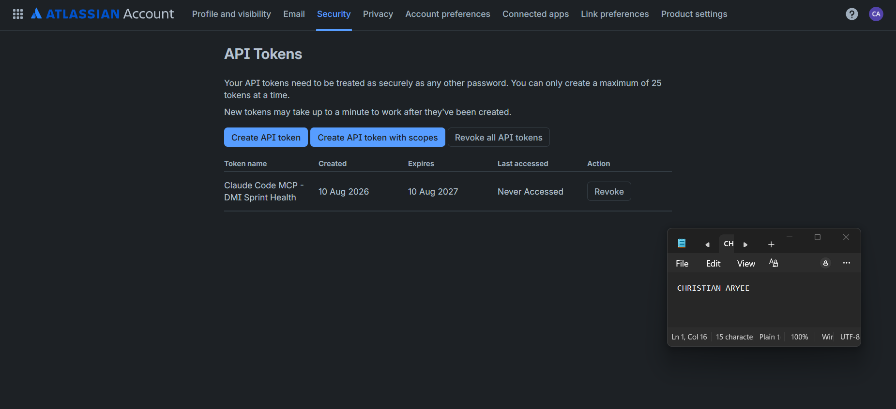
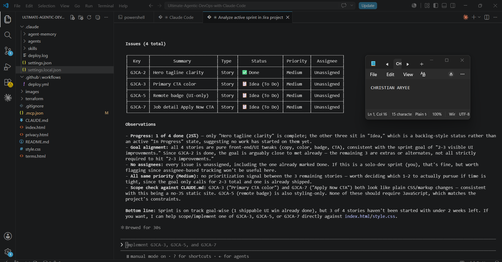

# Assignment 5 — AI-Assisted Sprint Health Report via Jira MCP

Part of the DevOps Micro Internship (DMI) Cohort 3 with Agentic AI

---

## Purpose

In this assignment, you will connect Claude Code to your Jira board through an MCP server, the same way you connected it to GitHub in Week 2, and build a read-only `/sprint-health` skill. The skill reads your current sprint through Jira's API and reports sprint velocity, stories at risk of missing the sprint, and items missing an estimate — but it must never create, edit, comment on, or transition a single ticket itself. You will prove that boundary holds by making a real change on the board yourself and confirming the skill only ever reports, never acts.

---

# Task 1 — Create a Jira API Token

## Goal

Generate an API token from your Atlassian account that the MCP server will use to authenticate with your Jira site. Do not screenshot the token value itself.

### Evidence

#### Screenshot 1 — Jira API token creation confirmation page showing the token name, with the token value not visible

### Notes You Must Write (Very Important):

Why does the MCP server need your site URL and account email in addition to the token?

The MCP server needs the site URL and account email in addition to the token because Jira's REST API uses Basic Authentication, which requires a username (email) and a secret (the token) together — the token alone doesn't identify which Atlassian account it belongs to, and the site URL specifies which Jira instance to connect to, since Atlassian hosts many separate sites. The token proves "this is really me," the email says "on behalf of this account," and the URL says "talk to this specific Jira site."

---

# Task 2 — Create .mcp.json at the Project Root

## Goal

Create or update `.mcp.json` at your project root with a Jira MCP server block, following the same shape as the GitHub MCP server you configured in Week 2.

### Evidence

#### Screenshot 2 — `.mcp.json` open in VS Code showing the Jira server configuration

### Notes You Must Write (Very Important):

Compare this jira block to the github block from Week 2 Assignment 5. The GitHub server ran via npx (a Node.js package); this one runs via uvx (a Python package) — what stays exactly the same shape despite that difference, and why doesn't Claude Code care which language a given MCP server is written in?

Despite running via a different package manager (uvx for the Python-based Jira server vs. npx for the Node-based GitHub server), both blocks follow the exact same shape: a command to launch the server, an args array telling that command which package to run, and an env object for environment variables. Claude Code doesn't care which language a given MCP server is written in because MCP is a standardized protocol — Claude Code only needs to know how to start the server process and then communicates with it over that same MCP interface regardless of what language or runtime is underneath. The server, whether Node or Python, ultimately exposes the same kind of tool-calling interface to Claude, so the implementation language is invisible from Claude Code's side.

---

# Task 3 — Add Your Credentials to settings.local.json

## Goal

Add your Jira site URL, account email, and API token to `.claude/settings.local.json`, and confirm that file is listed in `.gitignore` so it is never committed.

### Evidence

#### Screenshot 3 — `settings.local.json` open in VS Code showing the `env` section, with the actual token value blurred or covered

### Notes You Must Write (Very Important):

Why must JIRA_API_TOKEN live in settings.local.json and never in .mcp.json?

JIRA_API_TOKEN must live in settings.local.json and never in .mcp.json because .mcp.json is meant to be committed to version control and shared with the team — it only declares which MCP servers exist and how to launch them, which is safe to share since it contains no secrets. settings.local.json, by contrast, is gitignored and stays local to each developer's own machine. If the token were placed in .mcp.json instead, it would get pushed to GitHub the moment that file was committed, exposing the credential to anyone who could see the repo (including the public, if the repo is public). Keeping secrets exclusively in the gitignored local settings file means the actual credential never leaves your machine, even as the rest of the project configuration is shared and versioned normally.
---

# Task 4 — Verify the Connection with /mcp

## Goal

Restart Claude Code and confirm the Jira MCP server shows as connected.

### Evidence

#### Screenshot 4 — `/mcp` output showing `jira: connected`

---

# Task 5 — Run a Live Query to Prove Real Board Data

## Goal

Ask Claude to list the issues in your current active sprint through the Jira MCP connection, and confirm the result matches what you see on your live board in the browser.

### Evidence

#### Screenshot 5 — Claude's response showing the live sprint issue list retrieved via Jira MCP

### Notes You Must Write (Very Important):

How did you confirm this was real board data and not something Claude guessed?

I confirmed this was real board data, not something Claude guessed, in three ways: first, the sprint dates (Aug 8–22, 2026) and Sprint Goal text matched exactly what I had typed into Jira in Assignment 4. Second, GJCA-2 "Hero tagline clarity" correctly showed as Done — a status I had manually set days earlier — while the other three stories correctly showed as still To Do, exactly matching their real state on the live board. Third, the issue keys (GJCA-2, GJCA-3, GJCA-5, etc.) and board ID (68) are specific identifiers that Claude could not have fabricated or guessed; they only exist because the Jira MCP server queried Jira's actual REST API and returned genuine data.
---

# Task 6 — Build the /sprint-health Skill

## Goal

Create a `/sprint-health` skill restricted to read-only Jira tools plus `Read`, with no issue-mutating tools and no `Write`. Run it and confirm it produces a report covering sprint velocity, at-risk stories, and items missing an estimate.

### Evidence

#### Screenshot 6 — `SKILL.md` frontmatter showing `allowed-tools` limited to read-only Jira tools plus `Read`, with `disable-model-invocation: true`

#### Screenshot 7 — `/sprint-health` output showing the full triage report against your real sprint

### Notes You Must Write (Very Important):

1. Which Jira MCP tools does this skill's allowed-tools list include, and which mutating tools (create issue, update issue, transition issue, add comment) does it deliberately exclude?

The skill's allowed-tools list includes four read-only Jira MCP tools — mcp__jira__jira_search, mcp__jira__jira_get_issue, mcp__jira__jira_get_sprint, and mcp__jira__jira_get_board — plus the built-in Read tool. It deliberately excludes every mutating tool: there is no create-issue, update-issue, transition-issue, or add-comment tool anywhere in the list, and Write is explicitly excluded as well. If a mutating tool isn't named in allowed-tools, the skill has no way to call it, even if the model "wanted" to.

2. Why does a Scrum Master need this restriction more than almost any other role in this course?

A Scrum Master needs this restriction more than almost any other role in this course because their job is fundamentally about visibility and facilitation, not unilateral action — sprint health, velocity, and risk are supposed to surface information the team then discusses and decides on together. If an AI assistant could silently reassign, re-estimate, or transition tickets while "just generating a report," it would erode the very transparency and shared ownership that Scrum depends on. A Scrum Master reporting false confidence in a board that was quietly altered by a tool — rather than by the team's own decisions — undermines trust in the process itself.
---

# Task 7 — Prove the Skill Never Mutates the Board

## Goal

Manually update one ticket on your board in the browser (for example, move a story to "Done" or add a missing estimate), then run `/sprint-health` again and confirm the new report reflects your change — proving the skill only ever reads live state and never wrote to the board itself.

### Evidence

#### Screenshot 8 — Second `/sprint-health` run showing the report now reflects your manual board change

### Notes You Must Write (Very Important):

Map this assignment to Gather → Analyze → Human Act → Verify from Week 3 Assignment 6. Which step did you perform manually in the browser, and why must that step stay human?

Mapping this to Gather → Analyze → Human Act → Verify from Week 3 Assignment 6: the /sprint-health skill performs Gather (pulling live issue data via read-only Jira MCP tools) and Analyze (calculating velocity, flagging at-risk stories, checking for missing estimates). The Human Act step — actually moving PMPWCA-1 to Done and assigning it to myself — I performed manually in the Jira browser UI, not through the skill or through Claude Code at all. Running /sprint-health a second time and seeing the updated velocity (1/1, 100%) and updated status was the Verify step, confirming the change took effect. The "Act" step must stay human because sprint status changes represent real decisions about what work is actually complete — an AI reporting on state is safe and useful, but an AI silently changing that state removes the team's ability to catch mistakes, disagree, or apply judgment before a ticket's status becomes official record.
---

# Submission Instructions

Complete all tasks in sequence.

Your submission must include:
- All 8 required screenshots
- All the required notes

---

# Completion Checklist

- [x] Task 1: Jira API token created, value never screenshotted (Screenshot 1)
- [x] Task 2: `.mcp.json` has the Jira server block (Screenshot 2)
- [x] Task 3: Credentials stored in `settings.local.json`, token blurred, file gitignored (Screenshot 3)
- [x] Task 4: `/mcp` shows the Jira server connected (Screenshot 4)
- [x] Task 5: Live query returned real sprint data, verified against the browser (Screenshot 5)
- [x] Task 6: `/sprint-health` skill created with correct read-only `allowed-tools`, and produced a full report (Screenshots 6–7)
- [x] Task 7: A manual board change was reflected in a second `/sprint-health` run (Screenshot 8)
- [x] Skill never created, edited, transitioned, or commented on any issue
- [x] Reflection answered (Notes)
- [x] No API token value exposed

---

## 📌 About DMI & CloudAdvisory

DevOps Micro Internship (DMI) is a project-based DevOps program run by Pravin Mishra (The CloudAdvisory) focused on real-world execution, systems thinking, and career readiness.

It helps learners build strong DevOps foundations with hands-on experience.

---

## 📌 Resources

- 🌐 DMI Official Website: https://dmi.pravinmishra.com?utm_source=github&utm_medium=readme  
- 🎓 University: https://university.pravinmishra.com?utm_source=github&utm_medium=readme  
- 💬 Discord Community: https://discord.pravinmishra.com?utm_source=github&utm_medium=readme  
- 📝 Blog: https://dmi.pravinmishra.com/blog?utm_source=github&utm_medium=readme  
- ▶️ YouTube Playlist: https://www.youtube.com/playlist?list=PLFeSNDtI4Cho  
- 🔗 Pravin Mishra (LinkedIn): https://www.linkedin.com/in/pravin-mishra-aws-trainer/  
- 🏢 CloudAdvisory (LinkedIn): https://www.linkedin.com/company/thecloudadvisory/

---

*This submission is part of DevOps Micro Internship (DMI) Cohort 3 — Agentic AI Track.*
