# Assignment 5 — Deploy a Highly Available Two-Tier Application on AWS (VPC + ALB + ASG + Multi-AZ RDS)

Part of the DevOps Micro Internship (DMI) Cohort 3 with Agentic AI

---

## Purpose

In this assignment, you will design and deploy a highly available two-tier web application on AWS: highly available networking across two Availability Zones, an Application Load Balancer, an Auto Scaling Group for the web tier, and a private Multi-AZ RDS database. You must prove high availability with real failure tests.

---

# Task 1 — Create HA Networking (VPC + 4 Subnets + IGW + NAT + Route Tables)

## Goal

Build a VPC (10.0.0.0/16) with two public and two private subnets across two Availability Zones, an Internet Gateway, a NAT Gateway, and the matching public/private route tables.

### Evidence

#### Screenshot 1 — VPC details showing CIDR 10.0.0.0/16

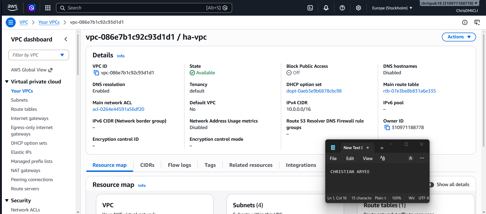

---

#### Screenshot 2 — Subnets list showing four subnets and their Availability Zones

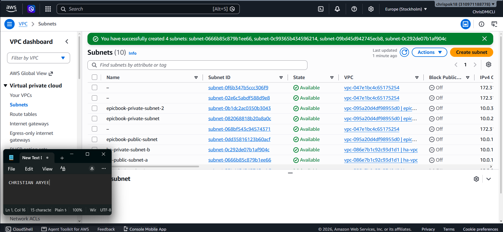

---

#### Screenshot 3 — Public route table showing the Internet Gateway route and both public-subnet associations

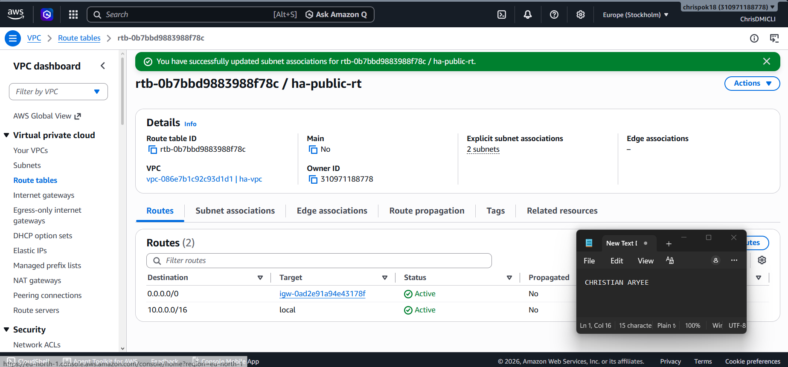

---

#### Screenshot 4 — Private route table showing the NAT Gateway route and both private-subnet associations

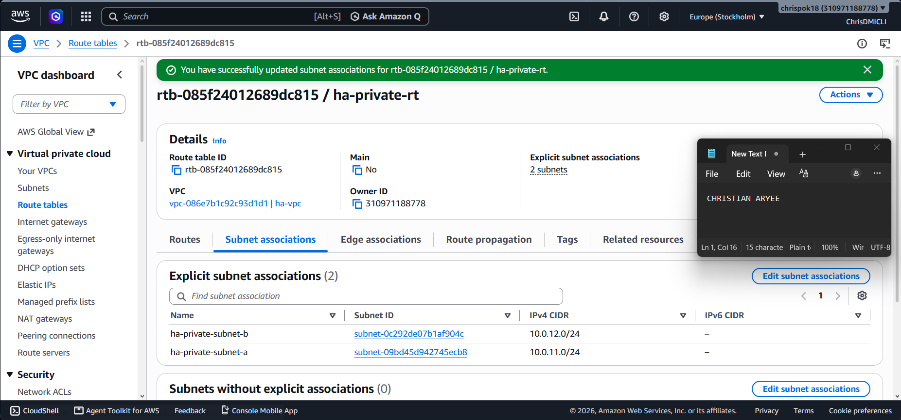

---

#### Screenshot 5 — NAT Gateway status showing Available and the Elastic IP

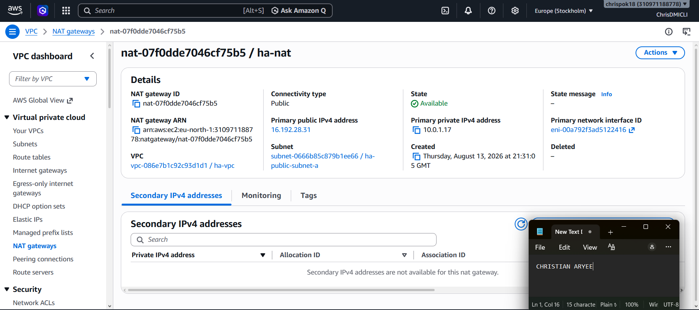

---

# Task 2 — Create Security Groups (ALB, EC2, RDS) with Least Privilege

## Goal

Create `ha-alb-sg` (HTTP public), `ha-web-sg` (HTTP only from `ha-alb-sg`, SSH from your IP), and `ha-db-sg` (database port only from `ha-web-sg`).

### Evidence

#### Screenshot 6 — ALB Security Group inbound rules

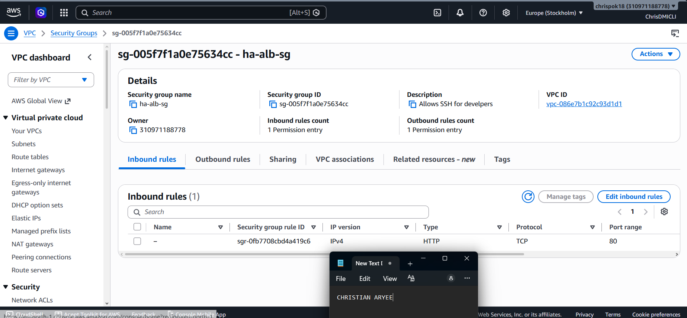

---

#### Screenshot 7 — EC2 Security Group inbound rules showing the ALB Security Group reference and SSH from your IP

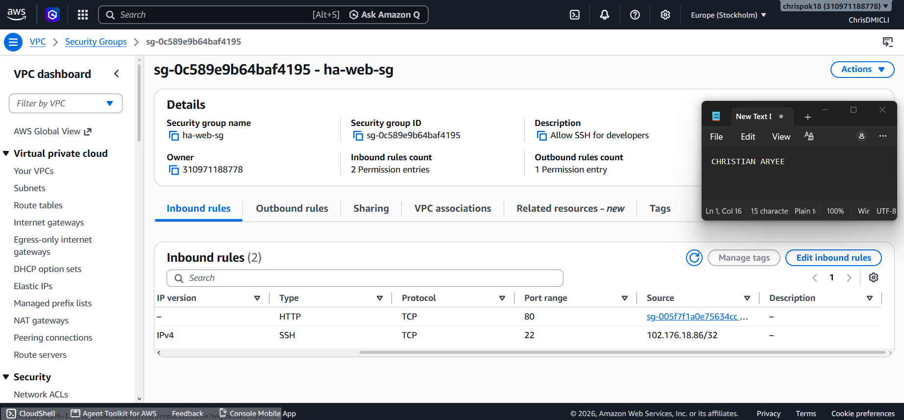

---

#### Screenshot 8 — RDS Security Group inbound rule showing the database port allowed only from the EC2 Security Group

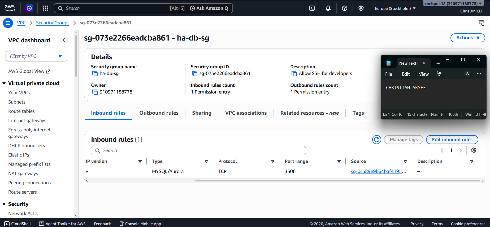

---

# Task 3 — Deploy Database Tier (RDS Multi-AZ in Private Subnets)

## Goal

Launch a private, Multi-AZ RDS database (MySQL or PostgreSQL) using the private DB Subnet Group and `ha-db-sg`.

### Evidence

#### Screenshot 9 — RDS summary showing Multi-AZ = Yes and Publicly accessible = No

---

#### Screenshot 10 — RDS connectivity section showing the DB Subnet Group and Security Group

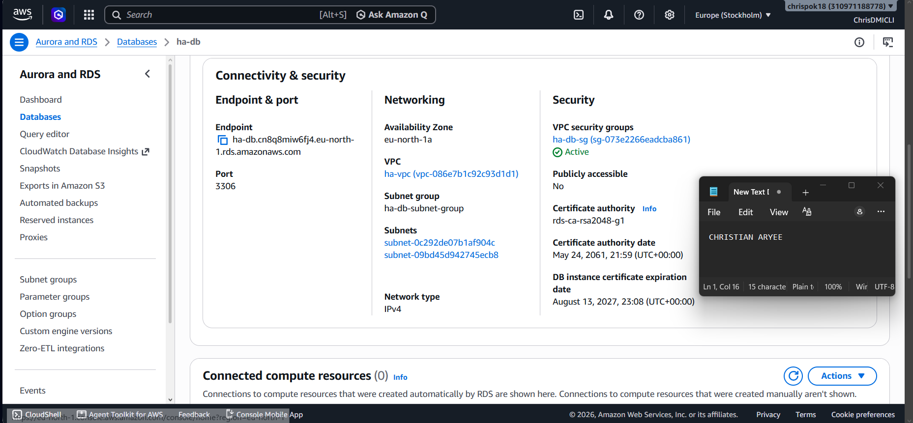

---

# Task 4 — Build a Launch Template (User Data Installs App + Connects to DB)

## Goal

Create a Launch Template whose user data installs the web-server runtime, deploys the application, configures the database connection, and starts the required services.

### Evidence

#### Screenshot 11 — Launch Template details showing that user data exists, including a visible snippet

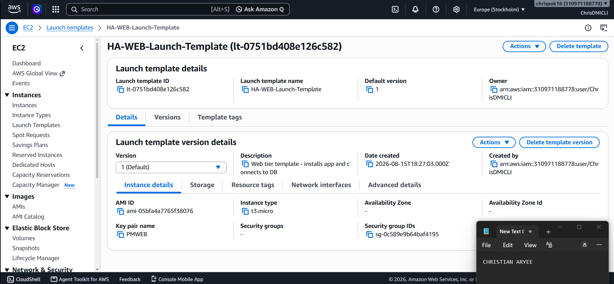

---

#### Screenshot 12 — A running instance created from the template showing that the application responds on port 80 through a local test or browser using its public IP

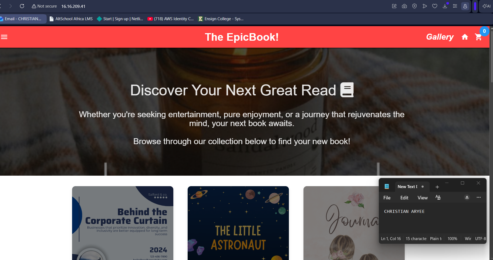

---

# Task 5 — Create an Application Load Balancer (ALB) Across 2 Public Subnets

## Goal

Create an internet-facing ALB across both public subnets with an HTTP listener and a healthy instance target group.

### Evidence

#### Screenshot 13 — ALB details showing two public subnets in two Availability Zones

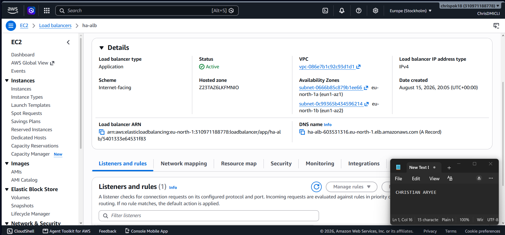

---

#### Screenshot 14 — Target group showing at least one healthy target

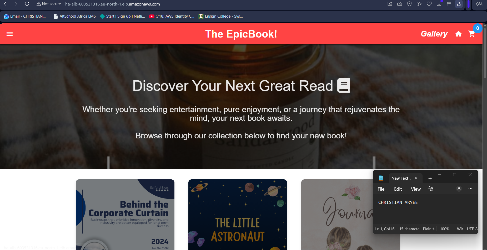

---

# Task 6 — Create Auto Scaling Group (ASG) in 2 Public Subnets

## Goal

Create an Auto Scaling Group from the Launch Template across both public subnets, with desired capacity 2, minimum 2, and maximum 4, registered to the ALB target group.

### Evidence

#### Screenshot 15 — Auto Scaling Group showing desired, minimum, and maximum capacity and the selected subnet Availability Zones

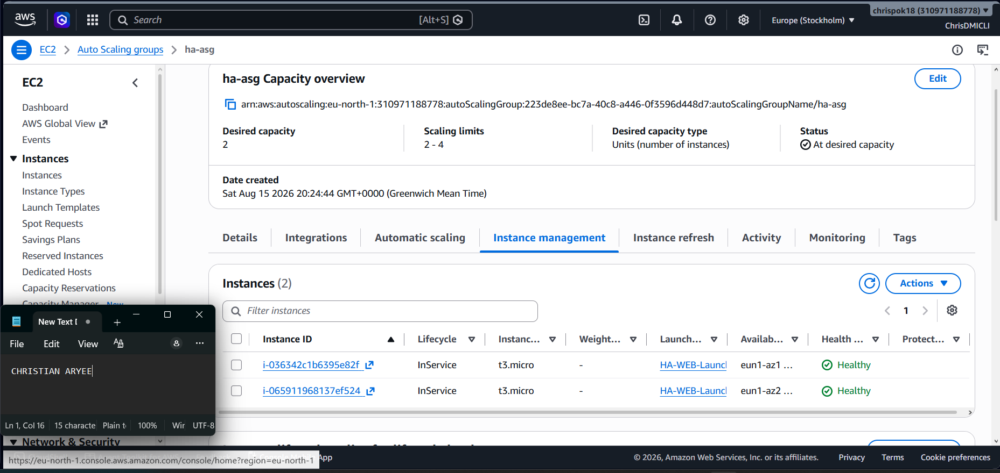

---

#### Screenshot 16 — EC2 instances list showing two running instances in different Availability Zones

---

# Task 7 — Configure App to Use RDS + Validate Read/Write

## Goal

Confirm the application communicates with the RDS database through the ALB DNS name with at least one read and one write operation.

### Evidence

#### Screenshot 17 — Browser showing the application loaded through the ALB DNS name with the URL visible

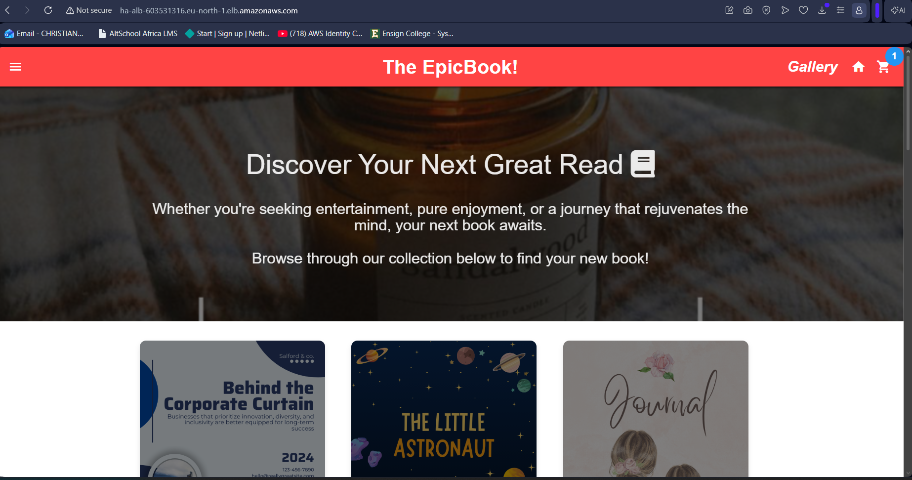

---

#### Screenshot 18 — Proof of a database write through a UI message or database query output

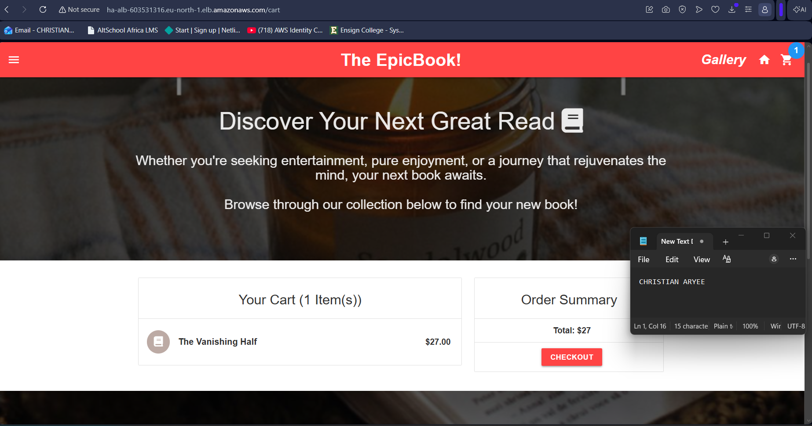

---

# Task 8 — High Availability Tests (Must Do Both)

## Goal

Test A: terminate one web instance and confirm the Auto Scaling Group replaces it automatically without interrupting the ALB.

Test B: simulate an Availability Zone impact (stop, detach, or reduce desired capacity in one AZ) and confirm the application stays available.

### Evidence

#### Screenshot 19 — EC2 showing the terminated instance and the newly launched instance; timestamps are helpful

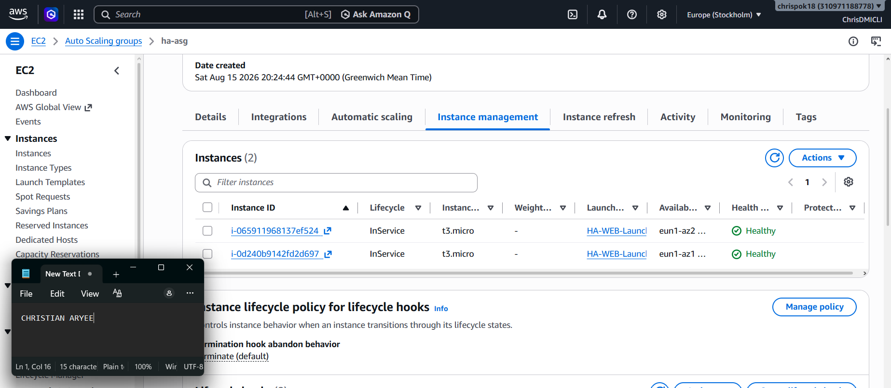

---

#### Screenshot 20 — Target group showing healthy targets after replacement

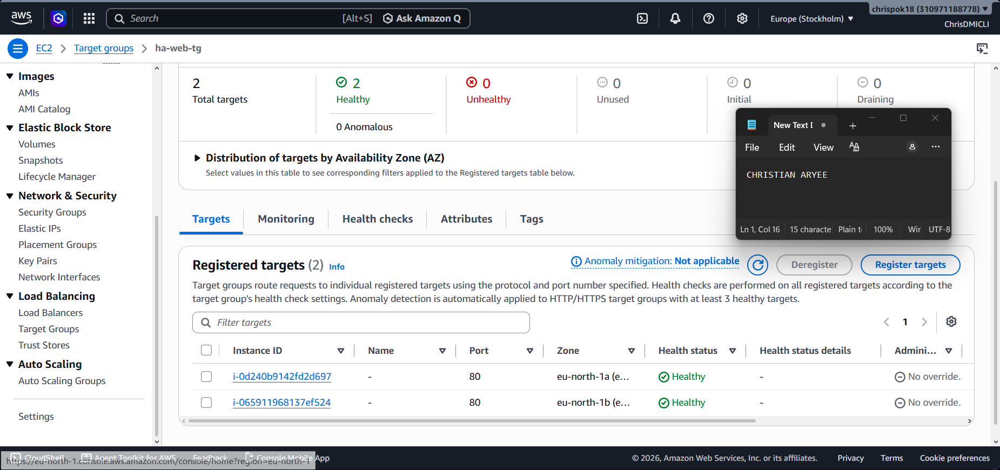

---

#### Screenshot 21 — Evidence that an instance was removed, detached, placed in Standby, or stopped in one Availability Zone

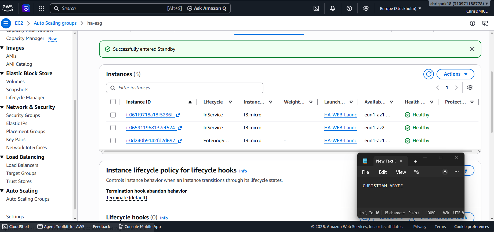

---

#### Screenshot 22 — Browser showing that the ALB DNS endpoint still works during the change

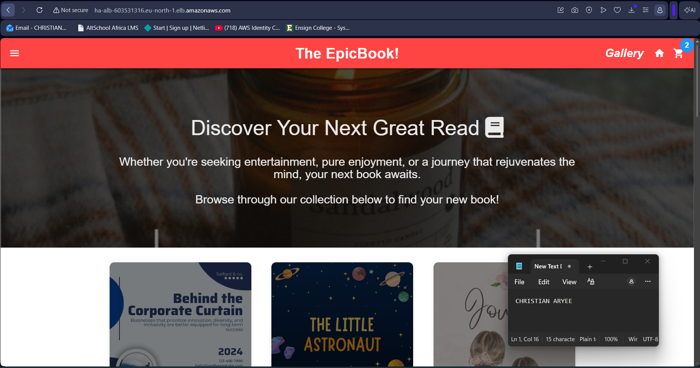

---

# Task 9 — Architecture and Test-Results Summary

## Goal

Summarize the VPC/subnet layout, the ALB and Auto Scaling Group setup, the private Multi-AZ RDS setup, and the results of both high-availability tests.

### Evidence

#### Screenshot 23 — A simple architecture diagram, which may be hand-drawn, or an AWS console overview showing the components

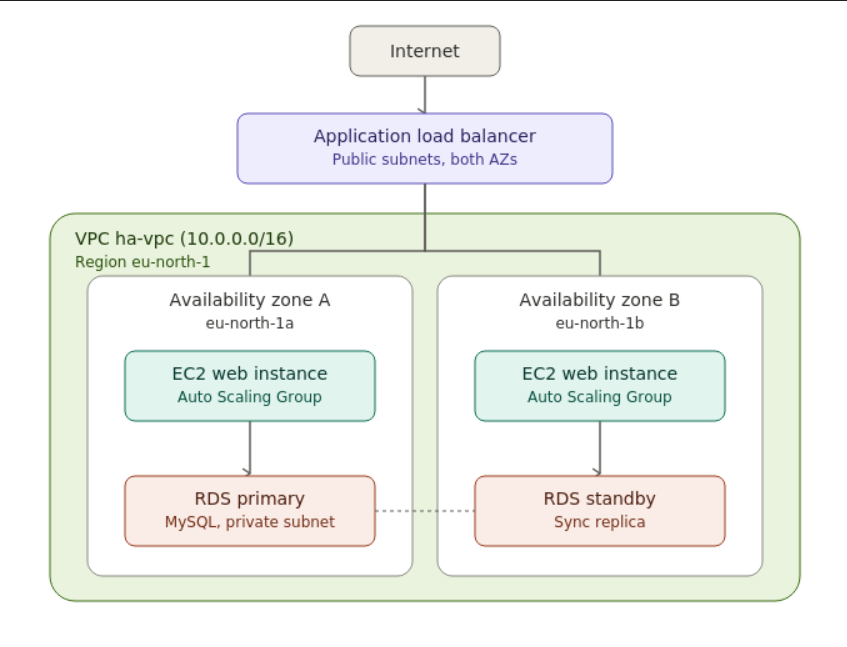

---

### Notes

Summarize the VPC and subnets across the two Availability Zones.

ha-vpc (10.0.0.0/16) spans two AZs in eu-north-1 (Stockholm). Each AZ has a public subnet (for the ALB and NAT Gateway) and a private subnet (for web and DB tiers): ha-public-subnet-a (10.0.1.0/24) and ha-public-subnet-b (10.0.2.0/24) in the public tier, ha-private-subnet-a (10.0.11.0/24) and ha-private-subnet-b (10.0.12.0/24) in the private tier. An Internet Gateway gives the public subnets internet access; a NAT Gateway in the public subnet lets private-subnet resources reach the internet outbound without being publicly reachable. Separate route tables route public subnet traffic through the IGW and private subnet traffic through the NAT Gateway.

Summarize the ALB and Auto Scaling Group setup.

The Application Load Balancer sits in both public subnets, distributing HTTP traffic across two AZs. Behind it, ha-asg runs a Launch Template (HA-WEB-Launch-Template, using a pre-baked AMI) with desired/min capacity of 2 and max of 4, keeping exactly one instance running per AZ under normal conditions. The ASG registers instances directly into the ALB's target group (ha-web-tg) and automatically replaces any instance that fails health checks.

Summarize the private Multi-AZ RDS setup.

The database tier is a Multi-AZ RDS instance (ha-db) deployed across a DB subnet group spanning both private subnets, with a synchronous standby in the second AZ. It's reachable only from the web tier's security group on port 3306, with no public access. Multi-AZ gives automatic failover to the standby if the primary AZ or instance becomes unavailable.

Summarize the results of both high-availability tests.

Test A (instance failure): manually terminating one ASG-managed web instance triggered automatic replacement — the ASG detected the unhealthy/terminated instance and launched a new one to restore desired capacity, which then registered as Healthy in the target group. The ALB continued serving traffic throughout via the remaining healthy instance, with no observed downtime.

Test B (AZ impact): putting one instance into Standby removed it from active service and the target group, simulating one AZ losing capacity while desired capacity stayed at 2. The application remained fully reachable through the ALB DNS name the entire time, served by the single remaining healthy instance in the other AZ.

---

# LinkedIn Post (Required)

## Goal

Publish a LinkedIn post about the high-availability build, including the ALB URL (or a redacted screenshot), three to five lines on what you built and how you tested high availability, and one proof screenshot.

## Evidence

#### LinkedIn Post URL

Paste your LinkedIn post URL here:

`https://www.linkedin.com/posts/caryee_dmibypravinmishra-aws-devops-ugcPost-7494514399727161344-5Bmy/?utm_source=share&utm_medium=member_desktop&rcm=ACoAACP6ElcBF7-kOglrea_3V5oUhVp4NSh-Trc`

---

#### Screenshot of LinkedIn post

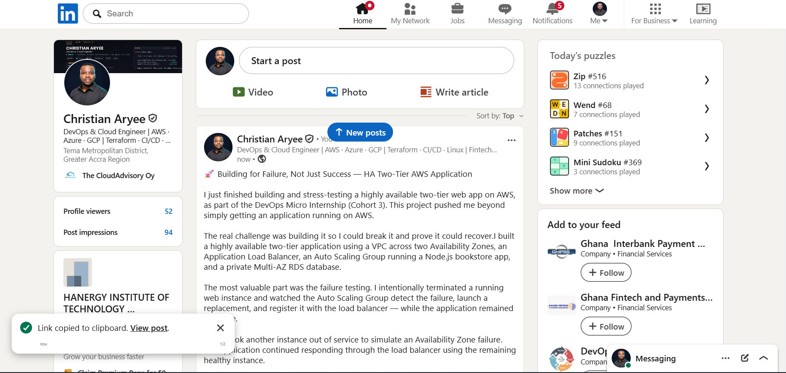

---

# Submission Instructions

- Add all required screenshots in your submission
- Do not expose passwords, connection strings, private keys, or account IDs

---

# Completion Checklist

- [x] Task 1: VPC, four subnets, IGW, NAT Gateway, and route tables created (Screenshots 1–5)
- [x] Task 2: Least-privilege ALB, EC2, and RDS security groups created (Screenshots 6–8)
- [x] Task 3: Private Multi-AZ RDS created (Screenshots 9–10)
- [x] Task 4: Self-configuring Launch Template created and tested (Screenshots 11–12)
- [x] Task 5: ALB created across both public subnets (Screenshots 13–14)
- [x] Task 6: Auto Scaling Group running two instances across two AZs (Screenshots 15–16)
- [x] Task 7: Application verified through the ALB with a database read and write (Screenshots 17–18)
- [x] Task 8: Both high-availability tests completed (Screenshots 19–22)
- [x] Task 9: Architecture and test-results summary completed (Screenshot 23 & Notes)
- [x] LinkedIn post published and URL submitted
- [x] No sensitive data exposed

---

## 📌 About DMI & CloudAdvisory

DevOps Micro Internship (DMI) is a project-based DevOps program run by Pravin Mishra (The CloudAdvisory) focused on real-world execution, systems thinking, and career readiness.

It helps learners build strong DevOps foundations with hands-on experience.

---

## 📌 Resources

- 🌐 DMI Official Website: https://dmi.pravinmishra.com?utm_source=github&utm_medium=readme  
- 🎓 University: https://university.pravinmishra.com?utm_source=github&utm_medium=readme  
- 💬 Discord Community: https://discord.pravinmishra.com?utm_source=github&utm_medium=readme  
- 📝 Blog: https://dmi.pravinmishra.com/blog?utm_source=github&utm_medium=readme  
- ▶️ YouTube Playlist: https://www.youtube.com/playlist?list=PLFeSNDtI4Cho  
- 🔗 Pravin Mishra (LinkedIn): https://www.linkedin.com/in/pravin-mishra-aws-trainer/  
- 🏢 CloudAdvisory (LinkedIn): https://www.linkedin.com/company/thecloudadvisory/

---

*This submission is part of DevOps Micro Internship (DMI) Cohort 3 — Agentic AI Track.*