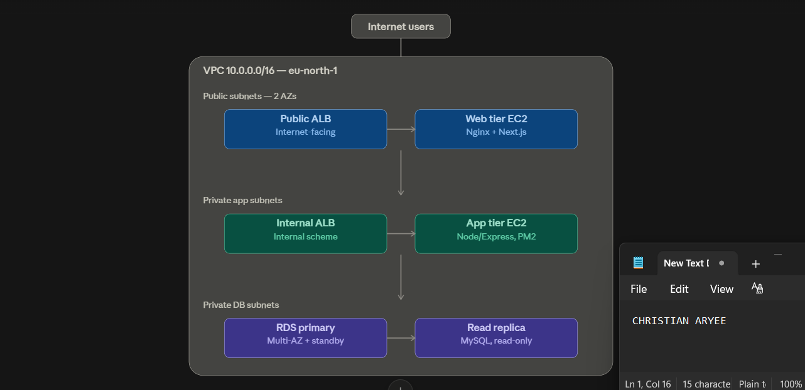
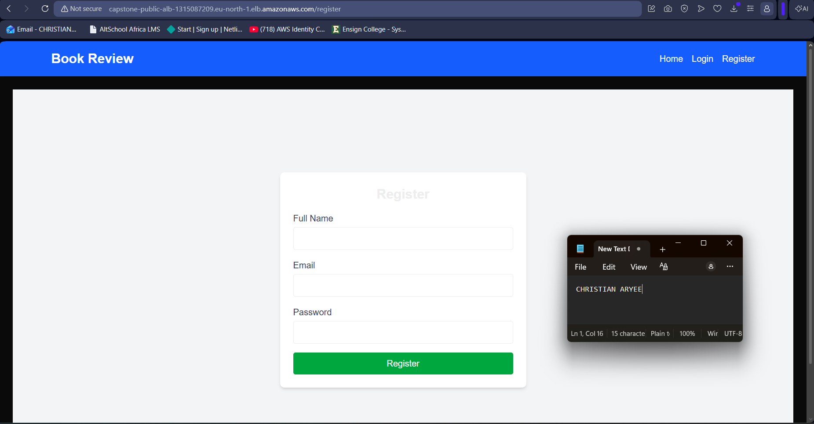
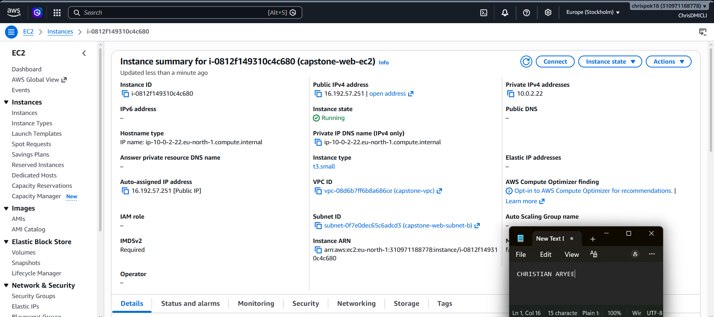
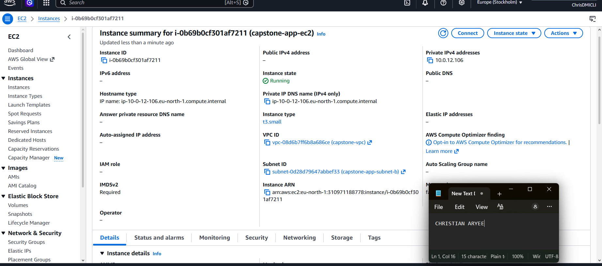
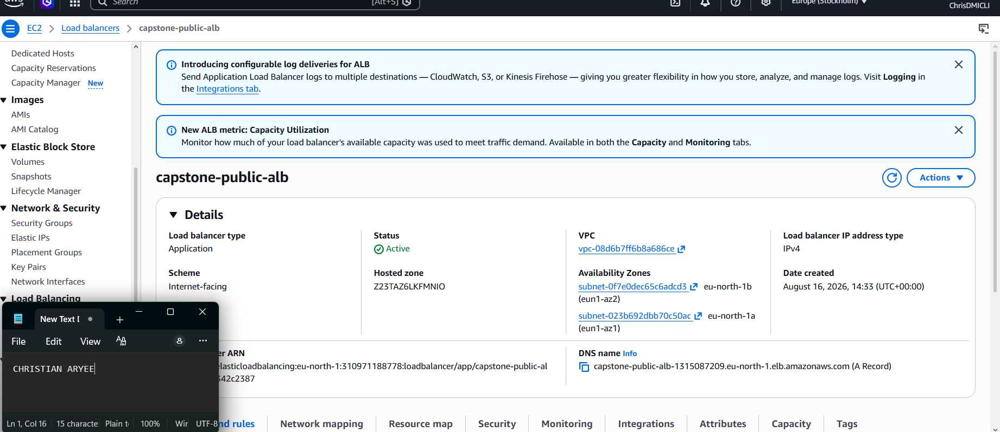
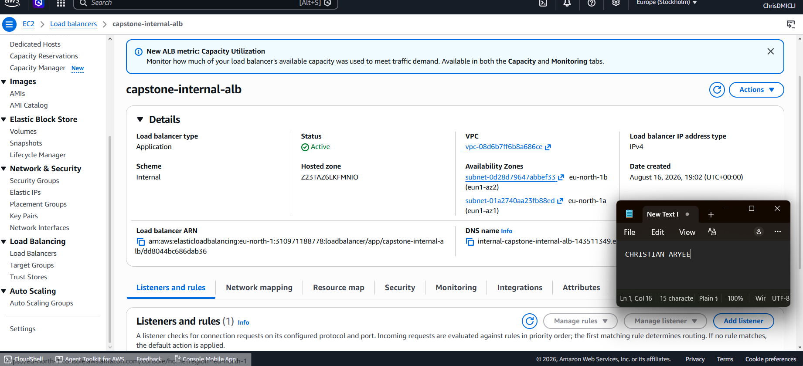
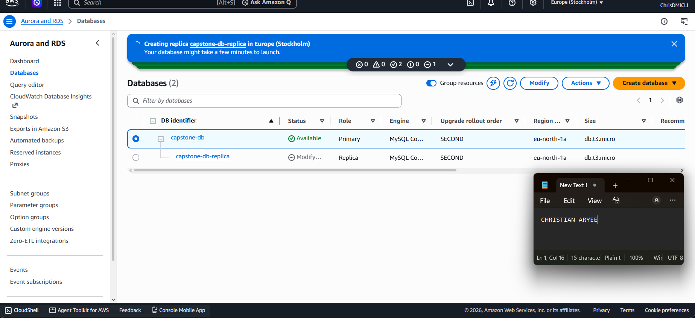
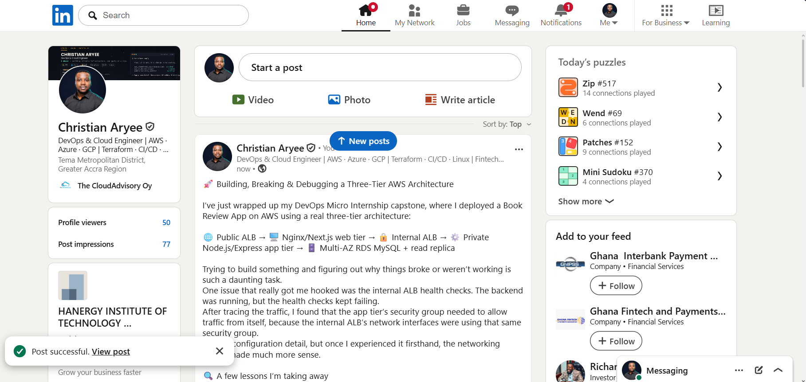

# Assignment 6 — Capstone Assignment — Deploy Book Review App (Three-Tier Architecture) on AWS

Part of the DevOps Micro Internship (DMI) Cohort 3 with Agentic AI

---

## Purpose

This is the most important assignment of the course. You will deploy the Book Review App in a fully production-style three-tier architecture on AWS: a Next.js Web Tier behind Nginx and a public ALB, a private Node.js/Express App Tier behind an internal ALB, and a private Multi-AZ MySQL RDS database with a read replica. You are expected to design, deploy, isolate, debug, and document the result independently.

---

# Task 1 — Architecture Diagram

## Goal

Create an architecture diagram showing the custom VPC (10.0.0.0/16), the six subnets across two Availability Zones (two public Web Tier, two private App Tier, two private Database Tier), the public ALB, Web Tier EC2/Nginx, internal ALB, private App Tier EC2, private Multi-AZ RDS with its read replica, and the permitted traffic flow.

### Evidence

#### Diagram image or link

---

# Task 2 — AWS Region & Services Used

## Goal

Record the AWS Region used and list every AWS service used across networking, compute, load balancing, security, and the database.

### Notes

**Region:**

Europe (Stockholm) — eu-north-1

---

**Services:**

Amazon VPC (custom VPC, 6 subnets across 2 AZs, Internet Gateway, NAT Gateway, route tables)
Amazon EC2 (2 instances — Web tier and App tier, Ubuntu 24.04 LTS)
Elastic Load Balancing — Application Load Balancer (1 public-facing, 1 internal)
Amazon RDS for MySQL (Multi-AZ deployment with standby + 1 read replica)
Amazon VPC Security Groups (4 — ALB, Web, App, DB tiers)
AWS IAM (account-level access)
Nginx (reverse proxy, self-managed on Web tier EC2)
PM2 (process manager for Node.js apps, self-managed on both EC2 tiers)

---

# Task 3 — Public Entry Point

## Goal

Confirm the Book Review App loads through the public ALB DNS name.

### Evidence

#### Public ALB DNS

Paste your public ALB DNS name here:

`http://capstone-public-alb-1315087209.eu-north-1.elb.amazonaws.com`

---

# Task 4 — Evidence Screenshots

## Goal

Capture visual proof of every tier and load balancer.

### Evidence

#### Web EC2

---

#### App EC2

---

#### Public ALB

---

#### Internal ALB

---

#### RDS + Replica

---

#### App UI proof

---

# Task 5 — Summary

## Goal

Summarize what worked in the final deployment, the issues encountered and how each was fixed, and the tools or sources used to research and debug.

### Notes

**What worked:**

The full three-tier architecture deployed successfully: a public-facing ALB routing to an Nginx-fronted Next.js web tier, an internal ALB routing to a private Node.js/Express app tier, and a Multi-AZ RDS MySQL database with a read replica. End-to-end connectivity was verified in the browser — the app correctly serves seeded book data through the entire chain (public ALB → web tier → internal ALB → app tier → RDS). Both compute tiers run under PM2 for process persistence.
---

**Issues + fixes:**

EC2 launches initially failed on t3.micro capacity in both AZs — resolved by switching to t3.small.
Internal ALB's first creation attempt used the wrong scheme (Internet-facing instead of Internal) after a session interruption — caught via the "Reachability may be impacted" warning, deleted and recreated correctly.
App tier target group health checks failed with "Request timed out" even though the backend was confirmed running locally — root cause was the app security group missing a self-referencing rule on port 3001, needed because the internal ALB's own network interfaces sit inside that same security group. Adding an inbound rule allowing port 3001 from the security group itself resolved it.
SSH access was briefly blocked after a home router restart changed the admin IP — updated both web and app security groups' SSH source to the new IP.
Bastion-hop SSH from the web tier to the app tier initially hung with no error — cause was the app security group only allowing SSH from the admin IP, not from the web tier's security group; added a second SSH rule sourced from the web security group.

---

**Tools/sources used:**

AWS Management Console (EC2, VPC, RDS, ELB), AWS documentation for target group health checks and Multi-AZ RDS deployment options, and Claude for real-time troubleshooting and configuration guidance throughout the build.
---

# LinkedIn Post (Required)

## Goal

Publish a LinkedIn post sharing the capstone deployment, including the public ALB DNS (or a redacted screenshot), three to five lines on what you built and why it is production-style, and one proof screenshot.

## Evidence

#### LinkedIn Post URL

Paste your LinkedIn post URL here:

`https://www.linkedin.com/posts/caryee_dmibypravinmishra-aws-devops-ugcPost-7494896857479921664-0szP/?utm_source=share&utm_medium=member_desktop&rcm=ACoAACP6ElcBF7-kOglrea_3V5oUhVp4NSh-Trc`

---

#### Screenshot of LinkedIn post

---

# Submission Instructions

- Add all required screenshots and links in your submission
- Do not expose passwords, RDS credentials, connection strings, private keys, or account IDs

---

# Completion Checklist

- [x] Task 1: Architecture diagram completed
- [x] Task 2: AWS Region and services documented
- [x] Task 3: Public ALB DNS confirmed working
- [x] Task 4: All six evidence screenshots captured (Web Tier, App Tier, both ALBs, RDS + replica, app UI)
- [x] Task 5: Deployment summary completed (what worked, issues/fixes, tools/sources)
- [x] LinkedIn post published and URL submitted
- [x] App Tier and Database Tier confirmed not publicly accessible
- [x] No sensitive data exposed

---

## 📌 About DMI & CloudAdvisory

DevOps Micro Internship (DMI) is a project-based DevOps program run by Pravin Mishra (The CloudAdvisory) focused on real-world execution, systems thinking, and career readiness.

It helps learners build strong DevOps foundations with hands-on experience.

---

## 📌 Resources

- 🌐 DMI Official Website: https://dmi.pravinmishra.com?utm_source=github&utm_medium=readme  
- 🎓 University: https://university.pravinmishra.com?utm_source=github&utm_medium=readme  
- 💬 Discord Community: https://discord.pravinmishra.com?utm_source=github&utm_medium=readme  
- 📝 Blog: https://dmi.pravinmishra.com/blog?utm_source=github&utm_medium=readme  
- ▶️ YouTube Playlist: https://www.youtube.com/playlist?list=PLFeSNDtI4Cho  
- 🔗 Pravin Mishra (LinkedIn): https://www.linkedin.com/in/pravin-mishra-aws-trainer/  
- 🏢 CloudAdvisory (LinkedIn): https://www.linkedin.com/company/thecloudadvisory/

---

*This submission is part of DevOps Micro Internship (DMI) Cohort 3 — Agentic AI Track.*