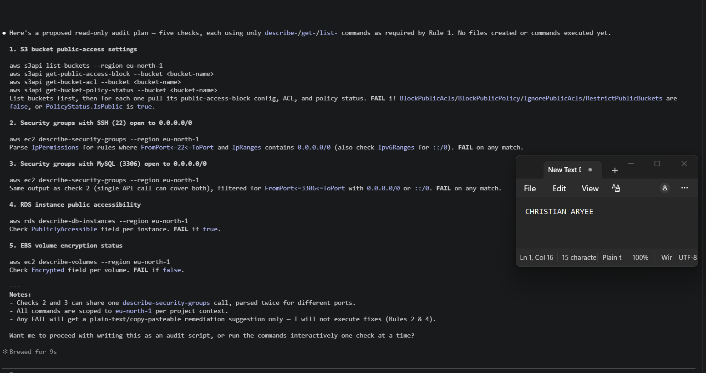
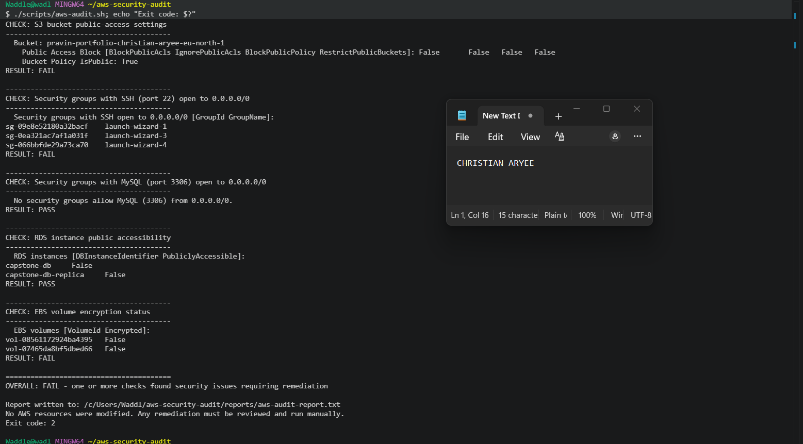
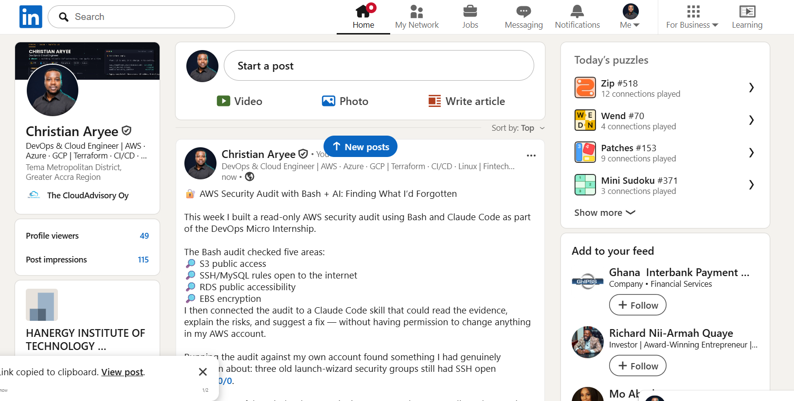

# Assignment 7 — AI-Assisted AWS Security and Cost Audit

Part of the DevOps Micro Internship (DMI) Cohort 3 with Agentic AI

---

## Purpose

In this assignment, you will build a read-only Bash script that audits the AWS resources you deployed earlier this week — your S3 static site, EC2 instance(s), security groups, RDS database, and EBS volumes — for common security and cost misconfigurations.

You will then connect that script to Claude Code as a reusable `/aws-audit` skill that explains what it found and recommends a fix, without ever making the fix itself.

Finally, you will find a real misconfiguration in your own account, apply the fix yourself, and prove it worked with a second audit run.

---

# Task 1 — Confirm Your AWS Resources and Set Up Your Workspace

## Goal

Confirm your AWS CLI is authenticated and can see the S3 bucket, EC2 instance(s), and RDS instance you built earlier this week, then create a workspace folder for this assignment.

### Evidence

#### Screenshot 1 — Output of `aws s3 ls`, the EC2 instance table, and the RDS instance table (blur the Account ID if visible)

---

#### Screenshot 2 — Output of `pwd` and `find . -maxdepth 4 -type d | sort`

---

### Notes You Must Write (Very Important)

**1. Which resources from this week's earlier assignments did you see in the listings?**

I saw the S3 bucket pravin-portfolio-christian-aryee-eu-north-1, two EC2 instances (capstone-web-ec2 and capstone-app-ec2, both running), and two RDS instances (capstone-db and capstone-db-replica, both available).

**2. Why must you confirm your resources exist before writing an audit script against them?**

If the script references resources that don't exist or have different names/IDs than expected, the AWS CLI calls would return empty or error out, and the audit would give a false sense of security — it might report "no issues found" simply because it found nothing to check, not because the account is actually secure. Confirming resources exist first ensures the audit is actually testing something real.
---

# Task 2 — Define Safety Rules in CLAUDE.md

## Goal

Create a `CLAUDE.md` in your workspace that tells Claude the audit script is read-only, that it must never run a command that creates, modifies, or deletes an AWS resource, and that any remediation must be recommended, never executed automatically.

### Evidence

#### Screenshot 3 — `CLAUDE.md` open in VS Code showing all four sections

---

### Notes You Must Write (Very Important)

**1. Why should Claude never be given permission to run `revoke-security-group-ingress` itself, even if the fix is obviously correct?**

Even a "correct" fix executed automatically removes the human checkpoint that catches context Claude can't see — for example, whether that open port is intentional for a legitimate reason, whether another process depends on it, or whether the timing of the change matters. Keeping a human in the loop for any state-changing AWS command is a basic safety boundary, regardless of how confident the recommendation is.

**2. Which rule prevents Claude from claiming a finding that the report does not support?**

Rule 3 — "Findings Must Be Evidence-Based." It requires every reported finding to be directly backed by the actual audit script output, and explicitly forbids Claude from inferring or guessing at findings not present in the report.
---

# Task 3 — Plan the Audit with Claude Code

## Goal

Ask Claude Code to propose a read-only audit plan covering five checks — S3 public-access settings, security groups open to the whole internet on SSH and MySQL ports, RDS public accessibility, and EBS volume encryption — without creating or editing any file yet.

### Evidence

#### Screenshot 4 — Claude Code showing the five-check plan

---

### Notes You Must Write (Very Important)

**1. Which part of this task represents the Gather phase?**

Claude proposing the five read-only checks and the specific AWS CLI commands to run for each one — before anything is executed or any file is written — represents the Gather phase. It's collecting/planning what evidence to look for, not yet acting on the account.

**2. Did every proposed command start with `describe-`, `get-`, or `list-`? Why does that matter?**

Yes — every command (list-buckets, get-public-access-block, get-bucket-acl, get-bucket-policy-status, describe-security-groups, describe-db-instances, describe-volumes) is read-only. This matters because it guarantees the audit itself can never accidentally change AWS account state — the whole safety model in CLAUDE.md depends on this constraint being followed at the planning stage, not just enforced after the fact.
---

# Task 4 — Build the AWS Audit Script

## Goal

Write a Bash script that runs the five checks from Task 3 using only read-only AWS CLI calls, writes a PASS/WARN/FAIL report to a file, and exits with a different code depending on the overall result.

Make it executable and confirm it has no syntax errors.

### Evidence

#### Screenshot 5 — Top section of `aws-audit.sh` showing the variables and the checks array

---

#### Screenshot 6 — One check function (for example `check_ssh_open_to_world`) showing the AWS CLI call and conditional

---

#### Screenshot 7 — Output of `bash -n scripts/aws-audit.sh` and `ls -l scripts/aws-audit.sh`

---

### Notes You Must Write (Very Important)

**1. What is stored in the checks array, and how does the loop use it?**

The checks array stores the names of the five check functions (check_s3_public_access, check_ssh_open_to_world, check_mysql_open_to_world, check_rds_public_access, check_ebs_encryption). The main loop iterates over the array and calls each function name dynamically ("$check_fn"), capturing its exit code to determine PASS/WARN/FAIL for that check, then tracks the worst result across all checks to compute the script's overall exit code.

**2. Why does every AWS CLI call in this script use `--query` and `--output text` instead of parsing raw JSON?**

--query applies JMESPath filtering directly in the CLI, returning only the specific fields needed (like PubliclyAccessible or Encrypted) instead of the full JSON response. Paired with --output text, this produces clean, predictable plain-text values that are easy to test with simple Bash comparisons (grep, [ "$x" = "True" ]) without needing a JSON parser like jq.

**3. Why does the script use different exit codes for HEALTHY, WARN, and FAIL?**

Different exit codes let the script communicate severity to whatever calls it — a script runner, a scheduled job, or later the /aws-audit Claude Code skill — without needing to parse the text report itself. Exit 0 means everything's clean, exit 1 flags something that couldn't be fully verified (like an API error) without necessarily being a security hole, and exit 2 signals a real finding that needs remediation. This distinction matters in practice too — my baseline run actually hit exit code 2, confirming three real FAIL findings (public S3 bucket, open SSH security groups, and unencrypted EBS volumes).

---

# Task 5 — Run the Baseline Audit

## Goal

Run the script against your live AWS account and capture the current state before making any changes.

### Evidence

#### Screenshot 8 — Output of `./scripts/aws-audit.sh` showing your Full Name and all five checks

---

#### Screenshot 9 — Output showing the captured exit code and final summary

---

### Notes You Must Write (Very Important)

**1. What is the overall status of your baseline audit?**

FAIL — the script exited with code 2, meaning at least one check found a real security issue.

**2. Did any check return FAIL or WARN? If so, which one, and what evidence did it show?**

Three checks failed: (1) the S3 bucket pravin-portfolio-christian-aryee-eu-north-1 has all four public-access-block settings set to False and a bucket policy with IsPublic: True; (2) three security groups (launch-wizard-1, launch-wizard-3, launch-wizard-4) allow SSH (port 22) from 0.0.0.0/0; (3) both EBS volumes attached to the capstone EC2 instances are unencrypted. The MySQL-open-to-world and RDS-public-accessibility checks both passed.

**3. If every check passed, what does that tell you about the security posture of your account so far?**

Not applicable — the baseline did not pass cleanly, which is actually a more realistic and useful result for this assignment, since it gives a genuine finding to remediate in Task 7.

---

# Task 6 — Build and Run the /aws-audit Skill

## Goal

Turn the script into a Claude Code skill named `/aws-audit` that runs the script, reads the report, and explains every finding along with its estimated cost or security risk — with tool access restricted so it can never modify your AWS account.

### Evidence

#### Screenshot 10 — `SKILL.md` showing the frontmatter, tool restrictions, and safety rules

---

#### Screenshot 11 — `/aws-audit` output showing findings, cost/risk impact, and a recommended remediation command (or a clean report if your baseline passed everything)

---

### Notes You Must Write (Very Important)

**1. Why does this skill have Bash, Read, and Grep, but not Write?**

Bash lets it run the existing audit script and read command output; Read and Grep let it inspect the report file and search within it. It deliberately has no Write (or Edit) tool, so it's structurally incapable of creating or modifying any file — including the audit script itself, the report, or any AWS-side state — no matter what it's asked to do.

**2. What part is performed by Bash, and what part is performed by Claude?**

Bash executes scripts/aws-audit.sh, which makes the actual read-only AWS CLI calls and writes the factual PASS/WARN/FAIL report — that part is entirely deterministic and mechanical. Claude reads that report and adds interpretation on top: explaining what each finding means in plain language, estimating the real-world risk or cost impact, and drafting (but not running) a specific remediation command.

**3. Why is estimating cost/risk impact something the AI adds on top of a plain PASS/FAIL script?**

A bash script can check a boolean condition (is this port open, is this bucket public) but can't reason about why that matters — how much attack surface it creates, what kind of exploit it invites, or how a grading rubric or compliance standard would weigh it. That kind of contextual judgment is exactly what an AI layer adds on top of the script's raw, mechanical output — turning a flat PASS/FAIL list into something a human can actually prioritize and act on.

---

# Task 7 — Fix a Real Finding and Re-Verify

## Goal

Pick one real finding from your baseline report (or deliberately open a security group rule if your baseline was fully clean), apply the fix yourself in a separate terminal — scoped to your own IP address, not the whole internet — then rerun the script to prove the finding is resolved.

### Evidence

#### Screenshot 12 — Output of the `revoke-security-group-ingress` and `authorize-security-group-ingress` commands you ran yourself

---

#### Screenshot 13 — Rerun of `./scripts/aws-audit.sh` showing the finding is now PASS

---

### Notes You Must Write (Very Important)

**1. Which exact finding did you fix, and what command did you run?**

I fixed the "SSH open to 0.0.0.0/0" finding for security group sg-09e8e52180a32bacf (launch-wizard-1). I ran aws ec2 revoke-security-group-ingress to remove the rule allowing SSH from 0.0.0.0/0, then aws ec2 authorize-security-group-ingress to add a new rule scoped to my own IP address only.

**2. Why did you scope the new rule to your own IP address instead of leaving it open to `0.0.0.0/0`?**

0.0.0.0/0 means "any IP address on the internet," which allows anyone in the world to attempt SSH login against instances using that group — a top target for automated brute-force and credential-stuffing bots. Scoping the rule to my own IP with /32 means only my exact current IP can reach port 22, closing that exposure entirely while still preserving my own access.

**3. Did Claude execute the remediation command, or did you? Why does that matter?**

I ran both commands myself, directly in my terminal — Claude Code only proposed them as suggested text. This matters because a human stays the final decision-maker on any change to live AWS infrastructure; even a correct-looking fix should be reviewed and consciously executed by a person, not run automatically by an AI agent.

**4. Which phase of the Agentic Loop does the Bash script represent? Which phase does Claude's explanation represent? Which phase is you running the fix?**

The Bash script represents the Gather phase — collecting factual evidence via read-only AWS CLI calls. Claude's explanation (risk context, cost impact, prioritized findings, suggested commands) represents the Reason/Recommend phase. Me actually running the revoke/authorize commands myself represents the Act phase — and critically, that phase stayed with the human, not the AI.

---

# LinkedIn Post (Required)

## Goal

Create a LinkedIn post including:

- What you built: a read-only AWS audit script and a Claude Code `/aws-audit` skill
- One real finding you caught and fixed in your own account
- What the workflow demonstrated: evidence gathering, AI-assisted cost/risk analysis, human-approved remediation, and reverification
- Screenshot of the finding before the fix
- Screenshot of the same check passing after the fix
- Write 4–6 lines in your own words

Suggested tags:

`#DMIByPravinMishra #AWS #AgenticAI #ClaudeCode #DevOps`

### Evidence

#### LinkedIn Post URL

Paste your LinkedIn post URL here:

`https://www.linkedin.com/posts/caryee_dmibypravinmishra-aws-agenticai-share-7495234115667984384-flV_/?utm_source=share&utm_medium=member_desktop&rcm=ACoAACP6ElcBF7-kOglrea_3V5oUhVp4NSh-Trc`

---

#### Screenshot of Published LinkedIn Post

---

# Submission Instructions

Complete all tasks in sequence.

Your submission must include:

- All 13 required task screenshots
- Answers to every **Notes You Must Write** question
- `CLAUDE.md`
- `scripts/aws-audit.sh`
- `.claude/skills/aws-audit/SKILL.md`
- `reports/aws-audit-report.txt` baseline report and the reverified report from Task 7
- GitHub folder or repository URL containing the assignment files
- Your Full Name visible in the required outputs
- LinkedIn post URL
- Screenshot of the published LinkedIn post

Submit only a Google Doc link.

Add the GitHub URL inside the Google Doc.

Follow the Assignment Submission Guidelines.

---

# Completion Checklist

- [x] Task 1: AWS resources confirmed and workspace created (Screenshots 1–2)
- [x] Task 2: `CLAUDE.md` created with project context and safety rules (Screenshot 3)
- [x] Task 3: Claude produced a read-only five-check audit plan before any script existed (Screenshot 4)
- [x] Task 4: `aws-audit.sh` built, executable, and passes `bash -n` (Screenshots 5–7)
- [x] Task 5: Baseline audit captured and saved with Full Name visible (Screenshots 8–9)
- [x] Task 6: `/aws-audit` skill loads and runs successfully with no Write permission (Screenshots 10–11)
- [x] Task 7: A real finding was fixed by you and reverified as PASS (Screenshots 12–13)
- [x] Skill never executed a remediation command
- [x] New security group rule is scoped to your own IP, not `0.0.0.0/0`
- [x] All 13 required task screenshots are included
- [x] All "Notes You Must Write" questions are answered in your own words
- [x] No AWS credentials or unblurred account IDs exposed
- [x] LinkedIn post published and URL submitted
- [x] GitHub URL included in the Google Doc
- [x] Google Doc is accessible
- [x] Link tested in incognito mode

---

# Final Submission

Submit only your Google Doc link.

### Question

Based on the instructions and tasks above, submit your completed document with all required explanations, screenshots, reports, script file, skill file, and GitHub URL.

`Add your Google Doc link here`

---

## 📌 About DMI & CloudAdvisory

DevOps Micro Internship (DMI) is a project-based DevOps program run by Pravin Mishra (The CloudAdvisory) focused on real-world execution, systems thinking, and career readiness.

It helps learners build strong DevOps foundations with hands-on experience.

---

## 📌 Resources

- 🌐 DMI Official Website: https://dmi.pravinmishra.com?utm_source=github&utm_medium=readme  
- 🎓 University: https://university.pravinmishra.com?utm_source=github&utm_medium=readme  
- 💬 Discord Community: https://discord.pravinmishra.com?utm_source=github&utm_medium=readme  
- 📝 Blog: https://dmi.pravinmishra.com/blog?utm_source=github&utm_medium=readme  
- ▶️ YouTube Playlist: https://www.youtube.com/playlist?list=PLFeSNDtI4Cho  
- 🔗 Pravin Mishra (LinkedIn): https://www.linkedin.com/in/pravin-mishra-aws-trainer/  
- 🏢 CloudAdvisory (LinkedIn): https://www.linkedin.com/company/thecloudadvisory/

---

*This submission is part of DevOps Micro Internship (DMI) Cohort 3 — Agentic AI Track.*