# Assignment 5 — Deploy Book Review App in Your Favorite Cloud (Agentic Terraform Project)

Part of the DevOps Micro Internship (DMI) Cohort 3 with Agentic AI

---

## Purpose

This is the most important assignment of the Terraform section. You will deploy the Book Review App in a production-style three-tier architecture using Terraform on your choice of AWS or Azure — six subnets across two Availability Zones, tier-specific security rules, public and internal load balancers, Next.js/Node.js on Ubuntu VMs, and a private managed MySQL database with a read replica. This assignment is agent-assisted: you may use Claude Code, ChatGPT, or another LLM tool to help design, generate, debug, and improve the infrastructure.

---

# Task 1 — VPC/VNet and Subnet Setup

## Goal

Create a custom VPC/VNet (10.0.0.0/16) with six subnets across two Availability Zones: two public Web Tier subnets, two private App Tier subnets, and two private Database Tier subnets, implemented with Terraform.

### Evidence

#### Screenshot 1 — VPC or VNet details showing 10.0.0.0/16

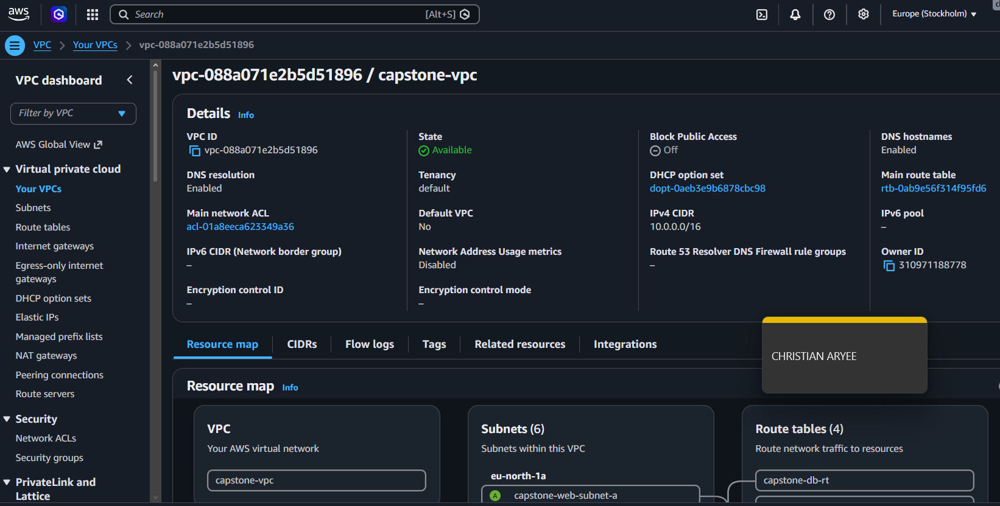

---

#### Screenshot 2 — Subnet list showing all six subnets, their tiers, CIDR ranges, and Availability Zones

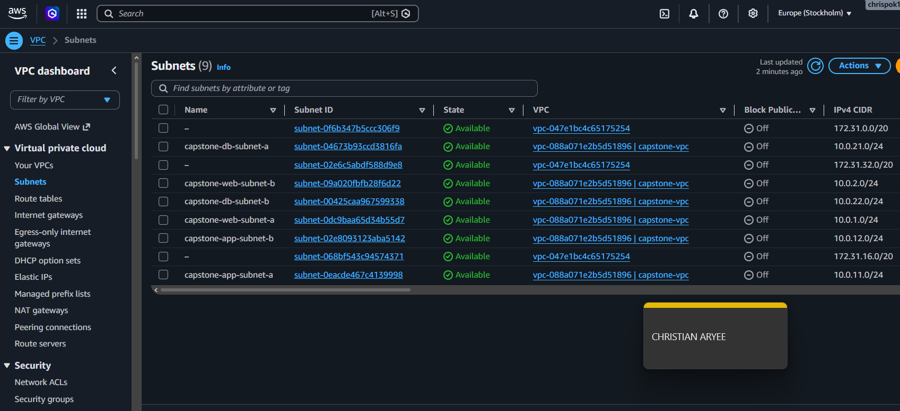

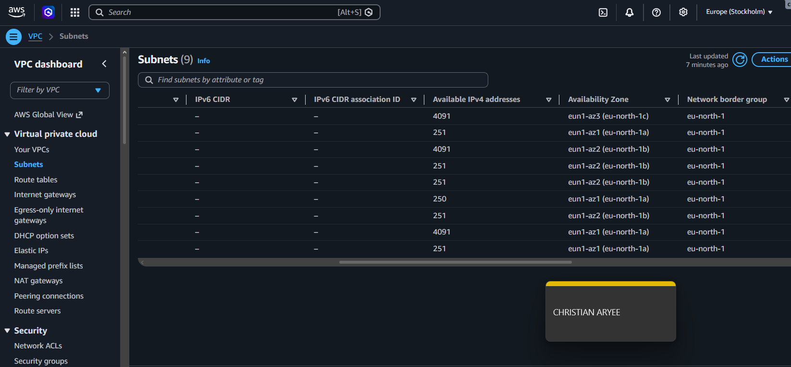

---

#### Screenshot 3 — Terraform plan or cloud networking view showing the required routing and tier isolation

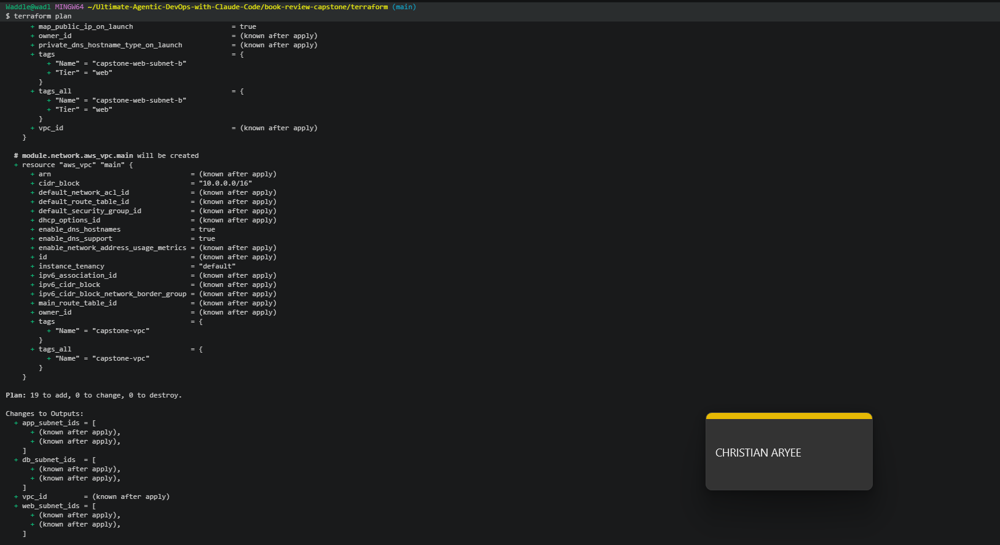

---

# Task 2 — Security Groups/NSGs and Load Balancers

## Goal

Configure tier-specific Security Groups/NSGs (Web Tier HTTP 80, App Tier 3001 only from Web Tier, Database Tier 3306 only from App Tier), and create a public load balancer for the frontend and an internal load balancer for the backend, all with Terraform.

### Evidence

#### Screenshot 4 — Web, App, and Database Security Group or NSG rules

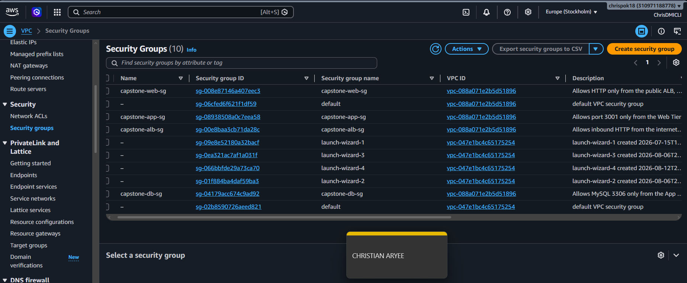

---

#### Screenshot 5 — Public frontend load balancer configuration

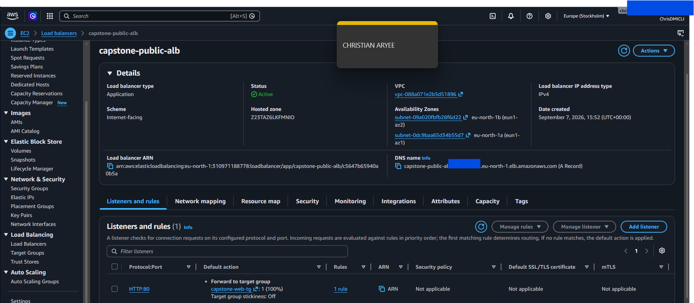

---

#### Screenshot 6 — Internal backend load balancer configuration

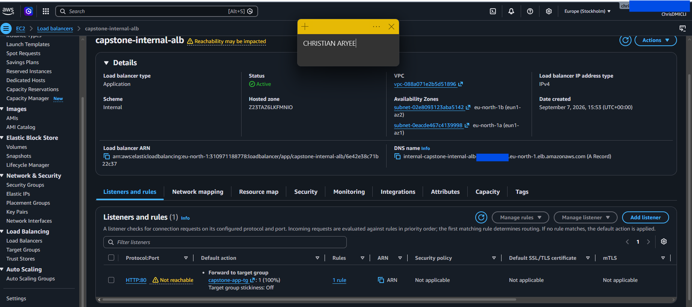

---

#### Screenshot 7 — Healthy frontend and backend targets or backend pools

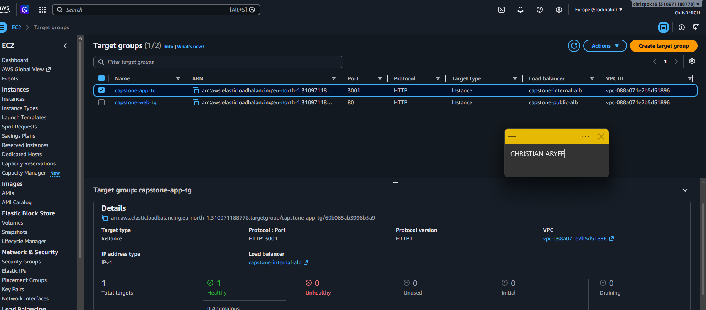

---

# Task 3 — VMs and Application Deployment

## Goal

Deploy the Next.js Web Tier behind Nginx on port 80 in the public subnets, and the Node.js App Tier on port 3001 in the private subnets (no Elastic IPs/Public IPs on private VMs), with the frontend reaching the backend through the internal load balancer.

### Evidence

#### Screenshot 8 — EC2 or Azure VM dashboard showing the frontend and backend VMs

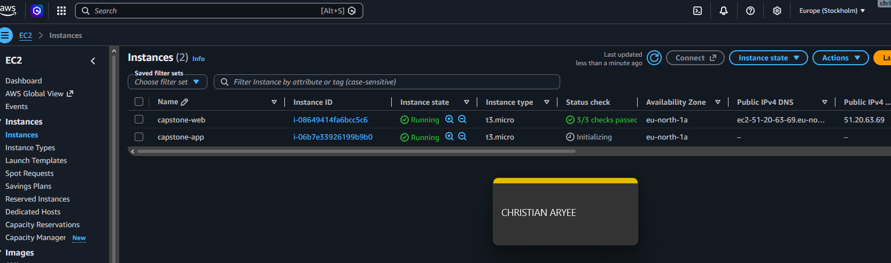

---

#### Screenshot 9 — Nginx status or frontend response on the Web Tier

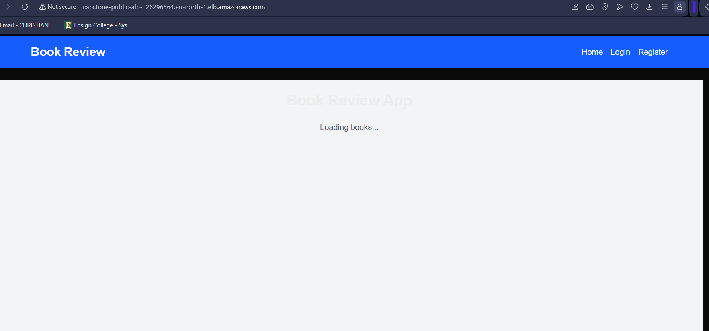

---

#### Screenshot 10 — Backend API response through the permitted internal path

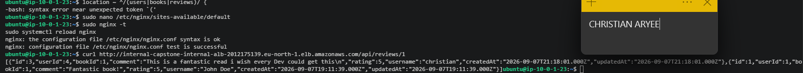

---

# Task 4 — MySQL Database Setup

## Goal

Deploy a private managed MySQL database (Amazon RDS Multi-AZ or Azure Database for MySQL Flexible Server) with a read replica, restricted to the App Tier on port 3306, and validate the Book Review App homepage, login, review flow, backend API, and database integration through the public load balancer.

### Evidence

#### Screenshot 11 — Amazon RDS or Azure Database dashboard showing the primary database and read replica

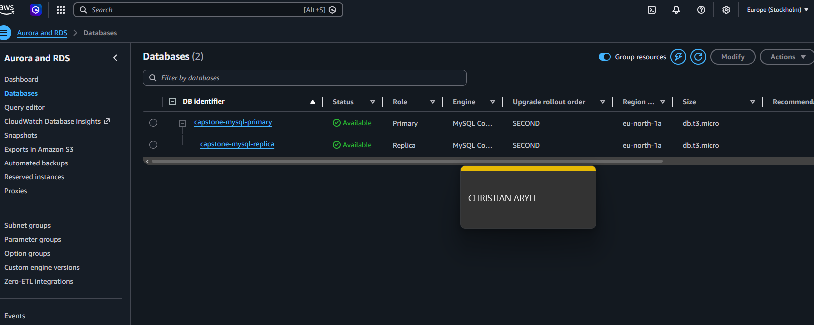

---

#### Screenshot 12 — Evidence of private database networking and permitted App Tier access

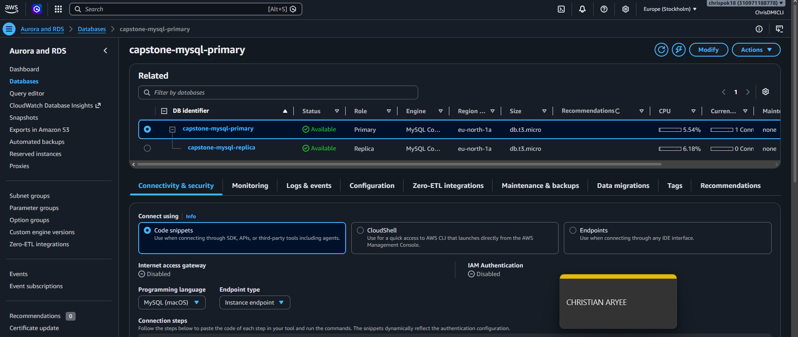

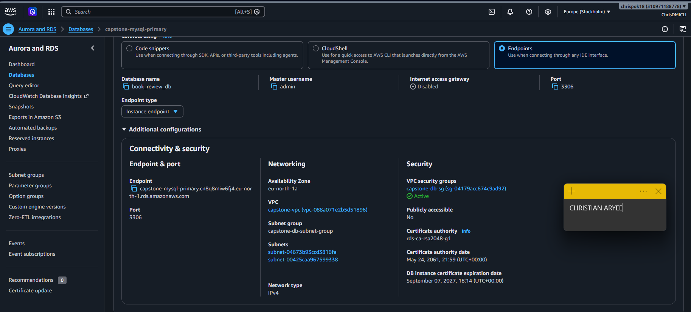

---

#### Screenshot 13 — Functional Book Review App homepage and login flow

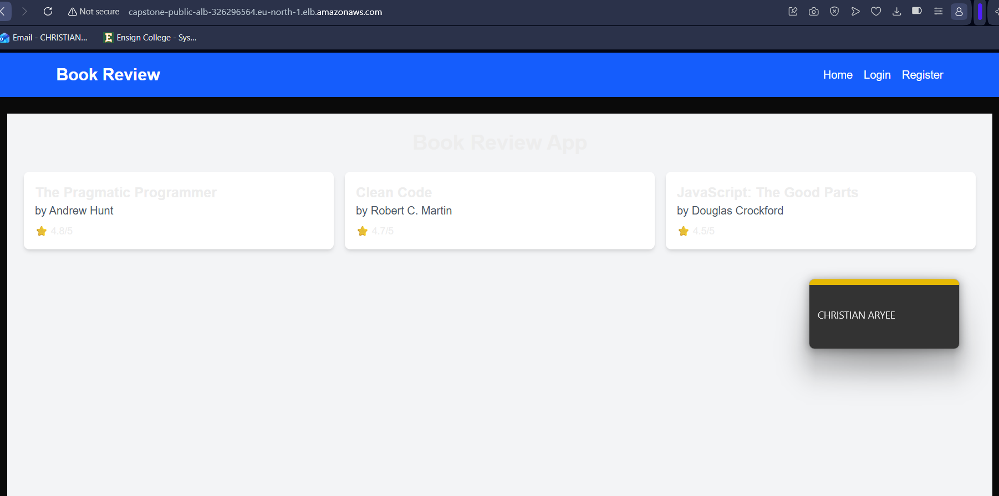

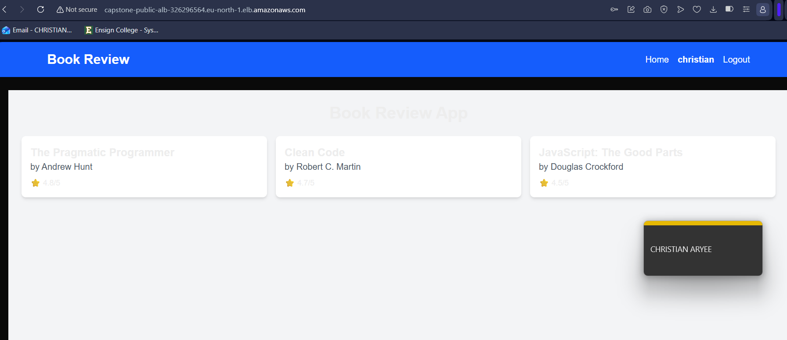

---

#### Screenshot 14 — Functional review flow with working backend API and database integration

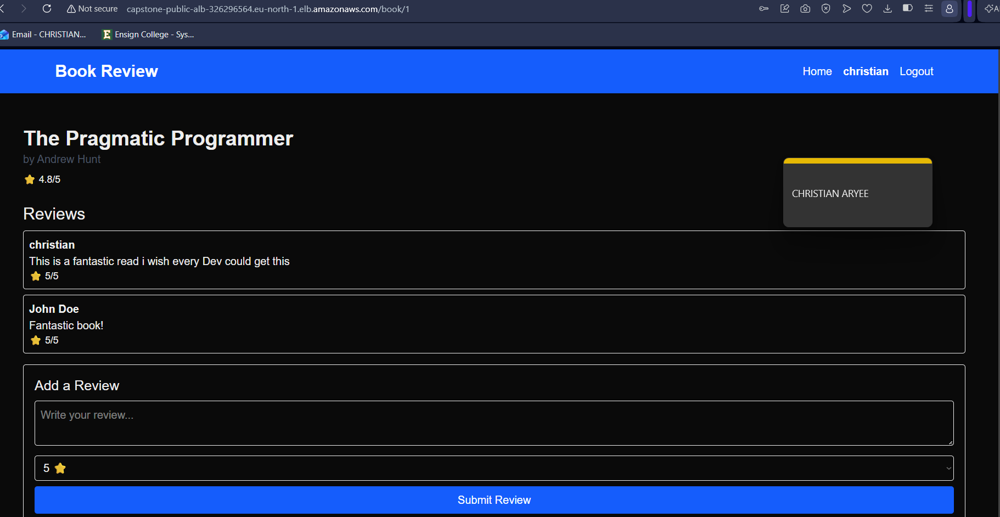

---

#### Screenshot 15 (optional) — Application logs or terminal output

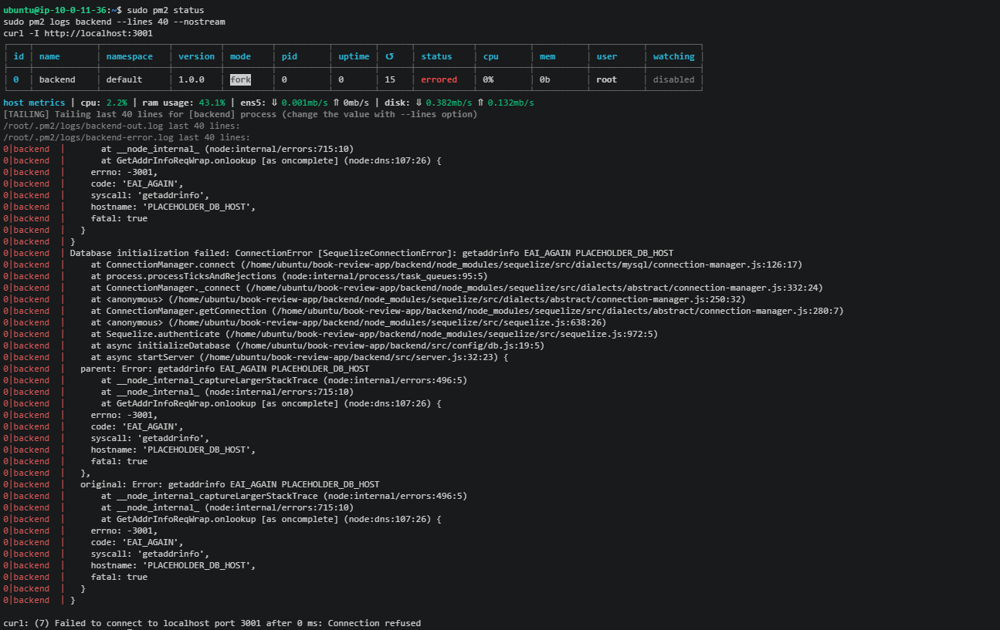

---

### Notes

Report the cloud platform used (AWS or Azure), your Terraform code structure (`main.tf`, `variables.tf`, `outputs.tf`, and supporting files), a link/description of your architecture diagram, and the Public Load Balancer DNS used to access the frontend.

Cloud Platform Used

AWS (Amazon Web Services), region eu-north-1 (Stockholm).

Terraform Code Structure

The project uses a modular structure, separating each layer of the architecture into its own reusable module:

book-review-capstone/terraform/
├── main.tf                  # Root config — calls all 4 modules, sets AWS provider/region
├── variables.tf             # Root input variables (region, CIDRs, project name, db_password)
├── outputs.tf                # Root outputs — VPC ID, subnet IDs, ALB DNS names, DB endpoint, app private IP
├── terraform.tfvars          # Sensitive values (db_password) — gitignored, never committed
├── .gitignore                 # Excludes capstone-key, capstone-key.pub, *.tfstate, terraform.tfvars
├── capstone-key / capstone-key.pub   # SSH key pair for EC2 access (private key gitignored)
└── modules/
    ├── network/              # VPC, 6 subnets, IGW, NAT Gateway, route tables
    │   ├── main.tf
    │   ├── variables.tf
    │   └── outputs.tf
    ├── security/               # 4 security groups (ALB, Web, App, DB) — least-privilege chaining
    │   ├── main.tf
    │   ├── variables.tf
    │   └── outputs.tf
    ├── load-balancer/          # Public ALB + internal ALB, target groups, listeners
    │   ├── main.tf
    │   ├── variables.tf
    │   └── outputs.tf
    ├── compute/                # EC2 instances (web + app), user-data scripts, target group attachments
    │   ├── main.tf
    │   ├── variables.tf
    │   ├── outputs.tf
    │   ├── web-userdata.sh
    │   └── app-userdata.sh
    └── database/               # RDS MySQL primary (Multi-AZ) + read replica, DB subnet group
        ├── main.tf
        ├── variables.tf
        └── outputs.tf

Each module takes its dependencies as input variables (e.g., the compute module receives subnet IDs from network, security group IDs from security, and target group ARNs from load_balancer) and exposes its key resource IDs as outputs for the next module to consume — keeping the modules independently readable while wiring together correctly through the root main.tf.

Architecture Diagram

(Insert your Draw.io/Lucidchart link or embedded image here — it should show the VPC, 6 subnets across 2 AZs, the public and internal ALBs, the web/app tiers, and the primary + replica MySQL setup, matching the "Screenshots #1–3" evidence above.)

Public Load Balancer DNS

capstone-public-alb-326296564.eu-north-1.elb.amazonaws.com

This is the single entry point for the deployed application — the frontend is only reachable through this DNS name, with the app, backend, and database all sitting in private subnets behind it.
---

# LinkedIn Post (Required)

## Goal

Publish a LinkedIn post about what you achieved in this assignment, with public or "Anyone" visibility.

## Evidence

#### LinkedIn Post URL

Paste your LinkedIn post URL here:

`https://www.linkedin.com/posts/caryee_dmibypravinmishra-devops-aws-ugcPost-7502844610474364928-23Dq/?utm_source=share&utm_medium=member_desktop&rcm=ACoAACP6ElcBF7-kOglrea_3V5oUhVp4NSh-Trc`

---

#### Screenshot 16 — Published LinkedIn post showing the text and at least one image or proof

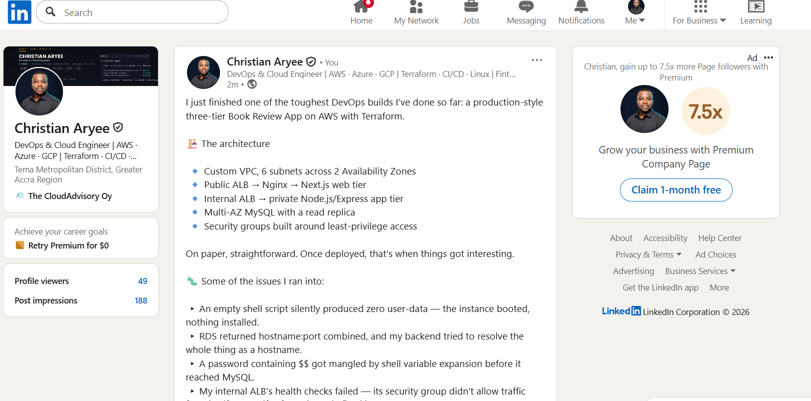

---

# Submission Instructions

- Add all required screenshots in your submission
- Include your architecture diagram and Public Load Balancer DNS
- Do not expose passwords, keys, tokens, database credentials, or Terraform state secrets

---

# Completion Checklist

- [x] Task 1: Six-subnet VPC/VNet created across two AZs with Terraform (Screenshots 1–3)
- [x] Task 2: Tier-specific security rules and load balancers configured (Screenshots 4–7)
- [x] Task 3: Web and App Tier VMs deployed with correct public/private placement (Screenshots 8–10)
- [x] Task 4: Private MySQL with read replica deployed and app validated end to end (Screenshots 11–15)
- [x] Report completed: cloud platform, Terraform structure, diagram, LB DNS (Notes)
- [x] LinkedIn post published and URL submitted (Screenshot 16)
- [x] No sensitive data exposed

---

## 📌 About DMI & CloudAdvisory

DevOps Micro Internship (DMI) is a project-based DevOps program run by Pravin Mishra (The CloudAdvisory) focused on real-world execution, systems thinking, and career readiness.

It helps learners build strong DevOps foundations with hands-on experience.

---

## 📌 Resources

- 🌐 DMI Official Website: https://dmi.pravinmishra.com?utm_source=github&utm_medium=readme  
- 🎓 University: https://university.pravinmishra.com?utm_source=github&utm_medium=readme  
- 💬 Discord Community: https://discord.pravinmishra.com?utm_source=github&utm_medium=readme  
- 📝 Blog: https://dmi.pravinmishra.com/blog?utm_source=github&utm_medium=readme  
- ▶️ YouTube Playlist: https://www.youtube.com/playlist?list=PLFeSNDtI4Cho  
- 🔗 Pravin Mishra (LinkedIn): https://www.linkedin.com/in/pravin-mishra-aws-trainer/  
- 🏢 CloudAdvisory (LinkedIn): https://www.linkedin.com/company/thecloudadvisory/

---

*This submission is part of DevOps Micro Internship (DMI) Cohort 3 — Agentic AI Track.*
