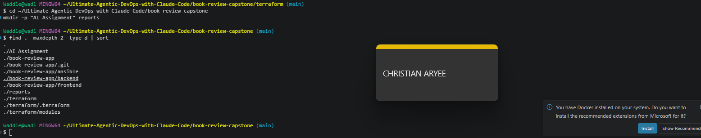
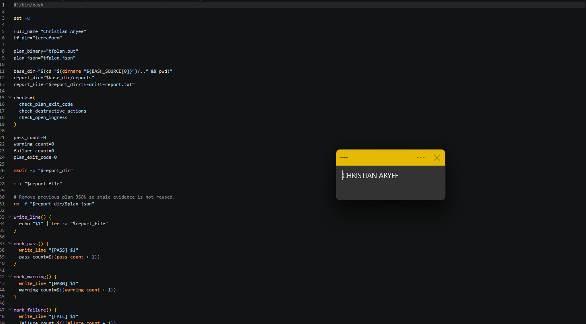
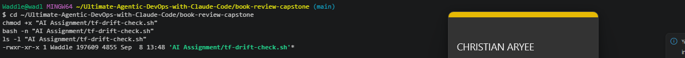
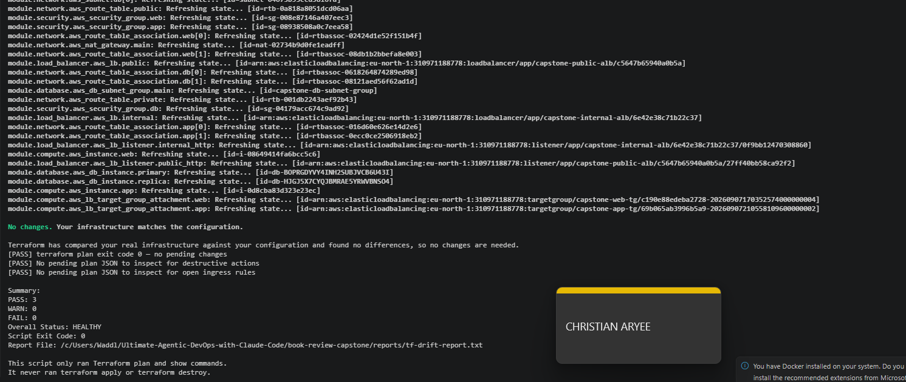
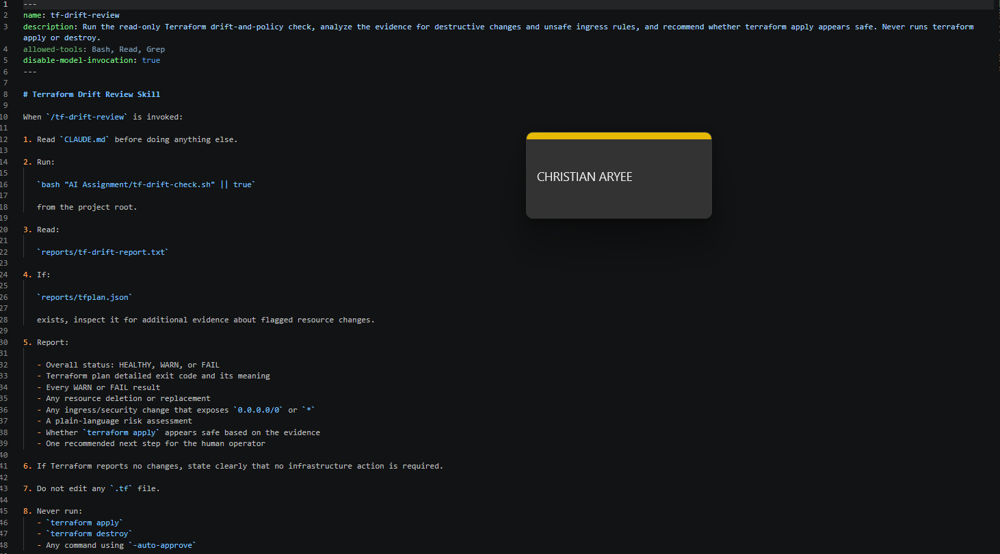
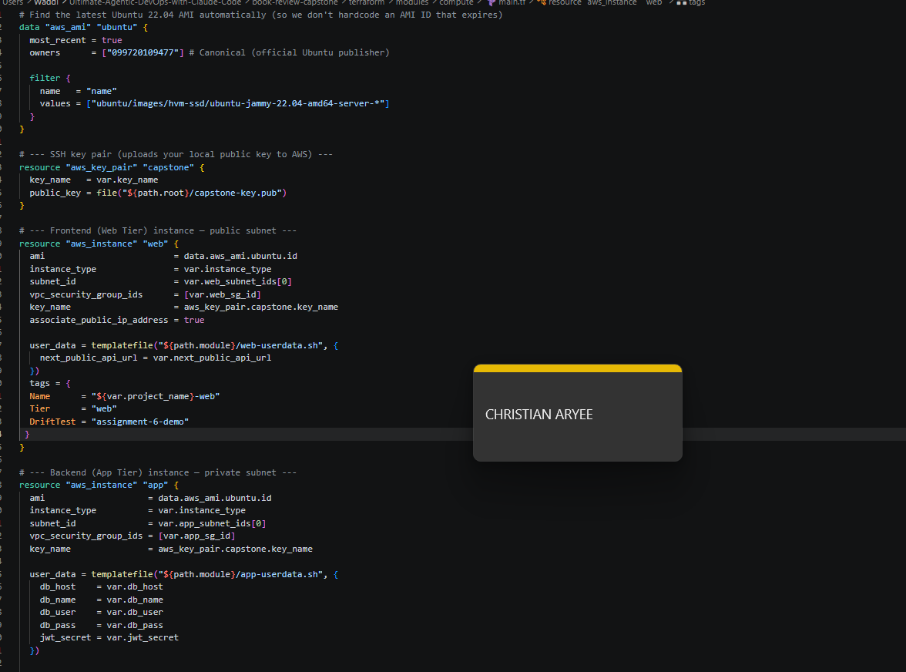
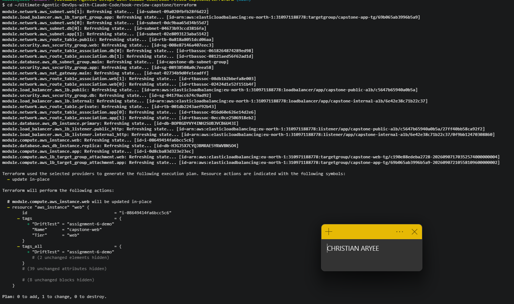

# Assignment 6 — AI-Assisted Terraform Drift and Policy Review

Part of the DevOps Micro Internship (DMI) Cohort 3 with Agentic AI

---

## Purpose

In this assignment, you will build a read-only Bash script that runs `terraform plan`, converts the plan to JSON, and checks it for two specific risks: resources that would be deleted or replaced, and any ingress or security rule that would open access to the whole internet. You will connect that script to Claude Code as a `/tf-drift-review` skill that explains what would change and whether `terraform apply` looks safe — without ever running `apply` or `destroy` itself. You will then deliberately introduce drift into your Terraform project, let the skill catch it, add a hook that blocks `apply` while a drift report is failing, and resolve the drift yourself.

---

# Task 1 — Confirm the Clean Baseline and Create the Workspace

## Goal

Confirm your existing Terraform project reports no pending changes, then create the folders for this assignment's script, skill, and reports.

### Evidence

#### Screenshot 1 — `terraform plan` showing no pending changes

---

#### Screenshot 2 — Folder structure showing the new workspace folders alongside your Terraform project

---

# Task 2 — Create Project Context and Safety Rules in CLAUDE.md

## Goal

Add a `CLAUDE.md` describing the read-only drift-review workflow and the safety rules Claude must follow — never run `apply` or `destroy`, never use `-auto-approve`, only recommend a next step.

### Evidence

#### Screenshot 3 — `CLAUDE.md` open showing the project overview, review workflow, and safety rules

---

# Task 3 — Build the Terraform Drift Check Script

## Goal

Create a Bash script that runs `terraform plan -detailed-exitcode`, converts the plan to JSON with `terraform show -json`, and uses `jq` to flag destructive resource changes and any ingress rule opening access to the whole internet.

### Evidence

#### Screenshot 4 — The script open showing its destructive-change and open-ingress checks

---

#### Screenshot 5 — Terminal showing the script passes a syntax check and is executable

---

# Task 4 — Run the Script Against the Clean Baseline

## Goal

Run the script against your unchanged infrastructure and confirm it reports a healthy result with no destructive changes or open ingress found.

### Evidence

#### Screenshot 6 — Script output showing a healthy result against the clean baseline

---

# Task 5 — Create and Run the /tf-drift-review Skill

## Goal

Turn the script into a `/tf-drift-review` skill that reads the drift report, explains any risk in plain language, and states whether `apply` looks safe — restricted to read-only tools so it can never modify a file or run `apply`/`destroy` itself.

### Evidence

#### Screenshot 7 — Skill file showing the tool restrictions and safety rules

---

#### Screenshot 8 — `/tf-drift-review` output against the healthy baseline

---

# Task 6 — Simulate Drift and Let the Skill Catch It

## Goal

Deliberately introduce a change Terraform did not make — a destructive change or a rule opening access to the whole internet — and confirm the skill flags it and does not run `apply` on its own.

### Evidence

#### Screenshot 9 — The drift you introduced, visible in your Terraform config or the cloud console

---

#### Screenshot 10 — `/tf-drift-review` output flagging the drift and explaining the risk

---

# Task 7 — Add a PreToolUse Hook That Blocks Apply on a Failed Report

## Goal

Extend the Week 2 hooks pattern with a `PreToolUse` hook that blocks any `terraform apply` command while the last drift report's status is failing.

### Evidence

#### Screenshot 11 — `settings.json` showing the new `PreToolUse` hook

---

#### Screenshot 12 — Claude's blocked response when attempting `terraform apply` while the report is failing

---

# Task 8 — Resolve the Drift, Verify, and Write the Review Summary

## Goal

Review the recommendation, resolve the drift yourself with a human-reviewed `terraform apply`, and confirm the hook no longer blocks it once the report is clean again.

### Evidence

#### Screenshot 13 — `terraform apply` completing successfully after your review

---

#### Screenshot 14 — Second `/tf-drift-review` run showing a healthy result

---

### Notes

Explain why this workflow needs both a fixed-rule hook that blocks `apply` outright and an AI skill that explains the risk in plain language — why isn't one of the two enough on its own?

The hook and the skill do two different jobs, and neither one can cover for the other.

The /tf-drift-review skill is the reasoning layer. It reads the plan, explains what's actually changing, and separates a low-risk change (like our tag update in Task 6) from a real risk (the pre-existing open SSH rules it also caught). That judgment call — "this looks safe" vs "this doesn't" — needs an AI that can read context and explain it in plain language. A skill alone isn't enough, though, because it's advisory: nothing stops a human, or Claude Code itself, from ignoring its recommendation and running apply anyway.

The PreToolUse hook is the enforcement layer. It doesn't understand why something failed — it just checks one deterministic fact (does the latest report say Overall Status: FAIL?) and blocks the command if so, every time, with no judgment involved. That's exactly what you want for a high-impact command like terraform apply — a rule that can't be talked out of its answer. But a hook alone isn't enough either, because it can't explain anything. It would have blocked our Task 6 apply attempt without ever telling us the block was really about unrelated SSH rules, not our tag change — which is information a human needs to decide what to actually do next.

Together they cover both halves: the skill explains, the hook enforces. Analysis without enforcement can be ignored; enforcement without analysis leaves the human guessing why they were stopped.
---

# Submission Instructions

Complete all tasks in sequence.

Your submission must include:
- All 14 required screenshots

---

# Completion Checklist

- [x] Task 1: Clean `terraform plan` baseline confirmed and workspace folders created (Screenshots 1–2)
- [x] Task 2: `CLAUDE.md` created with project context and safety rules (Screenshot 3)
- [x] Task 3: Drift check script built, passes syntax check, and is executable (Screenshots 4–5)
- [x] Task 4: Script run against the clean baseline shows a healthy result (Screenshot 6)
- [x] Task 5: `/tf-drift-review` skill created and run against the healthy baseline (Screenshots 7–8)
- [x] Task 6: Drift simulated and correctly flagged by the skill (Screenshots 9–10)
- [x] Task 7: `PreToolUse` hook created and shown blocking `apply` on a failing report (Screenshots 11–12)
- [x] Task 8: Drift resolved with a human-reviewed `apply`, second review shows healthy (Screenshots 13–14)
- [x] Notes question answered

---

## 📌 About DMI & CloudAdvisory

DevOps Micro Internship (DMI) is a project-based DevOps program run by Pravin Mishra (The CloudAdvisory) focused on real-world execution, systems thinking, and career readiness.

It helps learners build strong DevOps foundations with hands-on experience.

---

## 📌 Resources

- 🌐 DMI Official Website: https://dmi.pravinmishra.com?utm_source=github&utm_medium=readme  
- 🎓 University: https://university.pravinmishra.com?utm_source=github&utm_medium=readme  
- 💬 Discord Community: https://discord.pravinmishra.com?utm_source=github&utm_medium=readme  
- 📝 Blog: https://dmi.pravinmishra.com/blog?utm_source=github&utm_medium=readme  
- ▶️ YouTube Playlist: https://www.youtube.com/playlist?list=PLFeSNDtI4Cho  
- 🔗 Pravin Mishra (LinkedIn): https://www.linkedin.com/in/pravin-mishra-aws-trainer/  
- 🏢 CloudAdvisory (LinkedIn): https://www.linkedin.com/company/thecloudadvisory/

---

*This submission is part of DevOps Micro Internship (DMI) Cohort 3 — Agentic AI Track.*
