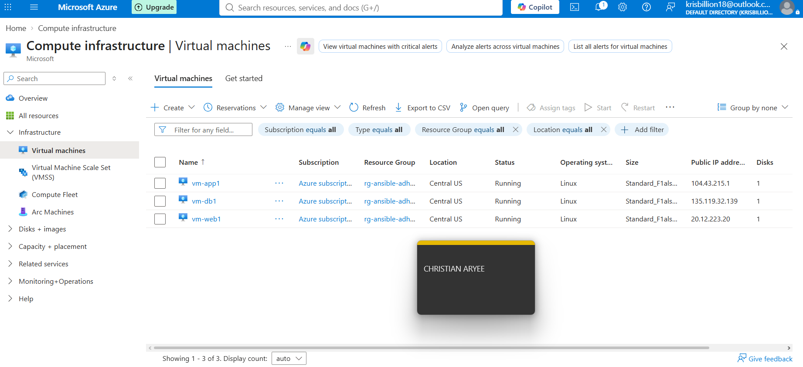
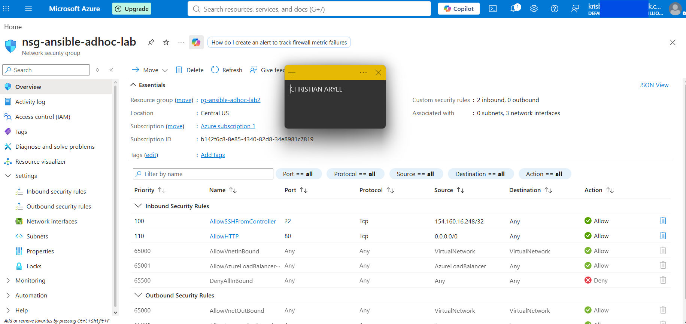
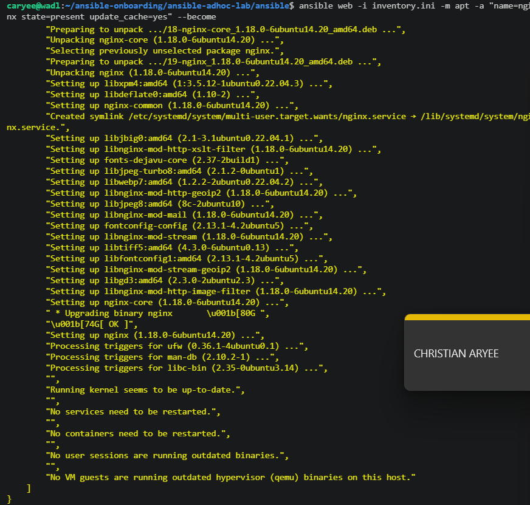
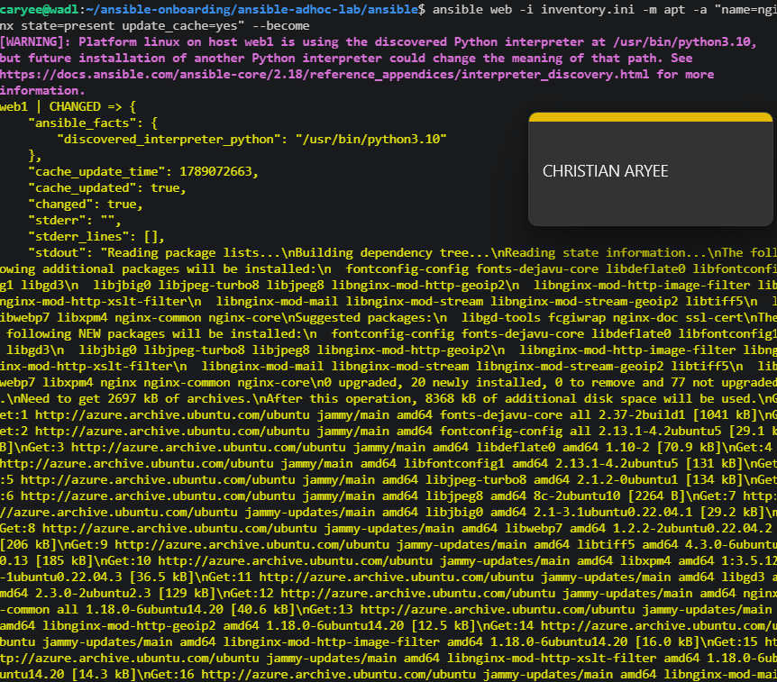
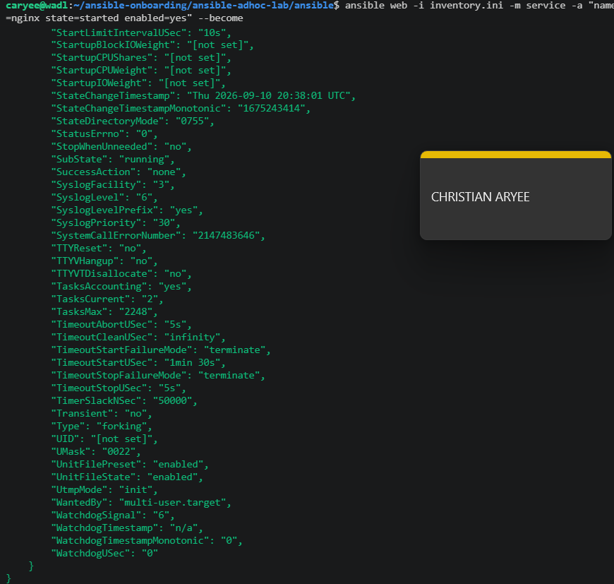

# Assignment 2 — Ad-Hoc Automation on Azure: 4 VMs, Inventory & Passwordless SSH

Part of the DevOps Micro Internship (DMI) Cohort 3 with Agentic AI

---

## Purpose

In this assignment, you will provision four Azure Linux VMs with Terraform, configure passwordless SSH, build a custom Ansible inventory with web/app/db groups, and run ad-hoc commands across individual hosts and groups.

---

# Task 1 — Provision 4 Azure VMs (Terraform)

## Goal

Provision four Ubuntu 22.04 VMs (`web1`, `web2`, `app1`, `db1`, Standard_B1s) with SSH key authentication and public IPs, in a VNet with an NSG allowing SSH (22) and HTTP (80), and output all four public IPs.

### Evidence

#### Screenshot 1 — Terminal showing successful `terraform apply` output and `terraform output public_ips`

---

#### Screenshot 2 — Azure Portal showing all four running Ubuntu VMs

---

#### Screenshot 3 — Network Security Group inbound rules showing SSH 22 and HTTP 80

---

# Task 2 — Configure Passwordless SSH

## Goal

Connect to each of the four VMs as `azureuser` and run `hostname` remotely without a password prompt.

### Evidence

#### Screenshot 4 — Terminal showing successful `hostname` output from all four passwordless SSH tests

---

# Task 3 — Create a Custom Ansible Inventory

## Goal

Create `inventory.ini` mapping VM indices 0–1 to `[web]`, index 2 to `[app]`, and index 3 to `[db]`, with `ansible_user` and `ansible_ssh_private_key_file` set under `[all:vars]`.

### Evidence

#### Screenshot 5 — Editor or terminal showing `inventory.ini` with the web, app, db, and all:vars sections

---

# Task 4 — Run Your First Ansible Ad-Hoc Commands

## Goal

Run `ping`, `whoami`, and `uptime` against all hosts; install and start Nginx on the `web` group with `--become`; install `htop` on all hosts; and run `df -h` on `db` and `free -m` on all hosts.

### Evidence

#### Screenshot 6 — Terminal showing `ansible ping` SUCCESS for all four hosts

---

#### Screenshot 7 — Terminal showing `uptime` output for all four hosts

---

#### Screenshot 8 — Terminal showing Nginx installation and service start on the web group

---

#### Screenshot 9 — Terminal showing `htop` installation on all hosts and group-targeted command output

---

### Notes

Describe an issue you faced and how you fixed it, what you learned, when you'd use an ad-hoc command instead of a playbook, and one challenge you faced during SSH or inventory setup.

While three VMs were successfully provisioned, this deployment hit a real
subscription-wide vCPU core quota of 4 cores (not per-region — confirmed
identical across East US, East Asia, Southeast Asia, Central US, Japan East,
Korea Central, and West US 2). Combined with region-specific SKU capacity
restrictions (East Asia had zero unrestricted 1-vCPU sizes for this
subscription), the original plan of using Standard_B1s repeatedly failed on
SkuNotAvailable errors. The fix: systematically queried Azure's SKU API for
genuinely unrestricted sizes rather than guessing, which surfaced
Standard_F1als_v7 (1 vCPU, Gen2-only) as available in Central US — fitting
all three VMs comfortably under the 4-core cap.

What I learned: cloud quota and capacity constraints are just as real a
design constraint as application requirements. Querying `az vm list-skus`
for actual restriction status (not just whether a size is "listed") saves
significant trial-and-error versus guessing sizes one at a time.

Ad-hoc commands are ideal here because this was a one-time verification and
setup task — installing Nginx and htop, checking connectivity — not a
repeatable deployment I need to version and rerun. I'd reach for a playbook
once these same steps needed to run consistently across environments or be
tracked in source control.

The main SSH/inventory challenge was that Azure Linux VMs only accept RSA
SSH keys, not the ED25519 key generated in Assignment 01 — resolved by
generating a separate `id_rsa_azure` key pair specifically for Azure and
referencing it in `ansible_ssh_private_key_file`.
---

# Submission Instructions

- Add all required screenshots in your submission
- Public IP addresses may be redacted
- Do not expose, upload, or commit the SSH private key

---

# Completion Checklist

- [x] Task 1: Four Azure VMs provisioned with Terraform (Screenshots 1–3)
- [x] Task 2: Passwordless SSH verified on all four VMs (Screenshot 4)
- [x] Task 3: `inventory.ini` created with web/app/db groups (Screenshot 5)
- [x] Task 4: Ad-hoc ping, uptime, Nginx, and htop commands run successfully (Screenshots 6–9)
- [x] Reflection notes written (Notes)
- [x] No private key material exposed

---

## 📌 About DMI & CloudAdvisory

DevOps Micro Internship (DMI) is a project-based DevOps program run by Pravin Mishra (The CloudAdvisory) focused on real-world execution, systems thinking, and career readiness.

It helps learners build strong DevOps foundations with hands-on experience.

---

## 📌 Resources

- 🌐 DMI Official Website: https://dmi.pravinmishra.com?utm_source=github&utm_medium=readme  
- 🎓 University: https://university.pravinmishra.com?utm_source=github&utm_medium=readme  
- 💬 Discord Community: https://discord.pravinmishra.com?utm_source=github&utm_medium=readme  
- 📝 Blog: https://dmi.pravinmishra.com/blog?utm_source=github&utm_medium=readme  
- ▶️ YouTube Playlist: https://www.youtube.com/playlist?list=PLFeSNDtI4Cho  
- 🔗 Pravin Mishra (LinkedIn): https://www.linkedin.com/in/pravin-mishra-aws-trainer/  
- 🏢 CloudAdvisory (LinkedIn): https://www.linkedin.com/company/thecloudadvisory/

---

*This submission is part of DevOps Micro Internship (DMI) Cohort 3 — Agentic AI Track.*
