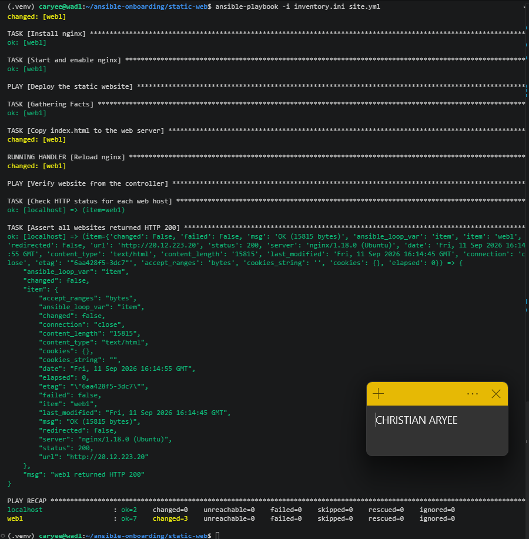
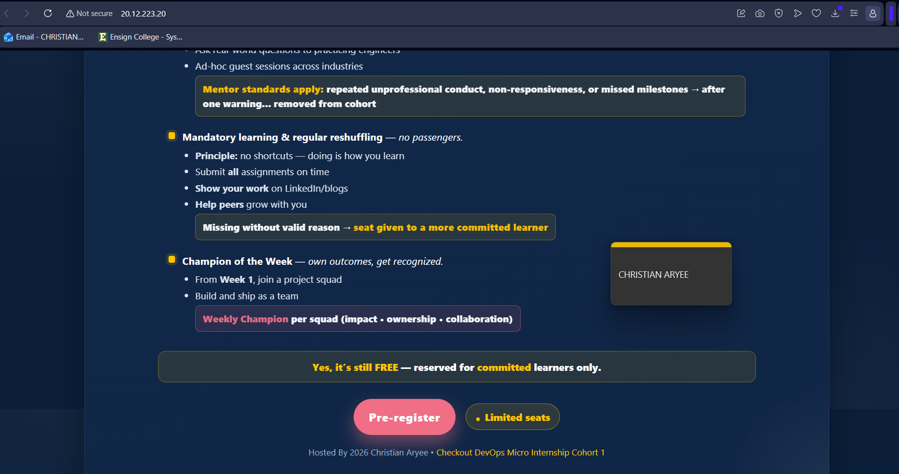

# Assignment 3 — Multi-Play Web Deploy on Azure

Part of the DevOps Micro Internship (DMI) Cohort 3 with Agentic AI

---

## Purpose

In this assignment, you will create one Ansible playbook (`site.yml`) with three plays — install Nginx, deploy a static website with the `copy` module, and verify the deployment from the controller — against the `[web]` group from your existing inventory.

---

# Task 1 — Set Up Folder Layout

## Goal

Create the `static-web` project directory with `inventory.ini`, `site.yml`, a `files/` subdirectory, and `README.md`.

### Evidence

#### Screenshot 1 — Terminal or editor showing the complete `static-web` folder layout

---

# Task 2 — Get the Content

## Goal

Stage `index.html` from `https://github.com/pravinmishraaws/Azure-Static-Website` locally under `static-web/files/`.

### Evidence

#### Screenshot 2 — Editor or terminal showing `files/index.html` staged inside the `static-web` project

---

# Task 3 — Create the Multi-Play Playbook: site.yml

## Goal

Write `site.yml` with three plays: Play 1 (install/start Nginx on `web`), Play 2 (`copy` `files/index.html` to `/var/www/html/index.html` with owner `www-data`/mode `0644`, notifying an Nginx reload handler), and Play 3 (verify every web host with the `uri` module from `localhost`, asserting HTTP 200).

### Evidence

#### Screenshot 3 — Editor showing the three plays in `site.yml`

---

#### Screenshot 4 — Editor showing the copy task, file ownership/mode, handler, uri task, and HTTP 200 assertion

---

# Task 4 — Run the Playbook

## Goal

Run `ansible-playbook -i inventory.ini site.yml` and confirm all plays complete with no failures.

### Evidence

#### Screenshot 5 — Terminal showing the `ansible-playbook` run and final recap with OK/changed results and no failures

---

#### Screenshot 6 — Terminal showing the successful localhost URI verification results

---

# Task 5 — Manual Verification

## Goal

Confirm the deployed static website is reachable directly from a web-server public IP via `curl` and a browser.

### Evidence

#### Screenshot 7 — Browser showing the static website loaded from a web-server public IP

---

### Notes

Describe an issue you faced and how you fixed it, what you learned, why installation and deployment were split into separate plays, and one benefit of using `copy` instead of cloning from Git directly.

The main issue faced was in a prior related assignment (provisioning the
underlying VM), not in this playbook itself: this project reuses the same
web1 VM and inventory built for the Ansible ad-hoc automation assignment,
after working through Azure subscription-wide public IP and vCPU core
quota limits to get that VM running in the first place. Once the VM and
inventory were in place, this playbook ran cleanly on the first real
attempt after a passing syntax check.

What I learned: separating a deployment into distinct plays (install,
deploy, verify) makes each stage independently testable and debuggable.
When the playbook ran a second consideration would be idempotency — the
install play only reports "changed" the first time Nginx is actually
installed, and the copy task only triggers the reload handler when the
file content actually changes, not on every run.

Installation and deployment are split into separate plays because they
change at different rates and for different reasons: Nginx installation
is infrastructure setup that rarely changes once done, while the website
content is expected to be updated frequently. Keeping them separate means
re-running a content deployment never risks re-triggering package
installation logic, and vice versa.

The benefit of using the copy module instead of cloning directly from Git
on each server is control and consistency: the exact same file, from a
single known source on the controller, is pushed to every managed host.
Cloning independently on each server risks each host ending up on a
different commit or branch if the repo changes between runs, and it also
means every managed server needs outbound access to GitHub and git
installed — the copy module needs neither.
---

# Submission Instructions

- Add all required screenshots in your submission
- IP addresses in `inventory.ini` may be redacted
- Do not expose SSH private keys

---

# Completion Checklist

- [x] Task 1: `static-web` project structure created (Screenshot 1)
- [x] Task 2: `index.html` staged under `files/` (Screenshot 2)
- [x] Task 3: Three-play `site.yml` written (Screenshots 3–4)
- [x] Task 4: Playbook run successfully with no failures (Screenshots 5–6)
- [x] Task 5: Site verified manually via browser (Screenshot 7)
- [x] Reflection notes written (Notes)
- [x] No sensitive data exposed

---

## 📌 About DMI & CloudAdvisory

DevOps Micro Internship (DMI) is a project-based DevOps program run by Pravin Mishra (The CloudAdvisory) focused on real-world execution, systems thinking, and career readiness.

It helps learners build strong DevOps foundations with hands-on experience.

---

## 📌 Resources

- 🌐 DMI Official Website: https://dmi.pravinmishra.com?utm_source=github&utm_medium=readme  
- 🎓 University: https://university.pravinmishra.com?utm_source=github&utm_medium=readme  
- 💬 Discord Community: https://discord.pravinmishra.com?utm_source=github&utm_medium=readme  
- 📝 Blog: https://dmi.pravinmishra.com/blog?utm_source=github&utm_medium=readme  
- ▶️ YouTube Playlist: https://www.youtube.com/playlist?list=PLFeSNDtI4Cho  
- 🔗 Pravin Mishra (LinkedIn): https://www.linkedin.com/in/pravin-mishra-aws-trainer/  
- 🏢 CloudAdvisory (LinkedIn): https://www.linkedin.com/company/thecloudadvisory/

---

*This submission is part of DevOps Micro Internship (DMI) Cohort 3 — Agentic AI Track.*
