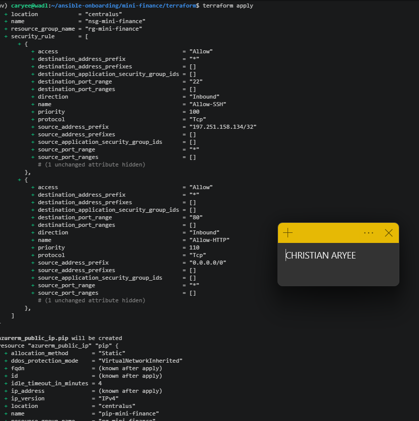
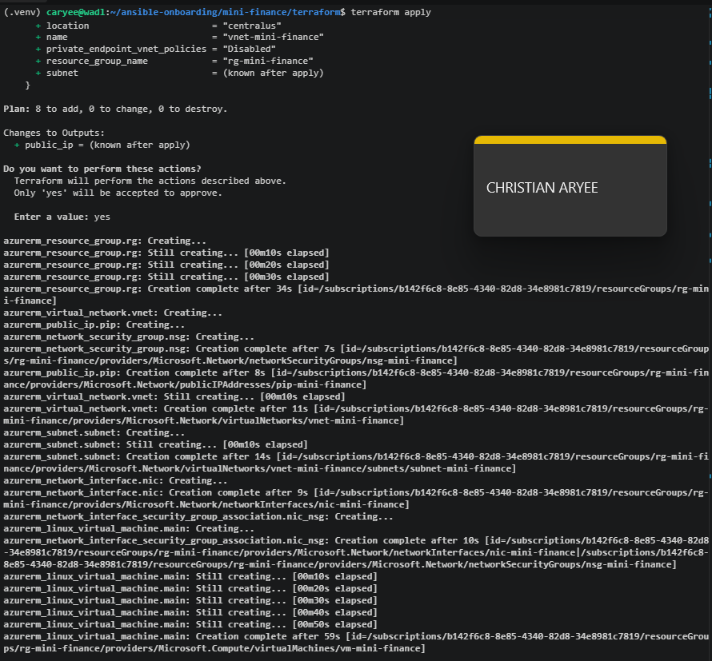

# Assignment 4 — Deploy Mini Finance Project Using Terraform and Ansible

Part of the DevOps Micro Internship (DMI) Cohort 3 with Agentic AI

---

## Purpose

In this assignment, you will provision an Azure VM with Terraform and use Ansible to automate the install, deploy, and verify workflow for the Mini Finance static website — a clean separation between infrastructure and configuration management.

---

# Task 1 — Set Up Folder Layout

## Goal

Create the `mini-finance` project with separate `terraform/` and `ansible/` subdirectories.

### Evidence

#### Screenshot 1 — Terminal or editor showing the complete `mini-finance` project tree

---

# Task 2 — Terraform — Azure VM + NSG (Ports 22/80)

## Goal

Provision an Ubuntu 22.04 Standard_B1s VM with a public IP, SSH key authentication, and an NSG allowing SSH (22) and HTTP (80), and output the public IP.

### Evidence

#### Screenshot 2 — Terminal showing the end of a successful `terraform apply`

---

#### Screenshot 3 — Terminal showing `terraform output public_ip`

---

#### Screenshot 4 — Terraform code or Azure Portal showing NSG inbound rules for ports 22 and 80

---

# Task 3 — Configure Passwordless SSH

## Goal

Connect to the VM with SSH using the injected key and run `hostname` remotely without a password prompt.

### Evidence

#### Screenshot 5 — Terminal showing the successful passwordless SSH hostname check

---

# Task 4 — Ansible — Multi-Play: Install → Deploy → Verify

## Goal

Create `ansible/inventory.ini` and a three-play `site.yml` that installs Nginx and Git, clones and deploys the Mini Finance repository to `/var/www/html/` with a reload handler, and verifies HTTP 200 from `localhost`.

### Evidence

#### Screenshot 6 — Editor showing `inventory.ini` and the three plays in `site.yml`

---

#### Screenshot 7 — Terminal showing `ansible-playbook -i inventory.ini site.yml` with HTTP 200, assertion OK, and no failures

---

# Task 5 — Test End-to-End Functionality

## Goal

Confirm the Mini Finance site is publicly accessible and correctly served by Nginx.

### Evidence

#### Screenshot 8 — Browser showing the Mini Finance site loaded from `http://<public_ip>` with the URL visible

---

### Notes

Describe an issue you faced and how you fixed it, and what you learned.

The main issue faced was a hung `git clone` task in Play 2 that appeared to
freeze indefinitely with no error — it sat unresponsive for hours across
multiple attempts. Diagnosis ruled out the obvious suspects one by one: VM
memory/disk were healthy, DNS resolved github.com correctly, and curl could
reach GitHub over HTTPS fine. The real cause only surfaced by testing a raw
`git clone` directly on the VM with `GIT_TERMINAL_PROMPT=0`, which forced git
to fail fast instead of hanging on an invisible credential prompt — revealing
"terminal prompts disabled" as the actual error. That pointed to git treating
the repository as requiring authentication, which meant the repo path itself
was wrong. A web search confirmed the correct repository is
`pravinmishraaws/mini_finance` (underscore), not `mini-finance-project`
(hyphen) as originally assumed — GitHub returns a 404 for a truly missing
repo, and git falls back to demanding credentials rather than failing
outright, which is what created the silent hang.

What I learned: a "hanging" automation task is rarely actually infinite —
it usually means something downstream is waiting on input that will never
come (like a credential prompt with no TTY attached). Testing the exact
underlying command manually, with tools like `GIT_TERMINAL_PROMPT=0` or a
`timeout` wrapper, isolates whether the problem is the automation layer or
the command itself, rather than guessing at network or resource issues.
---

# LinkedIn Post (Required)

## Goal

Publish a LinkedIn post about the Terraform + Ansible deployment, mentioning the Azure VM, secure networking, passwordless SSH, Nginx deployment, and HTTP verification, with one challenge you faced and how you fixed it, and one real-world example of this workflow.

## Evidence

#### LinkedIn Post URL

Paste your LinkedIn post URL here:

`Add your URL here`

---

#### Screenshot — Published LinkedIn post showing the text and at least one image or proof

Add your screenshot here.

---

# Submission Instructions

- Add all required screenshots in your submission
- The `mini-finance` project tree and `inventory.ini` may have the final IP octet masked
- Do not expose private keys or other secrets

---

# Completion Checklist

- [x] Task 1: `mini-finance` project structure created (Screenshot 1)
- [x] Task 2: Azure VM and NSG provisioned with Terraform (Screenshots 2–4)
- [x] Task 3: Passwordless SSH verified (Screenshot 5)
- [x] Task 4: Ansible install/deploy/verify plays run successfully (Screenshots 6–7)
- [x] Task 5: Site verified in the browser (Screenshot 8)
- [x] Reflection notes written (Notes)
- [x] LinkedIn post published and URL submitted
- [x] No sensitive data exposed

---

## 📌 About DMI & CloudAdvisory

DevOps Micro Internship (DMI) is a project-based DevOps program run by Pravin Mishra (The CloudAdvisory) focused on real-world execution, systems thinking, and career readiness.

It helps learners build strong DevOps foundations with hands-on experience.

---

## 📌 Resources

- 🌐 DMI Official Website: https://dmi.pravinmishra.com?utm_source=github&utm_medium=readme  
- 🎓 University: https://university.pravinmishra.com?utm_source=github&utm_medium=readme  
- 💬 Discord Community: https://discord.pravinmishra.com?utm_source=github&utm_medium=readme  
- 📝 Blog: https://dmi.pravinmishra.com/blog?utm_source=github&utm_medium=readme  
- ▶️ YouTube Playlist: https://www.youtube.com/playlist?list=PLFeSNDtI4Cho  
- 🔗 Pravin Mishra (LinkedIn): https://www.linkedin.com/in/pravin-mishra-aws-trainer/  
- 🏢 CloudAdvisory (LinkedIn): https://www.linkedin.com/company/thecloudadvisory/

---

*This submission is part of DevOps Micro Internship (DMI) Cohort 3 — Agentic AI Track.*
