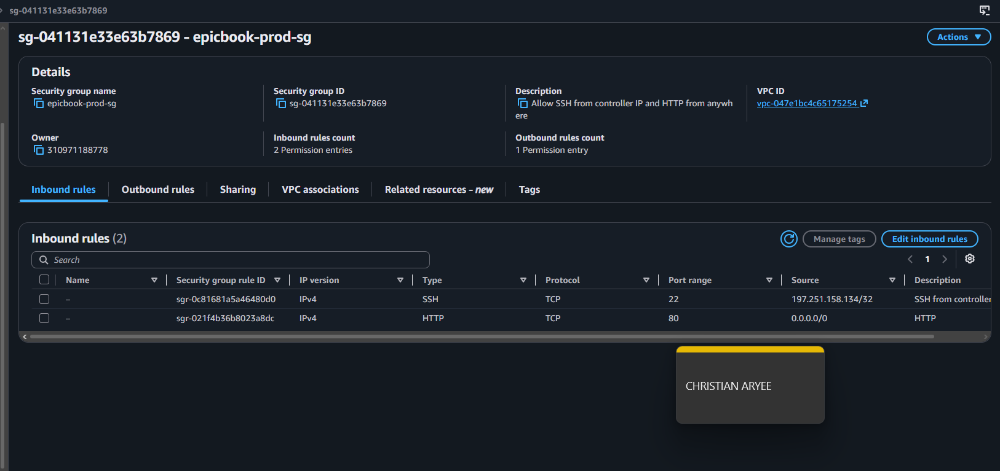
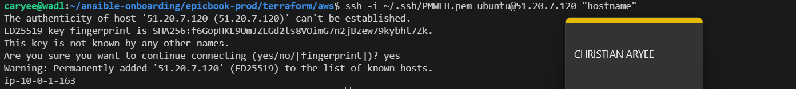
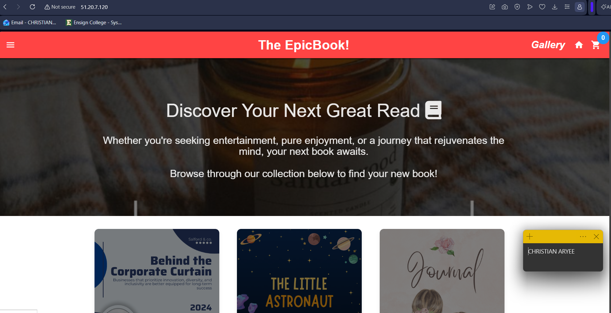
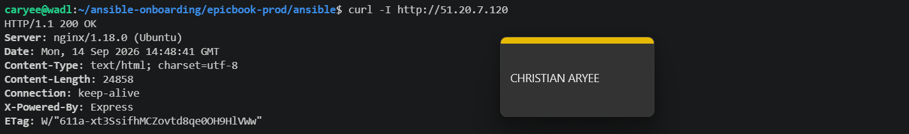
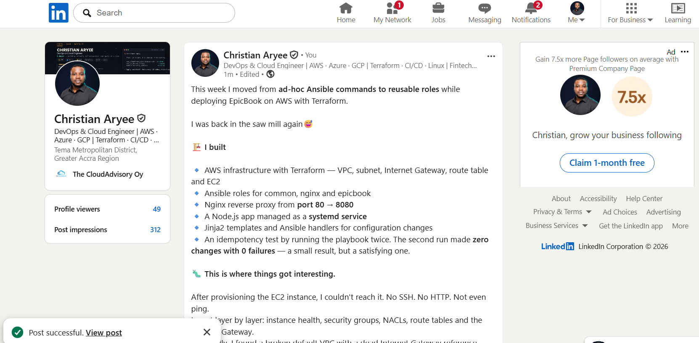
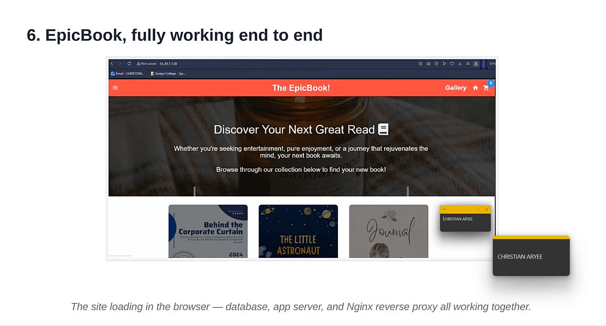

# Assignment 5 — Production-Grade EpicBook: Terraform + Ansible Roles (Azure or AWS)

Part of the DevOps Micro Internship (DMI) Cohort 3 with Agentic AI

---

## Purpose

In this assignment, you will deploy the EpicBook web application on a cloud VM provisioned with Terraform (Azure or AWS — pick one) and configured through reusable Ansible roles (`common`, `nginx`, `epicbook`) orchestrated by one playbook, using group variables, templates, and handlers, with a verified idempotent second run.

---

# Task 1 — Set Up Folder Layout

## Goal

Create the `epicbook-prod` project with `terraform/azure` or `terraform/aws`, `ansible/inventory.ini`, `ansible/site.yml`, `ansible/group_vars/web.yml`, and the `common`, `nginx`, and `epicbook` role directories.

### Evidence

#### Screenshot 1 — Terminal or editor showing the complete `epicbook-prod` project tree

---

# Task 2 — Terraform (Pick One: Azure or AWS)

## Goal

Provision one secure Ubuntu 22.04 VM with SSH key authentication, inbound SSH (22) and HTTP (80), and `public_ip`/`admin_user` outputs, on your chosen cloud.

### Evidence

#### Screenshot 2 — Terminal showing successful `terraform apply` and `terraform output` with `public_ip` and `admin_user`

---f

#### Screenshot 3 — Terraform code or cloud console showing inbound rules for ports 22 and 80

---

# Task 3 — Ansible Inventory

## Goal

Create the `[web]` inventory using the Terraform `public_ip` and `admin_user` outputs, and verify passwordless SSH and `ansible ping`.

### Evidence

#### Screenshot 4 — Terminal showing the successful passwordless SSH hostname check

---

#### Screenshot 5 — Editor or terminal showing `inventory.ini` and a successful Ansible ping

---

# Task 4 — Create site.yml (Role Orchestration)

## Goal

Create `site.yml` invoking the `common`, `nginx`, and `epicbook` roles in that exact order.

### Evidence

#### Screenshot 6 — Editor showing `ansible/site.yml` with the three roles in the required order

---

# Task 5 — Role: common

## Goal

Create `roles/common/tasks/main.yml` to update apt, upgrade packages, install baseline packages (`git`, `curl`, `unzip`, `software-properties-common`), with optional SSH hardening applied only after key-based access is confirmed.

### Evidence

#### Screenshot 7 — Editor showing `roles/common/tasks/main.yml`

---

# Task 6 — Role: nginx

## Goal

Create the `nginx` role to install Nginx, deploy the `epicbook.conf.j2` template to `/etc/nginx/sites-available/epicbook`, enable the site, remove the default site, and reload via handler.

### Evidence

#### Screenshot 8 — Editor showing the Nginx role tasks, handler, and `epicbook.conf.j2` template

---

#### Screenshot 9 — Terminal showing `/etc/nginx/sites-available/epicbook` and a successful Nginx configuration test

---

# Task 7 — Role: epicbook

## Goal

Create the `epicbook` role to clone the repository to `{{ app_dest }}`, set ownership/permissions using group variables, and notify the Nginx reload handler on change.

### Evidence

#### Screenshot 10 — Editor showing `roles/epicbook/tasks/main.yml`

---

# Task 8 — Group Variables

## Goal

Define `app_repo`, `app_dest`, `app_user`, and `app_group` in `ansible/group_vars/web.yml`.

### Evidence

#### Screenshot 11 — Editor showing `ansible/group_vars/web.yml`

---

# Task 9 — Run the Playbook

## Goal

Run `ansible-playbook -i inventory.ini site.yml` and confirm `common` → `nginx` → `epicbook` all complete with `failed=0`.

### Evidence

#### Screenshot 12 — Terminal showing the role-based Ansible run and final recap with `failed=0`

---

# Task 10 — Verify

## Goal

Confirm the EpicBook site loads with HTTP 200, inspect the Nginx configuration, and rerun the playbook to confirm the second run is mostly OK/UNCHANGED with `failed=0`.

### Evidence

#### Screenshot 13 — Browser showing the EpicBook site with the public IP visible

---

#### Screenshot 14 — Terminal showing HTTP 200 and the Nginx site-file snippet

---

#### Screenshot 15 — Terminal showing the idempotent second Ansible run with mostly OK/UNCHANGED and `failed=0`

---

### Notes

Describe an issue you faced and how you fixed it, what you learned, any security issues you identified, and your production remediation plan.

Issue I faced and how I fixed it:
Honestly, the hardest part of this whole assignment wasn't the Ansible roles — it was just getting SSH to work at all. After Terraform spun up the EC2 instance, I couldn't reach it. Not SSH, not HTTP, not even a ping. I went down the checklist one thing at a time: instance status (fine), security group rules via the CLI (correct), the subnet's NACL (wide open). Eventually I found it — the AWS account's default VPC had a route pointing to an internet gateway that literally didn't exist anymore. Probably leftover from cleaning up an old assignment. So I rebuilt the Terraform config to create its own VPC, subnet, gateway, and route table from scratch instead of trusting the account's default one.

That fixed the routing, but SSH still timed out. At that point I used AWS's browser-based EC2 Instance Connect just to see if the instance itself was even reachable — and it connected instantly. So the instance was fine the whole time; the problem was on my end. I switched to my phone's hotspot and tried again, and it worked immediately. My home network (or ISP) was apparently just silently swallowing traffic to that AWS IP range. Once I updated the security group to allow my hotspot's IP, everything went smoothly from there.

What I learned:
A timeout can come from basically any layer — the instance, the security group, the NACL, the routing, or your own network — and there's no shortcut, you really do have to test each one separately to find where it's actually breaking. I also learned the hard way that --syntax-check only checks that your YAML is valid, not that it'll actually behave correctly. My first playbook run worked fine, but the second one failed because the database import task wasn't idempotent — it tried to re-import a schema that already existed. I had to add a check beforehand (does this table already exist?) so reruns skip cleanly instead of erroring out.

Security issues I noticed:
While I was troubleshooting with EC2 Instance Connect, I temporarily opened SSH to the entire internet (0.0.0.0/0) just to rule things out, then locked it back down once I confirmed the instance was reachable. It's a normal thing to do while debugging, but it's also exactly the kind of thing that's easy to forget to undo. Separately, the MySQL root password in my Ansible role is just sitting there in plaintext — it matches what's already hardcoded in the app's own repo, so it's not a new leak, but it's still not how I'd want to handle it for real.

What I'd do differently in production:
I'd never open a security group to the whole internet again, even briefly — I'd use AWS Systems Manager Session Manager instead, which doesn't need any inbound ports open at all. And I'd pull that database password out of the task file completely and put it behind Ansible Vault, so it's encrypted instead of just sitting there in plain text.
---

# LinkedIn Post (Required)

## Goal

Publish a LinkedIn post describing the Terraform + Ansible roles deployment (cloud chosen, role structure, Nginx deployment, idempotency result), and add a 4–6 line video reflection covering one challenge/fix, security issues observed, and your production remediation plan.

## Evidence

#### LinkedIn Post URL

Paste your LinkedIn post URL here:

`https://www.linkedin.com/feed/update/urn:li:activity:7505324945498013696/`

---

#### Screenshot — Published LinkedIn post

---

#### Video reflection screenshot

---

# Submission Instructions

- Add all required screenshots in your submission
- Do not expose private keys, credentials, tokens, or unrestricted management access

---

# Completion Checklist

- [X] Task 1: `epicbook-prod` project and role structure created (Screenshot 1)
- [X] Task 2: Cloud VM provisioned with Terraform (Screenshots 2–3)
- [X] Task 3: Passwordless SSH and Ansible ping verified (Screenshots 4–5)
- [X] Task 4: `site.yml` orchestrates roles in common → nginx → epicbook order (Screenshot 6)
- [X] Task 5: `common` role created (Screenshot 7)
- [X] Task 6: `nginx` role, template, and handler created (Screenshots 8–9)
- [X] Task 7: `epicbook` role created (Screenshot 10)
- [X] Task 8: Group variables defined (Screenshot 11)
- [X] Task 9: Playbook run successfully with `failed=0` (Screenshot 12)
- [X] Task 10: Site verified and idempotent rerun confirmed (Screenshots 13–15)
- [X] Reflection and security remediation notes written (Notes)
- [X] LinkedIn post and video reflection submitted
- [X] No sensitive data exposed

---

## 📌 About DMI & CloudAdvisory

DevOps Micro Internship (DMI) is a project-based DevOps program run by Pravin Mishra (The CloudAdvisory) focused on real-world execution, systems thinking, and career readiness.

It helps learners build strong DevOps foundations with hands-on experience.

---

## 📌 Resources

- 🌐 DMI Official Website: https://dmi.pravinmishra.com?utm_source=github&utm_medium=readme  
- 🎓 University: https://university.pravinmishra.com?utm_source=github&utm_medium=readme  
- 💬 Discord Community: https://discord.pravinmishra.com?utm_source=github&utm_medium=readme  
- 📝 Blog: https://dmi.pravinmishra.com/blog?utm_source=github&utm_medium=readme  
- ▶️ YouTube Playlist: https://www.youtube.com/playlist?list=PLFeSNDtI4Cho  
- 🔗 Pravin Mishra (LinkedIn): https://www.linkedin.com/in/pravin-mishra-aws-trainer/  
- 🏢 CloudAdvisory (LinkedIn): https://www.linkedin.com/company/thecloudadvisory/

---

*This submission is part of DevOps Micro Internship (DMI) Cohort 3 — Agentic AI Track.*
