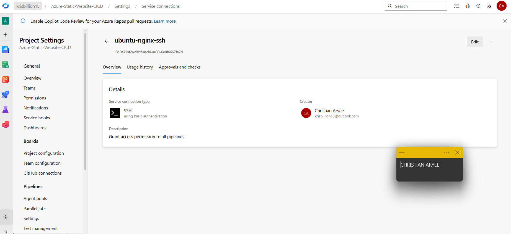
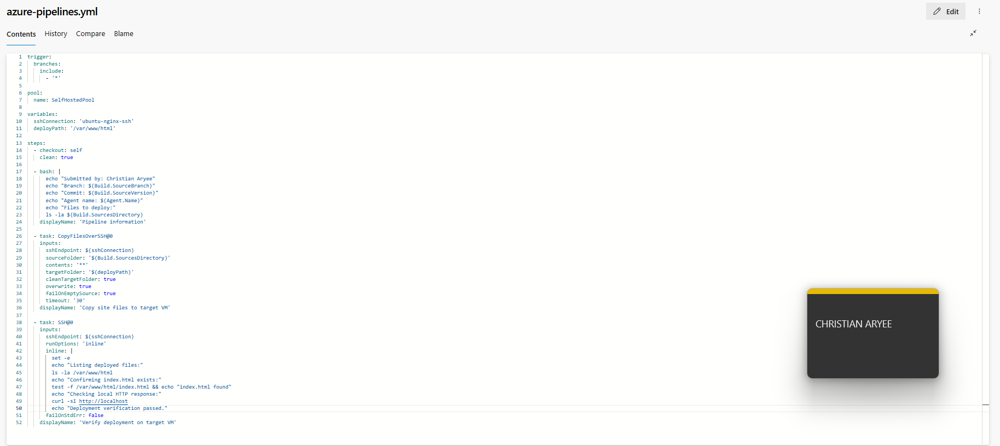
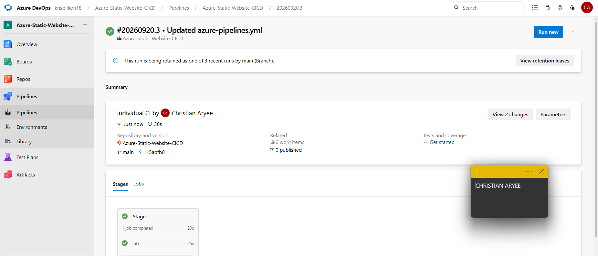
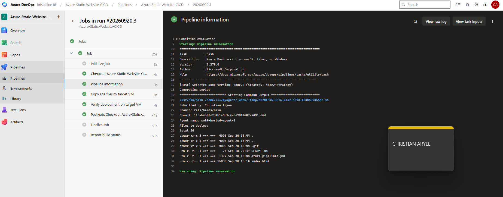
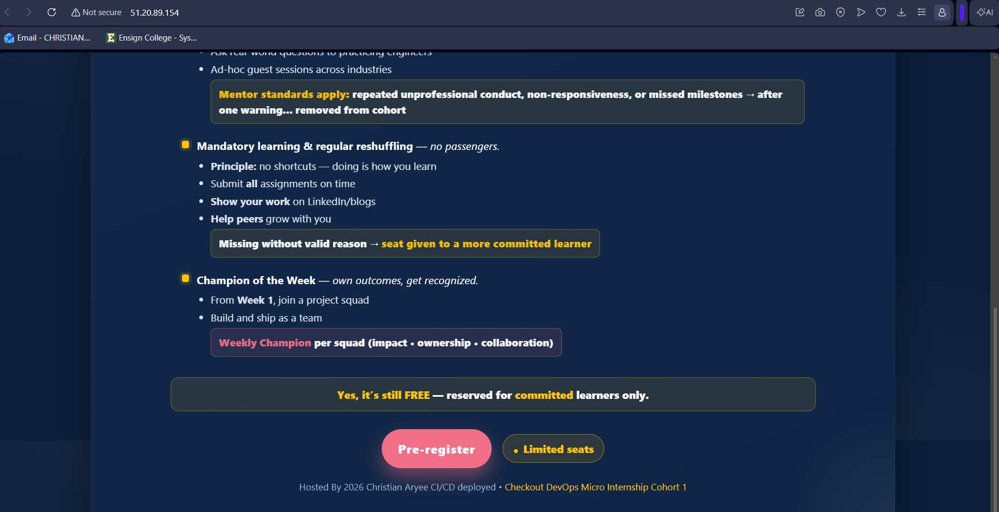
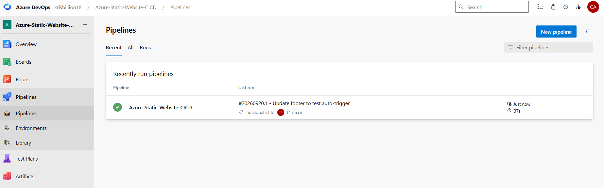
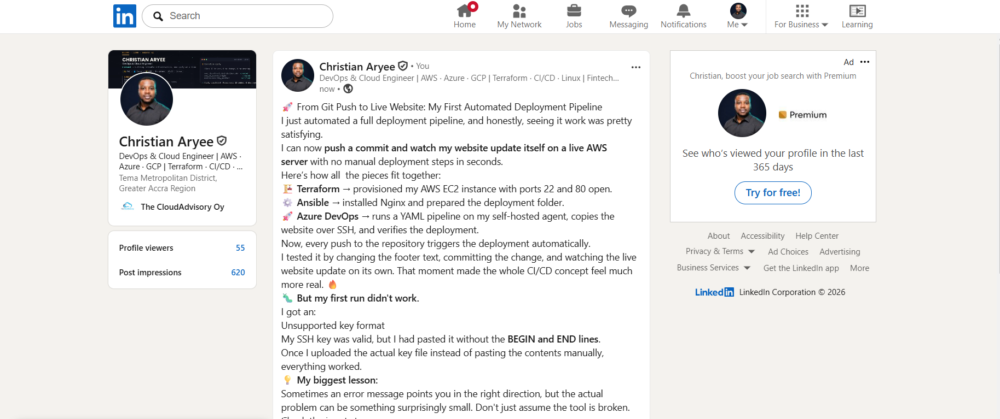

# Assignment 2 — Deploy A Static Website to AWS EC2 Using an Azure DevOps CI/CD Pipeline

Part of the DevOps Micro Internship (DMI) with Agentic AI

---

## Purpose

In this assignment, you will import and personalize the Static Website, provision and configure an AWS EC2 instance using Terraform and Ansible, and create an Azure DevOps CI/CD pipeline that automatically deploys the website to Nginx through an SSH Service Connection.

---

# Task 0 — Verify the Existing Tooling and Self-Hosted Agent

## Goal

Confirm that Terraform, Ansible, AWS CLI, SSH, and the self-hosted Azure Pipelines agent are ready.

No submission screenshot is required for this task.

---

# Task 1 — Import and Personalize the Azure Static Website Repository

## Goal

Import the Azure Static Website into Azure Repos and add your Full Name to the website.

## Evidence

### Screenshot 1 — Azure Static Website in Azure Repos

---

# Task 2 — Provision and Configure the Target EC2 Instance

## Goal

Provision the AWS EC2 instance using Terraform and configure Nginx, SSH access, and deployment permissions using Ansible.

No additional submission screenshot is required for this task.

---

# Task 3 — Create the SSH Service Connection

## Goal

Create an Azure DevOps SSH Service Connection that can connect to the target EC2 instance using your selected SSH authentication method.

## Evidence

### Screenshot 2 — SSH Service Connection

---

# Task 4 — Create the Azure DevOps YAML Pipeline

## Goal

Create an Azure DevOps YAML pipeline that deploys the Azure Static Website to the target EC2 instance after a commit is pushed.

## Evidence

### Screenshot 3 — Azure Pipelines YAML

---

# Task 5 — Create, Authorize, and Run the Pipeline

## Goal

Run the Azure DevOps pipeline and confirm that the website files are transferred and verified successfully.

## Evidence

### Screenshot 4 — Successful Pipeline Run

### First attempt (failed before I fixed the SSH key)

---

# Task 6 — Verify the Website and Automatic Trigger

## Goal

Confirm that the website is accessible through the EC2 public IP address and that a new pushed commit automatically triggers another deployment.

## Evidence

### Screenshot 5 — Deployed Azure Static Website

### Automatic trigger proof

## Final Website URL

http://51.20.89.154

---

# Assignment Summary

I imported the Azure Static Website into Azure Repos, then used Terraform to provision an Ubuntu EC2 instance with ports 22 and 80 open. Ansible then installed and started Nginx and prepared `/var/www/html` for deployment. In Azure DevOps I created an SSH Service Connection (`ubuntu-nginx-ssh`) and a YAML pipeline that runs on the self-hosted agent, copies the site files to the server with `CopyFilesOverSSH@0`, and verifies the deployment with `SSH@0`.

Issue faced: the first run failed with "Cannot parse privateKey: Unsupported key format". The key was valid, but when I pasted it into the Service Connection I had copied only the base64 body and missed the `-----BEGIN-----` and `-----END-----` lines. I fixed it by using the "Upload SSH private key file" option instead of pasting. After re-saving the connection, the pipeline succeeded end to end.

To prove the automatic trigger, I changed the website footer and committed to `main`. Run 20260920.1 started by itself as an Individual CI run and the live site updated. A later commit silenced curl's progress output in the verify step, and run 20260920.3 finished with no errors.

---

# LinkedIn Requirement

## LinkedIn Post Screenshot

## LinkedIn Post URL

[LinkedIn Post URL](https://www.linkedin.com/posts/caryee_dmibypravinmishra-devops-terraform-ugcPost-7507477580737007616-bWZ7/?utm_source=share&utm_medium=member_desktop&rcm=ACoAACP6ElcBF7-kOglrea_3V5oUhVp4NSh-Trc)

---

# Submission Instructions

* Include the short assignment summary.
* Include Screenshots 1–5.
* Include the final website URL.
* Include the LinkedIn post screenshot and URL.
* Confirm that the EC2 instance is running during grading.
* Do not expose a password, SSH private key, passphrase, PAT, AWS credential, account ID, or another secret.

---

*This submission is part of the DevOps Micro Internship (DMI) — Agentic AI Track.*