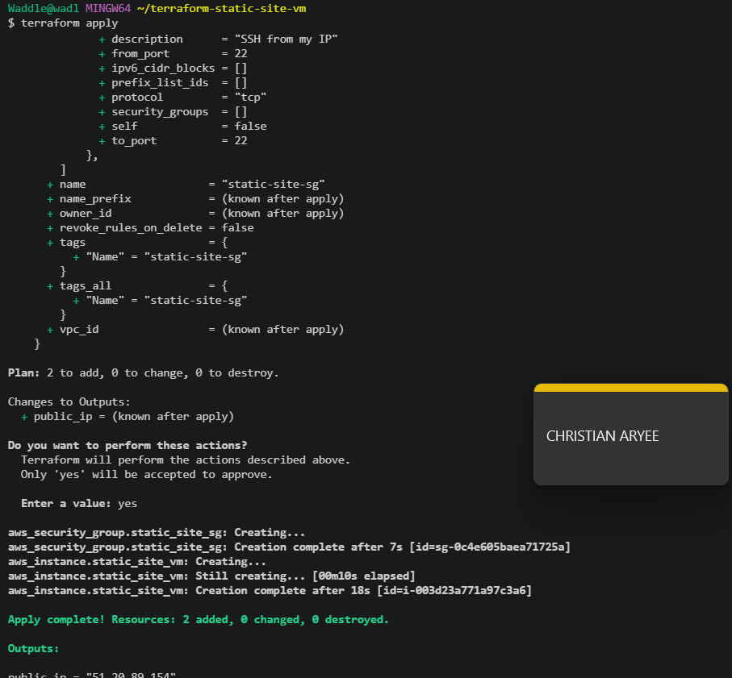
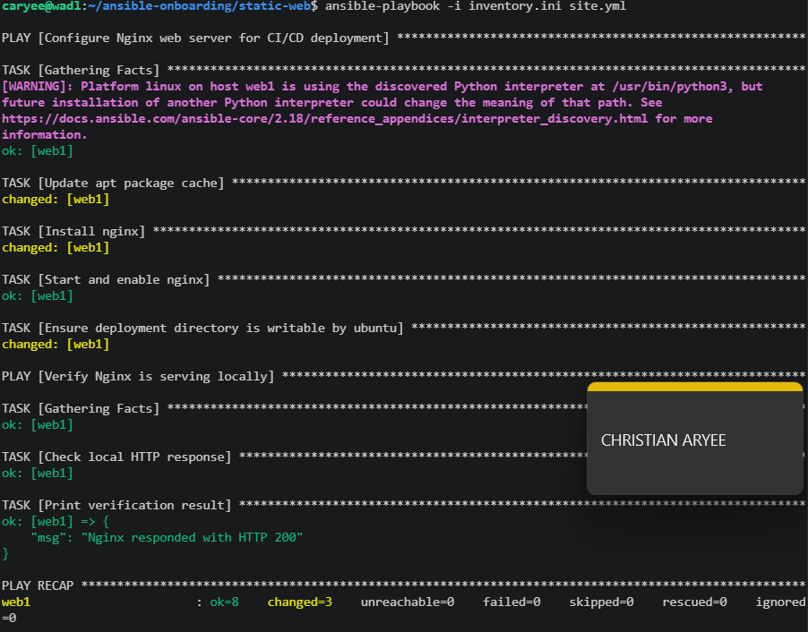
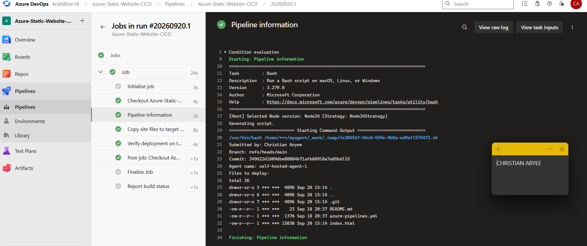
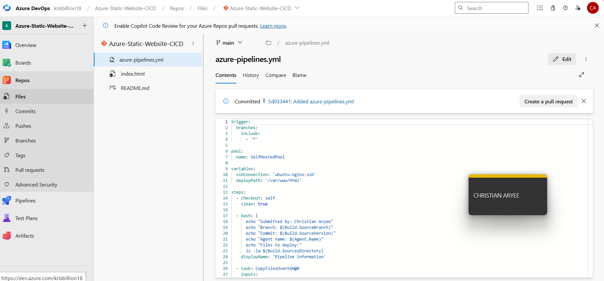
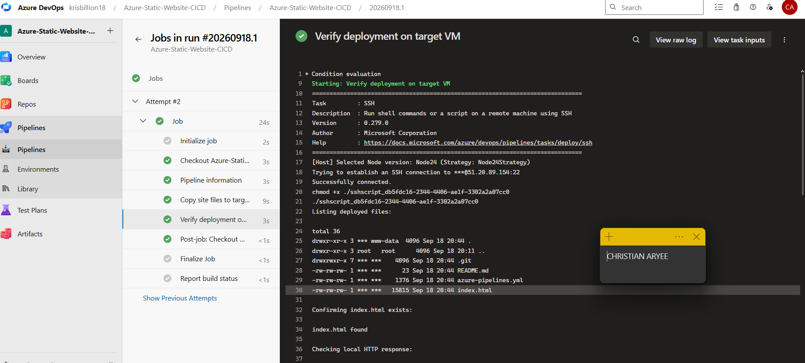
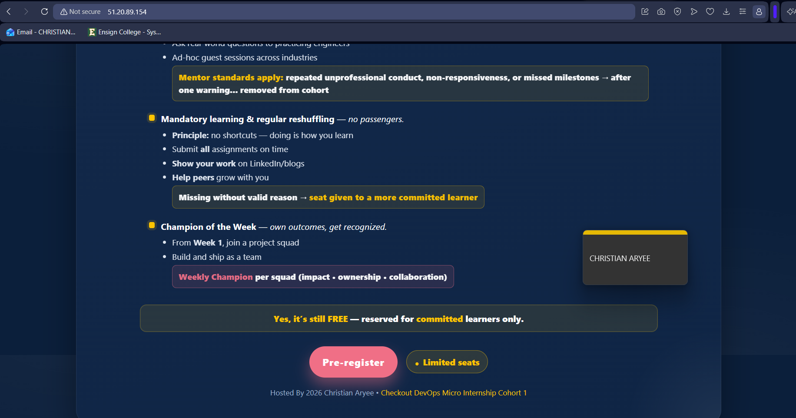

# Assignment 2 — Deploy Mini Finance Project via Azure DevOps Pipeline

Part of the DevOps Micro Internship (DMI) Cohort 3 with Agentic AI

---

## Purpose

In this assignment, you will build an Azure DevOps CI/CD pipeline that deploys the Mini Finance static website to an Ubuntu VM running Nginx: importing the repo into Azure Repos, provisioning the VM with Terraform and Ansible, connecting via an SSH Service Connection, and deploying on every commit to `main`.

---

# Task 1 — Import the Repository

## Goal

Import `https://github.com/pravinmishraaws/Azure-Static-Website` into Azure Repos and confirm `index.html` is present.

### Evidence

#### Screenshot 1 — Azure Repos showing the imported repository files with `index.html` visible

---

# Task 2 — Prepare the Target VM

## Goal

Provision a Linux VM with Terraform (ports 22/80 open), then use Ansible to install and start Nginx and prepare `/var/www/html`.

### Evidence

#### Screenshot 2 — Terraform output or cloud console showing the running VM and public IP

---

#### Screenshot 3 — Terminal showing Ansible completed successfully and Nginx is active

---

# Task 3 — Create an SSH Service Connection

## Goal

Create the password-based SSH Service Connection `ubuntu-nginx-ssh` pointing to the VM, and validate it.

### Evidence

#### Screenshot 4 — SSH Service Connection configuration page showing the connection details and successful validation, with the password hidden

---

# Task 4 — Author the YAML Pipeline

## Goal

Write a pipeline triggered on `main` that checks out the repo, copies files to `/var/www/html` via `CopyFilesOverSSH@0`, and verifies the deployment directory via an `SSH@0` task, using `ubuntu-nginx-ssh` and the self-hosted (or available Microsoft-hosted) pool.

### Evidence

#### Screenshot 5 — Pipeline YAML definition open in the Azure DevOps editor

---

# Task 5 — Verify Deployment

## Goal

Confirm the pipeline run succeeded (checkout, SSH connection, file transfer, remote verification) and the Mini Finance website is live at the VM's public IP.

### Evidence

#### Screenshot 6 — Successful Azure DevOps pipeline run log summary

First run failed on the SSH connection due to a truncated private key:

After fixing the service connection, the pipeline ran successfully:

---

#### Screenshot 7 — Browser showing the deployed website with the VM public IP visible

---

### Notes

Include the VM public URL. Describe any issue you faced and how you fixed it (e.g. parallelism/agent-pool issues).

VM public URL: http://51.20.89.154

Issue faced and how I fixed it:

The pipeline's first run failed on both the copy and verification steps with:

Unhandled: Failed to connect to remote machine. Verify the SSH service connection details. Error: Cannot parse privateKey: Unsupported key format

The key was already in the correct RSA PEM format, so the error was misleading — the real problem was that I'd copy-pasted the private key into the Service Connection's text field and only grabbed the base64 body, missing the -----BEGIN-----/-----END----- header lines. A key missing those markers can't be parsed, regardless of its actual format.

The fix was to stop copy-pasting entirely and use the "Upload SSH private key file..." option on the Service Connection form instead, pointing it directly at the .pem file. That loaded the complete key with no risk of truncation. After re-saving the connection with the uploaded key, the pipeline ran successfully end to end — file copy and remote verification both passed.
---

# Submission Instructions

- Add all required screenshots in your submission
- Do not commit the VM password to the repository or write it directly in YAML

---

# Completion Checklist

- [x] Task 1: Repository imported into Azure Repos (Screenshot 1)
- [x] Task 2: VM provisioned and Nginx configured (Screenshots 2–3)
- [x] Task 3: SSH Service Connection created and validated (Screenshot 4)
- [x] Task 4: YAML pipeline authored (Screenshot 5)
- [x] Task 5: Pipeline run succeeded and site verified (Screenshots 6–7)
- [x] VM URL and issue notes written (Notes)
- [x] No passwords, tokens, or credentials exposed

---

## 📌 About DMI & CloudAdvisory

DevOps Micro Internship (DMI) is a project-based DevOps program run by Pravin Mishra (The CloudAdvisory) focused on real-world execution, systems thinking, and career readiness.

It helps learners build strong DevOps foundations with hands-on experience.

---

## 📌 Resources

- 🌐 DMI Official Website: https://dmi.pravinmishra.com?utm_source=github&utm_medium=readme  
- 🎓 University: https://university.pravinmishra.com?utm_source=github&utm_medium=readme  
- 💬 Discord Community: https://discord.pravinmishra.com?utm_source=github&utm_medium=readme  
- 📝 Blog: https://dmi.pravinmishra.com/blog?utm_source=github&utm_medium=readme  
- ▶️ YouTube Playlist: https://www.youtube.com/playlist?list=PLFeSNDtI4Cho  
- 🔗 Pravin Mishra (LinkedIn): https://www.linkedin.com/in/pravin-mishra-aws-trainer/  
- 🏢 CloudAdvisory (LinkedIn): https://www.linkedin.com/company/thecloudadvisory/

---

*This submission is part of DevOps Micro Internship (DMI) Cohort 3 — Agentic AI Track.*
