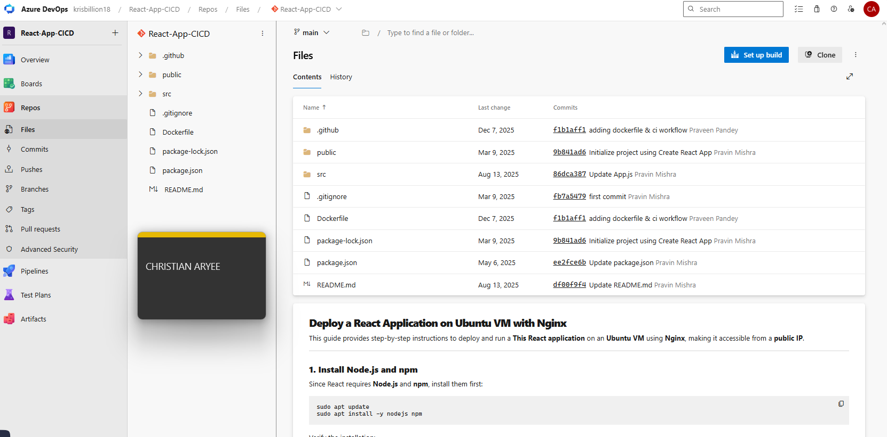
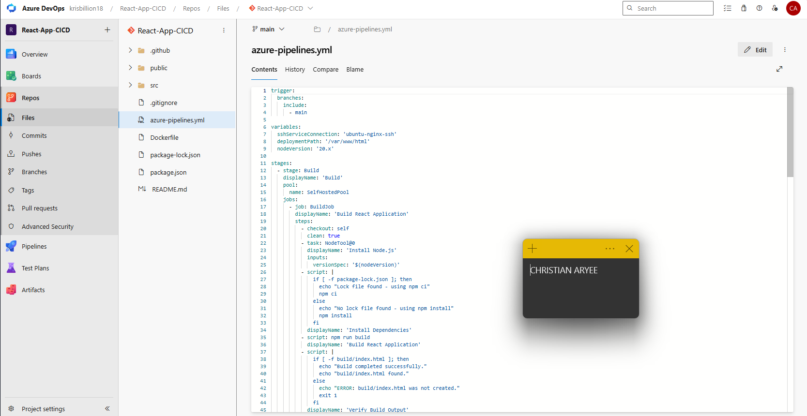
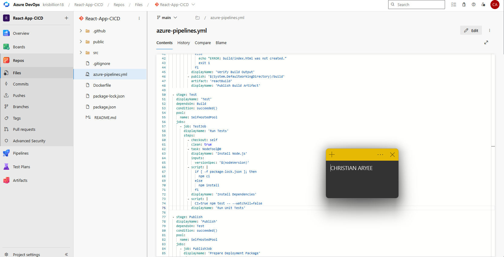
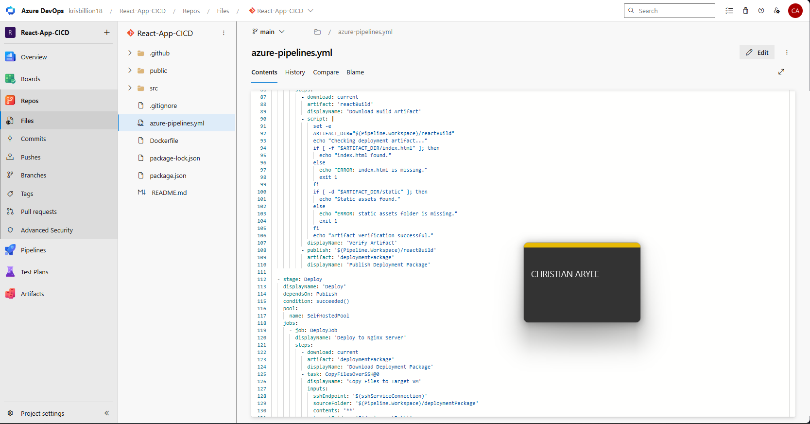
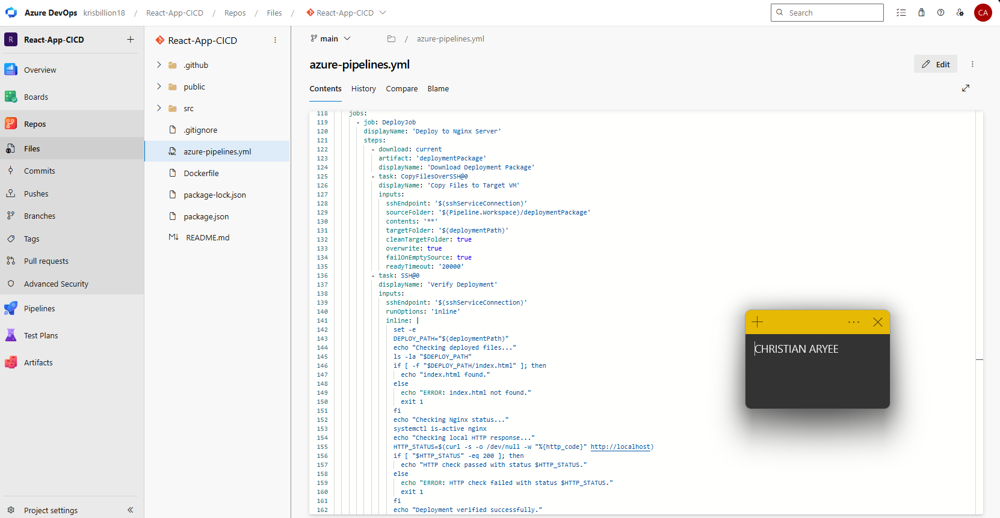
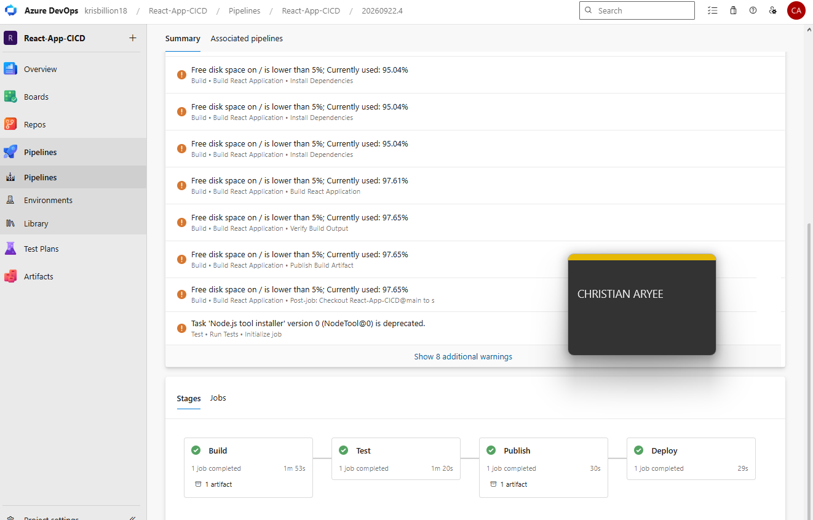
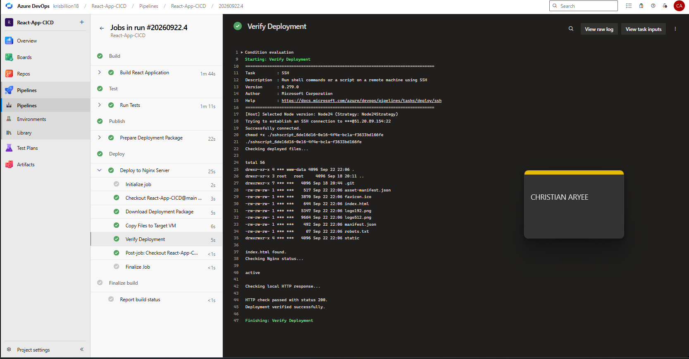
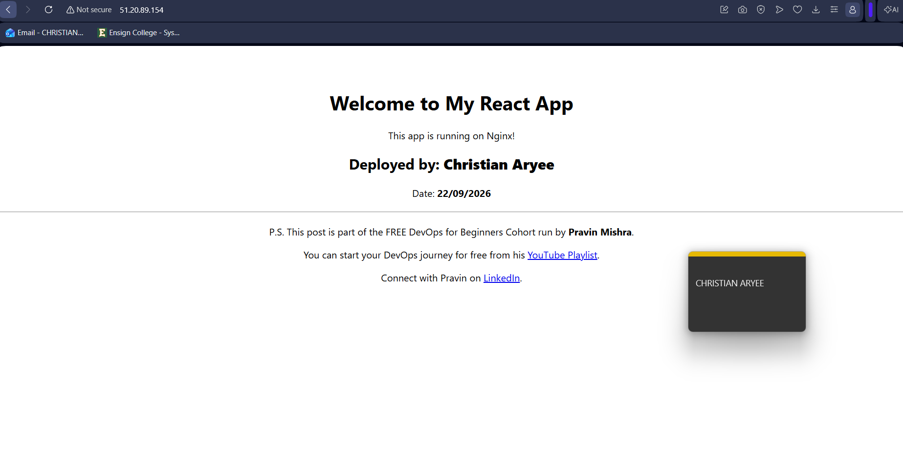
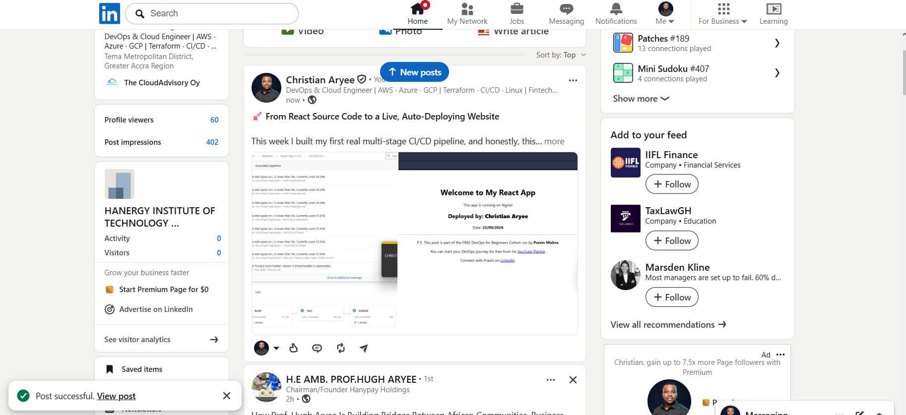

# Assignment 3 — Automate React App Deployment Using Azure DevOps CI/CD

Part of the DevOps Micro Internship (DMI) with Agentic AI

---

## Purpose

In this assignment, you will create a multi-stage Azure DevOps pipeline that builds, tests, publishes, and deploys a React application to an Ubuntu VM hosted on AWS or Azure. The pipeline will automatically run when changes are committed to `main`, transfer the production build as an artifact, and deploy it through Nginx.

---

# Task 0 — Verify the Starting Environment

## Goal

Confirm that Azure DevOps, the pipeline agent, Terraform, Ansible, and the selected cloud environment are ready.

No submission screenshot is required for this task.

---

# Task 1 — Import and Personalize the React Application

## Goal

Import the React application into Azure Repos and add your Full Name and the current date.

## Evidence

### Screenshot 1 — Imported React Project in Azure Repos

Add a screenshot of Azure Repos showing:

* Imported React project
* Repository name
* `main` branch
* Project files

---

# Task 2 — Provision and Configure the Target VM

## Goal

Provision an Ubuntu VM using Terraform and configure Nginx, React SPA routing, SSH access, and deployment permissions using Ansible.

No separate submission screenshot is required for this task.

---

# Task 3 — Create or Update the SSH Service Connection

## Goal

Create or update an Azure DevOps SSH Service Connection that allows the pipeline to connect securely to the target VM.

No separate submission screenshot is required for this task.

> Do not include the VM password, SSH private key, token, or another secret in the submission.

---

# Task 4 — Author the Multi-Stage Azure Pipeline

## Goal

Create an Azure Pipeline containing Build, Test, Publish, and Deploy stages with an automatic trigger for commits to `main`.

## Evidence

### Screenshot 2 — Multi-Stage Pipeline YAML

Add a screenshot of the Azure Pipeline YAML open in the editor showing:

* Trigger
* Build stage
* Test stage
* Publish stage
* Deploy stage

> Do not expose passwords, private keys, tokens, or cloud credentials.

---

# Task 5 — Run the Pipeline and Resolve Configuration Issues

## Goal

Complete a successful end-to-end pipeline run containing all four stages.

## Evidence

### Screenshot 3 — Successful Multi-Stage Pipeline Run

Add a screenshot of one Azure DevOps pipeline run showing all four stages succeeded:

* Build
* Test
* Publish
* Deploy

---

# Task 6 — Verify the Deployment on the VM

## Goal

Confirm that the pipeline deployed the production-ready React files to the correct Nginx web root.

## Evidence

### Screenshot 4 — Post-Deployment Contents of /var/www/html

Add a screenshot of the pipeline SSH verification log or VM terminal showing the post-deployment contents of:

`/var/www/html`

---

# Task 7 — Verify the Website and Automatic Trigger

## Goal

Confirm that the React application is accessible and that a commit to `main` automatically triggers the CI/CD pipeline.

## Evidence

### Screenshot 5 — Deployed React Application

Add a browser screenshot showing:

* Deployed React application
* VM public IP address in the browser address bar
* Your Full Name
* Deployment date

## Final Application URL

`http://51.20.89.154`

Replace the placeholder and paste your final application URL below:

http://51.20.89.154

---

# CI/CD Workflow Summary

Write a short explanation of the CI/CD workflow you created.

I built a four-stage Azure DevOps pipeline (Build → Test → Publish → Deploy) that automatically deploys a React application to an Nginx web server whenever a commit is pushed to main. The Build stage installs Node.js, runs npm run build, and publishes the compiled output as a pipeline artifact. The Test stage reinstalls dependencies independently and runs the test suite in non-interactive CI mode, so a broken build never reaches deployment. The Publish stage downloads the build artifact, verifies index.html and the static assets are present, and republishes it as an approved deployment package. The Deploy stage downloads that package, copies it to /var/www/html on the target VM over SSH using CopyFilesOverSSH@0, then runs a remote verification step confirming the files exist, Nginx is active, and the site returns an HTTP 200 response. Each stage only runs if the previous one succeeded, so a failure anywhere stops the release before it reaches the live server. Along the way I resolved an agent out-of-memory crash (fixed by adding swap space to the pipeline agent VM) and an SSH connection timeout caused by the target VM's security group not allowing traffic from the agent's IP.

---

# LinkedIn Requirement

## Evidence

### Screenshot 6 — LinkedIn Post

Add a screenshot of your LinkedIn post showing:

* Post text
* At least one image or link

## LinkedIn Post URL

https://www.linkedin.com/posts/caryee_dmibypravinmishra-devops-cicd-ugcPost-7508292489582321664-mFBU/?utm_source=share&utm_medium=member_desktop&rcm=ACoAACP6ElcBF7-kOglrea_3V5oUhVp4NSh-Trc

> Do not expose VM passwords, tokens, private keys, cloud credentials, or other sensitive information.

---

# Submission Instructions

* Complete all tasks in sequence.
* Include the short CI/CD workflow summary.
* Include Screenshots 1–6.
* Include the final application URL.
* Include the public LinkedIn post URL.
* Confirm that all screenshots are readable and show the required context.
* Do not expose passwords, PATs, private keys, cloud credentials, subscription IDs, account IDs, or other secrets.
* Follow the Assignment Submission Guidelines.

---

# Completion Checklist

* [x] All tasks were completed in sequence
* [x] The correct React repository was imported into Azure Repos
* [x] Your Full Name and date were added to the application
* [x] The pipeline YAML was authored and committed to the repository
* [x] Commits to `main` trigger the pipeline automatically
* [x] The pipeline contains Build, Test, Publish, and Deploy stages
* [x] All four stages succeeded in the same pipeline run
* [x] The production build moved between stages as a pipeline artifact
* [x] The Deploy stage used the SSH Service Connection
* [x] No password or secret is stored in the YAML
* [x] `index.html` is directly inside `/var/www/html`
* [x] Raw React source code was not deployed to the Nginx web root
* [x] `node_modules/` was not deployed to the Nginx web root
* [x] Nginx is active
* [x] The application opens through the VM public IP address
* [x] Your Full Name and date are visible in the browser screenshot
* [x] Screenshots 1–6 are included and readable
* [x] No password, token, private key, account ID, or other secret is visible
* [x] The final application URL is included
* [x] The LinkedIn post is published
* [x] The LinkedIn post URL is included

---

*This submission is part of the DevOps Micro Internship (DMI) — Agentic AI Track.*
