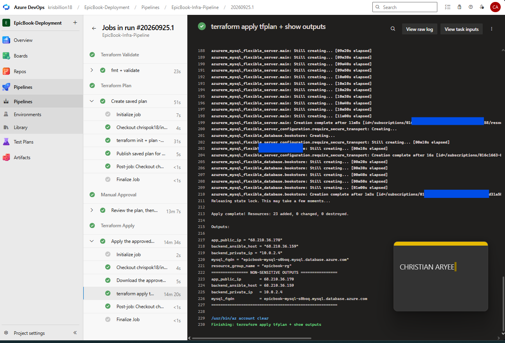
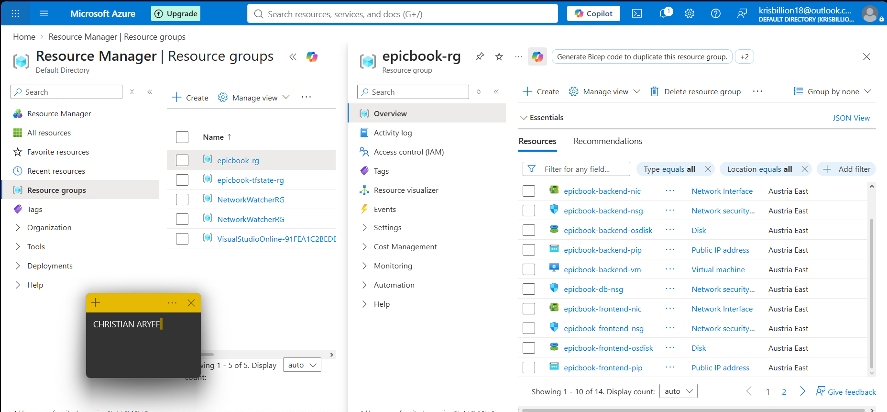
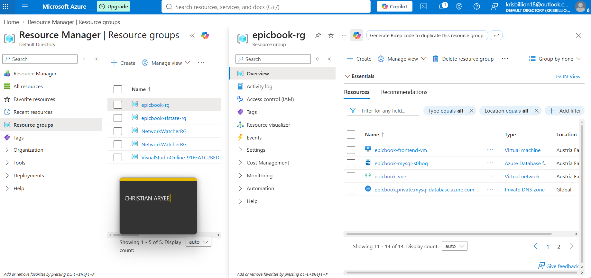
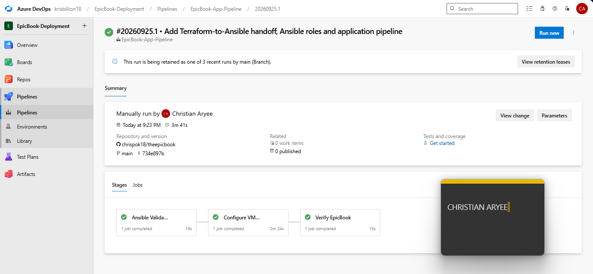
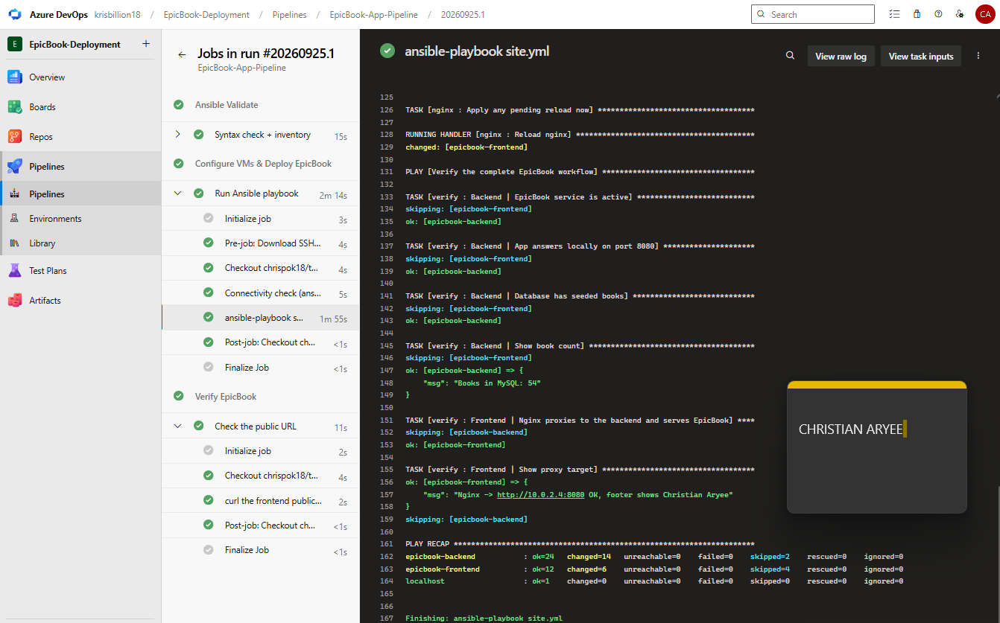
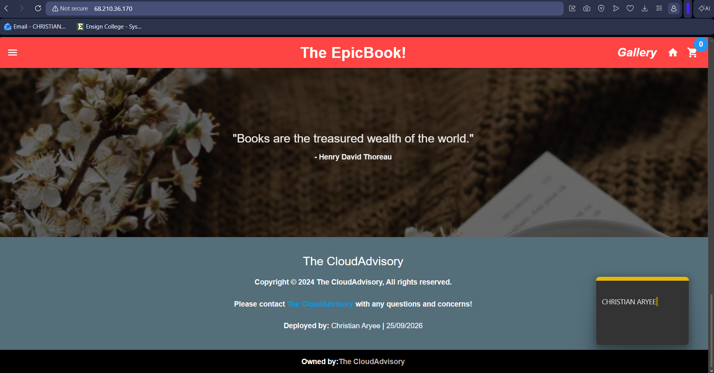
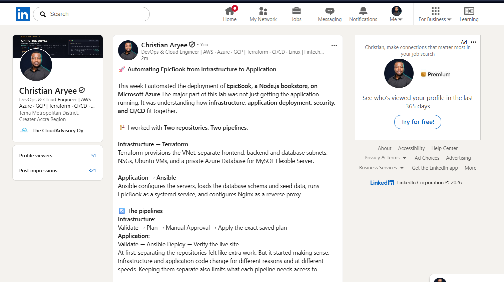

# Assignment 4 — Automate EpicBook Deployment with Dual Pipelines

Part of the DevOps Micro Internship (DMI) with Agentic AI

---

## Purpose

In this assignment, you will automate the EpicBook infrastructure and application deployment on Microsoft Azure using two repositories and two Azure DevOps pipelines. Terraform will provision the infrastructure, and Ansible will configure the servers, connect EpicBook to Azure Database for MySQL, and deploy the application through Nginx.

---

# Task 0 — Verify Accounts, Tools, and Pipeline Capacity

## Goal

Confirm that the required accounts, tools, pipeline agent, SSH key pair, and Terraform remote-state location are ready.

No submission screenshot is required for this task.

---

# Task 1 — Prepare the Two Repositories

## Goal

Create separate Infrastructure and Application Repositories for the EpicBook deployment.

No submission screenshot is required for this task.

---

# Task 2 — Configure Azure DevOps Connections, Secure Files, and Secrets

## Goal

Configure controlled pipeline access to GitHub, Microsoft Azure, the virtual machines, and Azure Database for MySQL.

No submission screenshot is required for this task.

> Do not expose the Azure Client Secret, SSH private key, MySQL password, access token, subscription ID, or another sensitive value.

---

# Task 3 — Author the Terraform Infrastructure Configuration

## Goal

Define the complete EpicBook Azure infrastructure using Terraform and an Azure Storage remote backend.

No submission screenshot is required for this task.

Resource group: epicbook-rg (Austria East)
└── Virtual network 10.0.0.0/16
    ├── frontend subnet 10.0.1.0/24 → Frontend VM (Nginx) — public IP, port 80 open to the world
    ├── backend subnet  10.0.2.0/24 → Backend VM (EpicBook app) — app port open ONLY to the frontend
    └── database subnet 10.0.3.0/24 → MySQL Flexible Server — PRIVATE, port 3306 open ONLY to the backend
SSH (port 22) on both VMs: allowed ONLY from your agent's IP and your home IP
Terraform state: stored in epicbooktfstate31971 (not in GitHub)

---

# Task 4 — Author and Run the Infrastructure Pipeline

## Goal

Validate, plan, approve, and apply the Terraform configuration through the Infrastructure Pipeline.

## Evidence

### Screenshot 1 — Successful Infrastructure Pipeline

Add a screenshot of the Infrastructure Pipeline run showing:

* Successful `terraform apply` completion
* `app_public_ip`
* `backend_ansible_host`
* `backend_private_ip`
* `mysql_fqdn`

> Do not expose the MySQL password, Client Secret, Terraform state, SSH private key, or another sensitive value.

---

### Screenshot 2 — Provisioned Azure Resources

Add a screenshot of the Azure Portal Resource Group overview showing:

* Virtual Network and related networking resources
* Frontend VM
* Backend VM
* Azure Database for MySQL Flexible Server
* Related EpicBook resources

> Hide sensitive IDs, credentials, and database details.

---

# Task 5 — Complete the Manual Terraform-to-Ansible Handoff

## Goal

Transfer the required non-sensitive Terraform outputs to the Application Repository for use by Ansible.

No submission screenshot is required for this task.

---

# Task 6 — Author the Ansible Application Configuration

## Goal

Create idempotent Ansible automation that configures the frontend and backend VMs, prepares the database, configures Nginx, and deploys EpicBook.

No submission screenshot is required for this task.

---

# Task 7 — Author and Run the Application Pipeline

## Goal

Run the Application Pipeline to configure the VMs, deploy EpicBook, and verify the application environment.

## Evidence

### Screenshot 3 — Successful Application Pipeline

Add a screenshot of the Application Pipeline run summary showing all required stages or jobs succeeded.

---

### Screenshot 4 — Successful Ansible Play Recap

Add a screenshot of the Application Pipeline log showing:

* Ansible play recap
* Successful configuration or verification
* Zero failed hosts
* Zero unreachable hosts

> Do not expose the SSH private key, MySQL password, Client Secret, or complete database connection string.

---

# Task 8 — Verify the Complete EpicBook Workflow

## Goal

Verify that the frontend, backend, and Azure Database for MySQL work together correctly.

## Evidence

### Screenshot 5 — Running EpicBook Application

Add a browser screenshot showing:

* Running EpicBook application
* Frontend public IP address in the browser address bar
* Your Full Name
* Deployment date

The screenshot may show a product, cart, or successful order view.

> Do not expose credentials or sensitive information.

---

# Required URLs

## Frontend Application URL

http://68.210.36.170/

## Infrastructure Repository URL

https://github.com/chrispok18/infra-epicbook

## Application Repository URL

https://github.com/chrispok18/theepicbook
---

# Two-Repository Model

Write a short explanation of why separate Infrastructure and Application Repositories were used.

I split the project into two repositories because infrastructure and application code change for different reasons, at different speeds, and are usually owned by different teams. The Infrastructure Repository (infra-epicbook) holds only Terraform and its pipeline. Only that pipeline is authorized to use the Azure Resource Manager service connection, so an application change can never create or delete cloud resources. The Application Repository (theepicbook) holds EpicBook, the Ansible code and its pipeline. Only that pipeline can use the SSH key in Secure Files. Each repository has its own history, triggers and permissions, which keeps changes smaller, reviews clearer, and access limited to what each pipeline actually needs.
---

# Manual Terraform-to-Ansible Handoff

Write a short explanation of how the following non-sensitive Terraform outputs were transferred to the Application Repository:

* `app_public_ip`
* `backend_ansible_host`
* `backend_private_ip`
* `mysql_fqdn`

After the Infrastructure Pipeline's Apply stage finished, I copied the four non-sensitive outputs from the pipeline log into the Application Repository:

app_public_ip and backend_ansible_host went into ansible/inventory/hosts.ini, as the frontend and backend hosts Ansible connects to.
All four values, including backend_private_ip and mysql_fqdn, went into ansible/group_vars/all.yml. Nginx uses backend_private_ip as its proxy target, and EpicBook uses mysql_fqdn to reach the private database.

No secrets were transferred. The MySQL password stays in the Azure DevOps secret variable group, and the SSH private key stays in Secure Files. I committed the handoff files to main and confirmed them with ansible all -m ping, which returned SUCCESS for both VMs.
---

# LinkedIn Requirement

## Evidence

### Screenshot 6 — LinkedIn Post

Add a screenshot of your LinkedIn post showing:

* Post text
* At least one image or link

## LinkedIn Post URL

https://www.linkedin.com/posts/caryee_dmibypravinmishra-devops-azure-ugcPost-7509371927048642560-ONGN/?utm_source=share&utm_medium=member_desktop&rcm=ACoAACP6ElcBF7-kOglrea_3V5oUhVp4NSh-Trc

Your post must include:

* What you automated
* Why separate Infrastructure and Application Repositories were used
* A brief explanation of the Terraform and Ansible pipelines
* How Azure credentials, the SSH key, and database secrets were protected
* One challenge you encountered
* How you solved the challenge
* Relevant technologies and skills

> Do not expose credentials, SSH keys, database passwords, subscription details, or other sensitive information.

---

# Submission Instructions

* Complete all tasks in sequence.
* Include your Full Name.
* Include a short explanation of the two-repository model.
* Include a short explanation of the manual Terraform-to-Ansible handoff.
* Include the Infrastructure Repository URL.
* Include the Application Repository URL.
* Include the final EpicBook application URL.
* Include Screenshots 1–6.
* Include the public LinkedIn post URL.
* Confirm that all screenshots are readable.
* Do not include Terraform state.
* Do not expose the Azure Client Secret, MySQL password, SSH private key, access token, complete connection string, subscription ID, tenant ID, account ID, or another sensitive value.
* Follow the Assignment Submission Guidelines.

---

# Completion Checklist

* [x] Two separate repositories were created
* [x] The Infrastructure Repository contains Terraform and its pipeline
* [x] The Application Repository contains EpicBook, Ansible, and its pipeline
* [x] Your Full Name and deployment date are visible in EpicBook
* [x] Both pipelines use the intended `main` branch
* [x] The Azure Resource Manager Service Connection works
* [x] The Azure Client Secret is not stored in Git or YAML
* [x] Terraform uses an Azure Storage remote backend
* [x] Terraform state was not published or committed
* [x] Separate frontend, backend, and database subnets were created
* [x] The frontend VM accepts public HTTP traffic on port 80
* [x] SSH access is restricted
* [x] The backend application port is not publicly accessible
* [x] Azure Database for MySQL uses private access
* [x] The Infrastructure Pipeline validates, plans, applies, and displays non-sensitive outputs
* [x] The reviewed Terraform plan was used during Apply
* [x] Approval or manual validation occurred before Apply
* [x] `app_public_ip` is available
* [x] `backend_ansible_host` is available
* [x] `backend_private_ip` is available
* [x] `mysql_fqdn` is available
* [x] Only non-sensitive Terraform outputs were transferred to the Application Repository
* [x] The SSH private key is stored in Azure DevOps Secure Files
* [x] The SSH private key was not committed or published
* [x] The MySQL password is stored as a secret pipeline variable
* [x] Ansible reaches both frontend and backend VMs
* [x] Ansible completes with zero failed and zero unreachable hosts
* [x] Nginx proxies requests to the backend private IP
* [x] EpicBook runs as a persistent service
* [x] The database schema and seed data are available
* [x] The application displays database-backed products
* [x] Cart or checkout actions are recorded in MySQL
* [x] The final application displays your Full Name and deployment date
* [x] Screenshots 1–6 are included and readable
* [x] The Infrastructure Repository URL is included
* [x] The Application Repository URL is included
* [x] The final EpicBook application URL is included
* [x] The LinkedIn post is published
* [x] The LinkedIn post URL is included
* [x] No secret or sensitive identifier is exposed

---

*This submission is part of the DevOps Micro Internship (DMI) — Agentic AI Track.*
