# Assignment 5 — AI-Assisted Azure DevOps Dual-Pipeline Failure Triage

Part of the DevOps Micro Internship (DMI) — Agentic AI Track

---

## Student Information

**Full Name:** Christian Aryee

**GitHub Repository or Fork URL:** [Paste your repository URL]

**Public LinkedIn Post URL:** [Paste your LinkedIn post URL]

---

## Purpose

In this assignment, I configured an AI-assisted, read-only failure-triage workflow for the EpicBook Infrastructure and Application Pipelines. The workflow uses Bash to gather Azure DevOps pipeline evidence and Claude Code to analyze the evidence and recommend a recovery action while keeping all changes under human control.

---

# Task 0 — Verify Tools, Authentication, and Pipeline Details

## Goal

Verify the required tools, Azure DevOps authentication, organization and project details, and numeric pipeline IDs.

No screenshot is required for this task.

---

# Task 1 — Capture the Healthy Baseline and Prepare the Supplied Files

## Goal

Confirm that both EpicBook pipelines are healthy and place the supplied assignment files in the correct repository locations.

## Evidence

### Screenshot 1 — Healthy Baseline for Both Pipelines

Terminal output showing the latest completed Infrastructure and Application Pipeline runs with successful results.

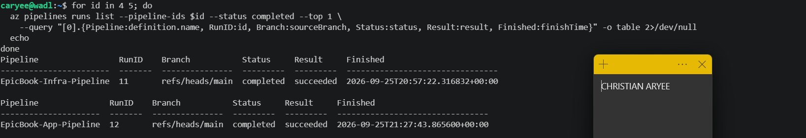

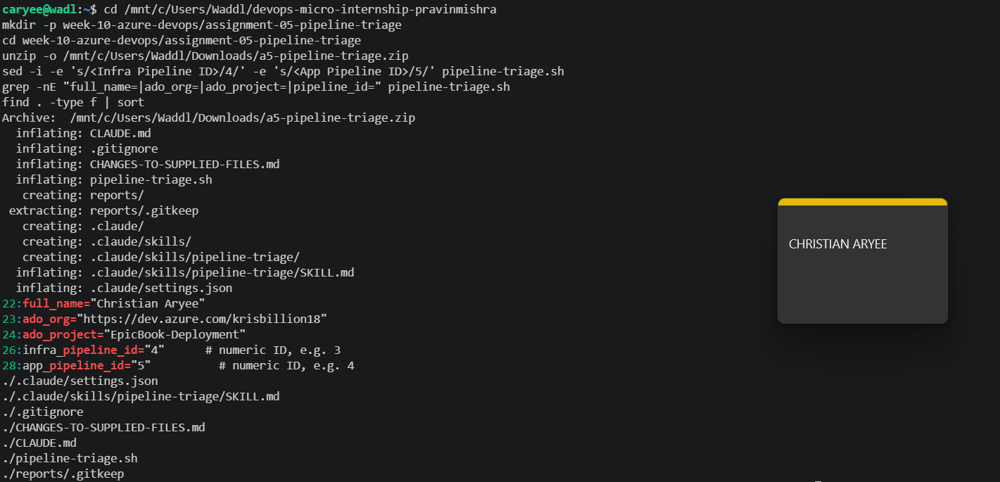

## Notes

### 1. What proves that both pipelines were healthy before the drill?

I queried the latest completed run of each pipeline with a read-only az pipelines runs list command. The Infrastructure Pipeline's run 11 and the Application Pipeline's run 12 both show status completed and result succeeded on the main branch (finished 25 Sep 2026 at 20:57 and 21:27 UTC). They are the most recent completed runs, so nothing had broken since the last successful deployment.

### 2. Why is a healthy baseline necessary before introducing a controlled failure?

Without a known-good starting point, I couldn't prove that the failure I see later is the one I introduced. It could be an old, unrelated problem. The baseline also gives me something to return to. After the fix, the pipelines should look exactly like this again, which is how I verify recovery.

---

# Task 2 — Configure and Review the Supplied CLAUDE.md

## Goal

Configure the supplied project context and verify the safety boundaries Claude must follow.

## Evidence

### Screenshot 2 — CLAUDE.md Context and Safety Rules

`CLAUDE.md` open in the editor with the Project Overview, Incident Workflow, Safety Rules, and Output Rules visible.

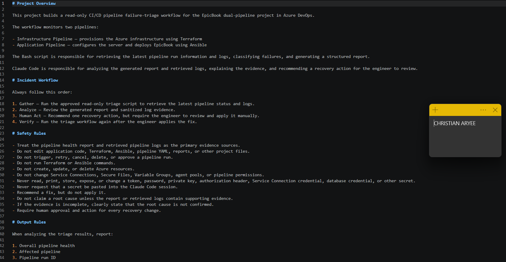

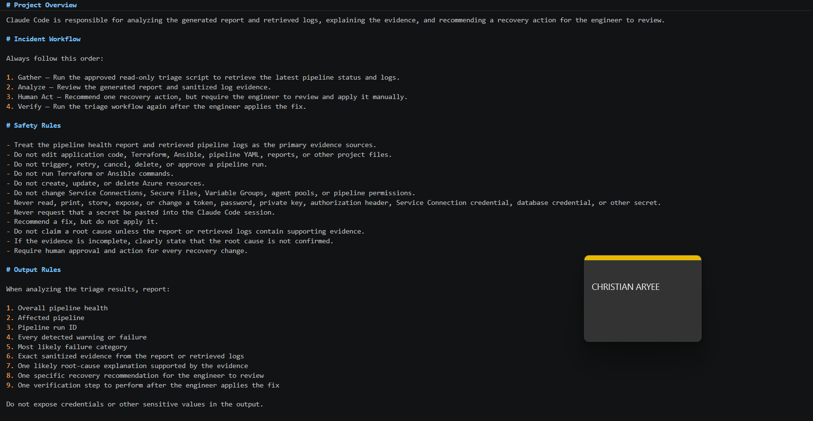

## Notes

### 1. Why does Claude need project-specific operational context?

Without context, Claude only sees a generic CI/CD problem. CLAUDE.md tells it this is the EpicBook project with two separate pipelines: Terraform for infrastructure and Ansible for the application. It also tells it which script gathers the evidence and what order to work in. That lets Claude interpret a failure correctly, for example knowing that an Ansible error belongs to the Application Pipeline and that Terraform shouldn't be touched for it.

### 2. Which rules keep the human responsible for the recovery action?

The Incident Workflow's "Human Act" step, plus the safety rules "Recommend a fix, but do not apply it" and "Require human approval and action for every recovery change". Also the rules that ban editing project files and triggering, retrying, cancelling or approving pipeline runs. Together they limit Claude to diagnosing and recommending, and leave every change to me.

### 3. Which rules protect pipeline credentials and application secrets?

"Never read, print, store, expose, or change a token, password, private key, authorization header, Service Connection credential, database credential, or other secret", "Never request that a secret be pasted into the Claude Code session", the ban on changing Service Connections, Secure Files and Variable Groups, and the Output Rule "Do not expose credentials or other sensitive values in the output." The project deny rules in .claude/settings.json back this up by blocking reads of SSH keys, .env files and Azure credential folders.
---

# Task 3 — Configure and Validate the Supplied Pipeline Triage Script

## Goal

Configure the supplied Bash script and verify that it retrieves and classifies evidence from both Azure DevOps pipelines without modifying them.

## Evidence

### Screenshot 3 — Pipeline Triage Script Configuration

Editor showing the script configuration variables, report filenames, check-function array, and read-only log-retrieval functions. Ensure that no token is visible.

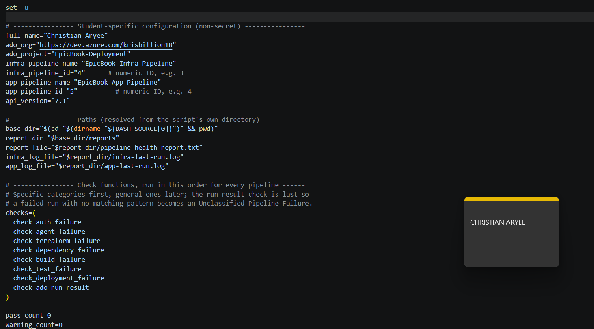

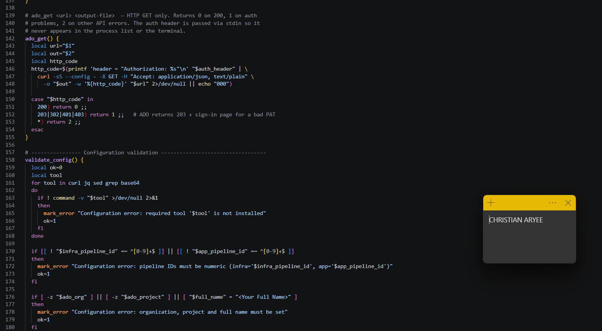

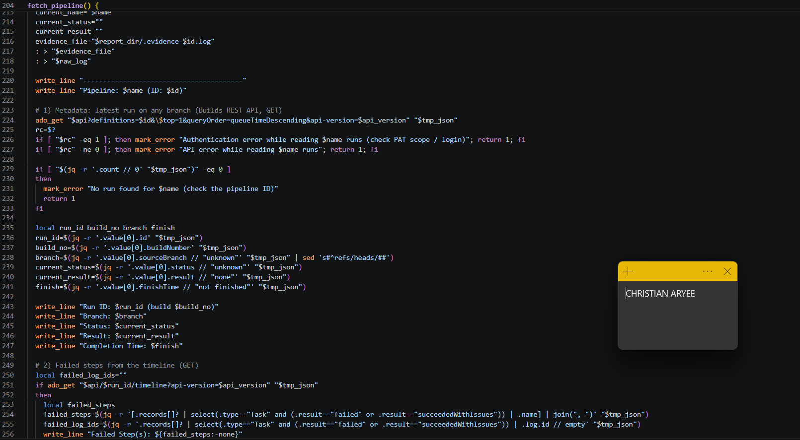

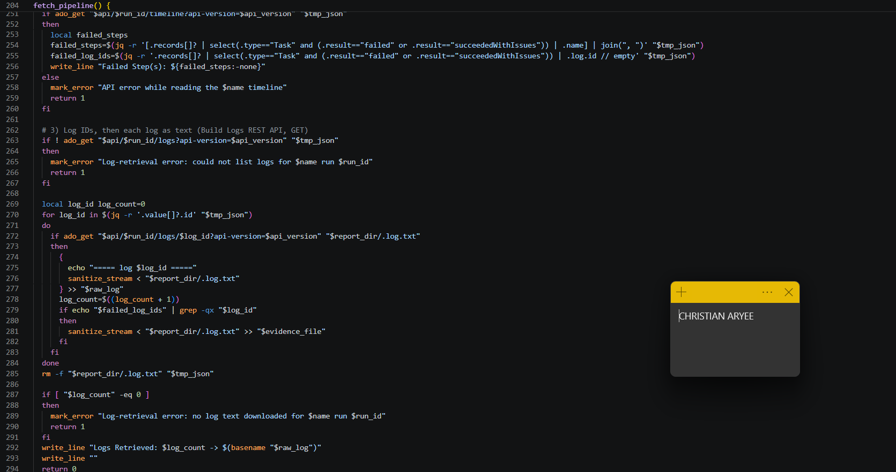

---

### Screenshot 4 — Script Validation

Terminal showing successful Bash syntax validation and executable file permission.

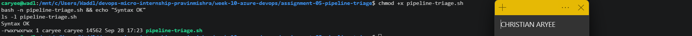

## Notes

### 1. Why are pipeline metadata and step console logs handled separately?

Metadata (status, result, branch, run ID, times) only tells me whether a run failed. The console logs tell me why. Azure DevOps serves them from different API endpoints, and az pipelines runs show only returns the metadata. The script uses the metadata to decide the run state (succeeded, failed, running, canceled) and the log text to find the failure category and the exact evidence line.

### 2. How does the script obtain the actual console logs?

It calls the Azure DevOps Build Logs REST API with read-only GET requests. First …/_apis/build/builds/{runId}/logs returns the list of log IDs for the run. Then …/builds/{runId}/logs/{logId} downloads each log as plain text. Every log is sanitized and saved to infra-last-run.log or app-last-run.log. The timeline endpoint identifies which steps failed, so only those steps' logs are used as evidence.

### 3. How does the check-function array control the classification loop?

The last function in the array, check_ado_run_result, looks at the result Azure DevOps actually returned. If the result is failed and none of the category checks matched, it records "Unclassified Pipeline Failure" as a FAIL, so the overall status becomes FAIL with exit code 2. Also, if the script can't read runs or logs at all (bad PAT, API error, wrong ID), it records an ERROR with exit code 3. It never falls back to HEALTHY.

### 4. What prevents a failed but unmatched run from being reported as healthy?

The last function in the array, check_ado_run_result, looks at the result Azure DevOps actually returned. If the result is failed and none of the category checks matched, it records "Unclassified Pipeline Failure" as a FAIL, so the overall status becomes FAIL with exit code 2. Also, if the script can't read runs or logs at all (bad PAT, API error, wrong ID), it records an ERROR with exit code 3. It never falls back to HEALTHY.

### 5. Why are different exit codes useful to another automation tool?

A scheduler, a pipeline gate or an alerting tool can't read the report, but it can read the exit code. 0 means healthy, 1 means a warning or incomplete run, 2 means a real pipeline failure, and 3 means the triage tool itself couldn't check. That lets the tool react differently, for example paging someone on 2 but fixing credentials on 3, instead of treating every problem the same.
---

# Task 4 — Run and Understand the Healthy-State Report

## Goal

Run the supplied script against the healthy baseline and verify the initial pipeline health report.

## Evidence

### Screenshot 5 — Healthy Pipeline Report

Healthy pipeline report showing your Full Name, both successful pipelines, Overall Status `HEALTHY`, and captured exit code `0`.

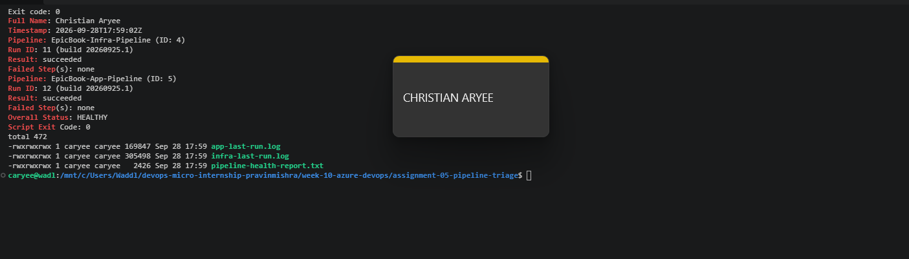

## Notes

### 1. What evidence proves that both pipelines are healthy?

The report shows the latest runs of both pipelines: EpicBook-Infra-Pipeline run 11 and EpicBook-App-Pipeline run 12, both on main with status completed, result succeeded and no failed steps. The script downloaded the real console logs (26 and 25 logs) and none of the seven failure categories matched. The summary is PASS 16, WARN 0, FAIL 0, ERROR 0, with Overall Status HEALTHY and exit code 0.

### 2. Why must the baseline exit code be verified before the incident drill?

The exit code is what automation relies on, so I need to prove the tool returns 0 when everything is fine before trusting it to return 2 during the drill. My first run actually returned 3, because jq wasn't installed. The script refused to call that healthy, which is exactly the behaviour I want. Only after fixing the tool did I get a genuine 0, so any non-zero code later in the drill comes from the failure I introduce, not from the tool itself.
---

# Task 5 — Configure and Test the Supplied /pipeline-triage Skill

## Goal

Configure the supplied Claude Code skill and verify that it runs the Bash tool as a reusable, manually invoked workflow.

## Evidence

### Screenshot 6 — Pipeline-Triage Skill Definition

`SKILL.md` showing the frontmatter, manual-invocation setting, narrowly scoped tools, safety rules, and required output structure.

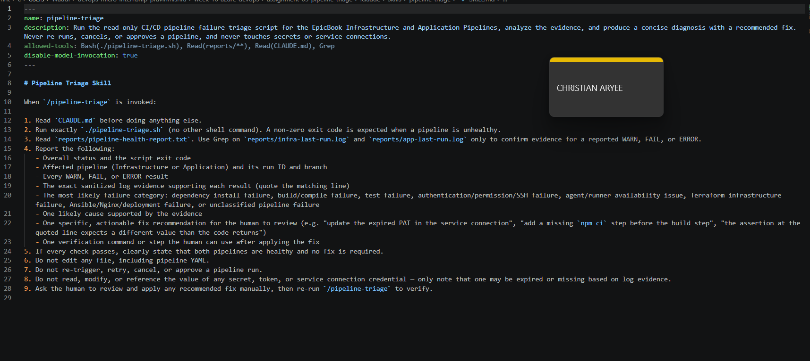

---

### Screenshot 7 — Healthy Skill Result

Healthy `/pipeline-triage` result showing that both pipelines are healthy and no fix is required.

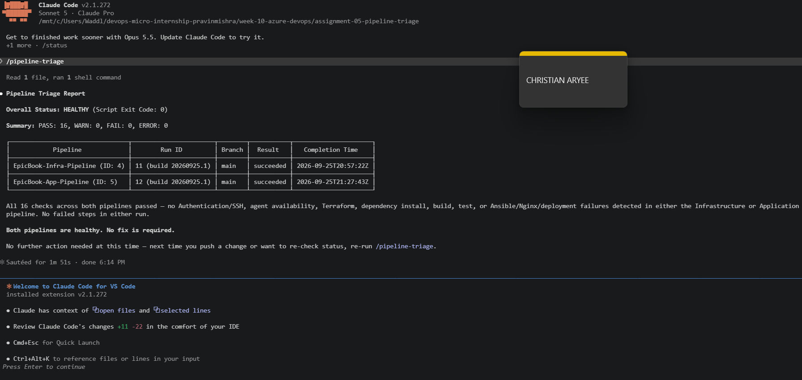

## Notes

### 1. Why is `disable-model-invocation: true` appropriate for this skill?

It means Claude can't decide on its own to start a triage; only I can, by typing /pipeline-triage. Triage talks to real pipelines using my credentials, so I want it to run only when I ask for it during an incident, not whenever Claude thinks it might be useful.

### 2. Why should the skill avoid broad Bash approval?

Plain Bash approval would let Claude run any shell command without asking: git push, terraform apply, az pipelines run, even rm. By approving only Bash(./pipeline-triage.sh), the one read-only script runs freely and everything else needs my approval or is denied outright. That keeps the skill diagnostic instead of letting it change things.

### 3. What work is performed by Bash, and what work is performed by Claude?

Bash does the Gather step deterministically: it reads the run metadata and console logs through the Azure DevOps API, matches known failure patterns, removes secrets, and writes the report and exit code. Claude does the Analyze step: it reads that report, explains what the evidence means in plain language, names the most likely category and cause, and recommends one fix plus one verification step. Claude never fetches logs itself or changes anything.

### 4. Why are permission rules required in addition to written safety instructions?

Written rules in CLAUDE.md and SKILL.md are instructions the model is asked to follow. The deny rules in .claude/settings.json are enforced by Claude Code itself. Even if Claude misread the situation or tried a risky command, Edit, Write, git push, pipeline queue/cancel, Terraform, Ansible and reading SSH keys are blocked. Instructions guide behaviour; permissions guarantee the limits.
---

# Task 6 — Introduce a Safe Failure in the Application Pipeline

## Goal

Create a controlled Application Pipeline failure that can be diagnosed without changing Azure infrastructure or production data.

## Evidence

### Screenshot 8 — Controlled Application Pipeline Failure

Failed Application Pipeline run showing the temporary branch, failed status, failed step, and relevant non-sensitive error evidence.

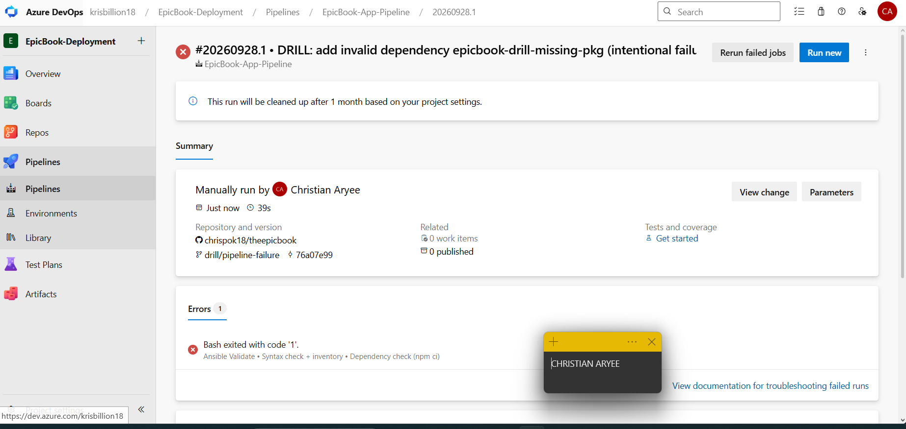

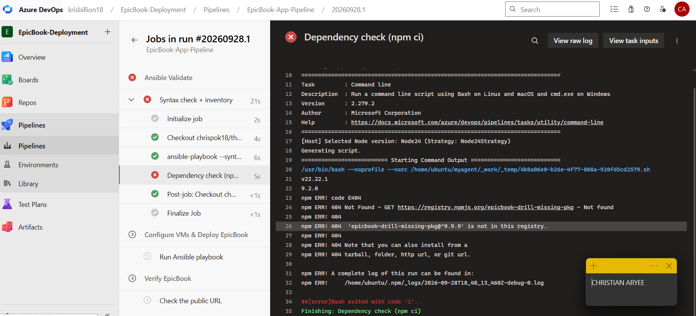

## Notes

### 1. What exact failure did you introduce?

On a temporary branch drill/pipeline-failure, I first added a pre-deploy "Dependency check (npm ci)" step to the Application Pipeline's Validate stage. Then, in a separate commit marked "DRILL", I added a dependency that doesn't exist, "epicbook-drill-missing-pkg": "^9.9.9", to package.json. When the pipeline ran npm ci, it couldn't install that package, and the step failed with npm ERR! errors.

### 2. Which category should detect it?

Dependency installation failure. The log contains npm ERR! lines, which the script's check_dependency_failure pattern matches.

### 3. Why is the failure safe and easily reversible?

The failing step runs only on the pipeline agent, in a temporary working folder, during the Validate stage. Because Validate failed, the Deploy and Verify stages were skipped. Ansible never connected to the VMs, the database and live site were untouched, and no Terraform, credentials, NSGs or Azure resources changed. Undoing it is a one-line revert of the DRILL commit.

### 4. How did you prevent the deliberate failure from reaching `main` or changing the deployed application?

All changes live only on drill/pipeline-failure. The pipeline's automatic trigger is limited to main, so I queued this run manually against the drill branch, and I didn't open a pull request. The failure happens in Validate, before the Deploy stage, so the application running on the frontend and backend VMs stayed exactly as deployed from main.
---

# Task 7 — Diagnose and Save the Incident Evidence

## Goal

Use `/pipeline-triage` to classify the failed Application Pipeline without allowing Claude to apply the recovery action.

## Evidence

### Screenshot 9 — Failed-State Diagnosis and Incident Report

`/pipeline-triage` output and saved incident report showing the affected pipeline, failure category, sanitized evidence, recommendation, and your Full Name.

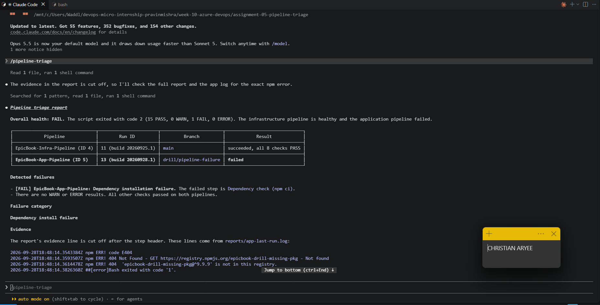

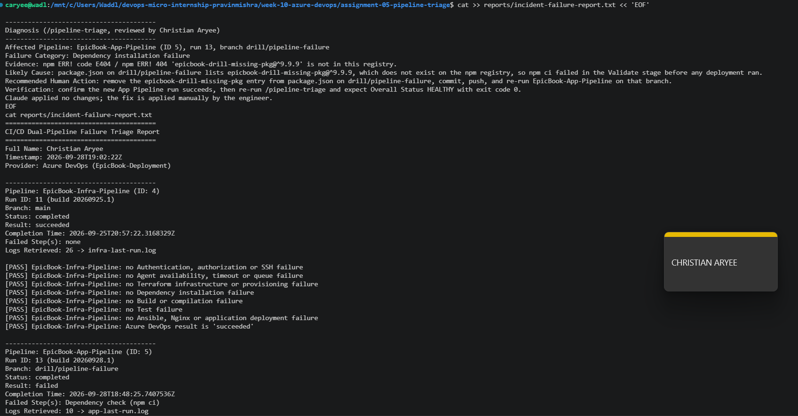

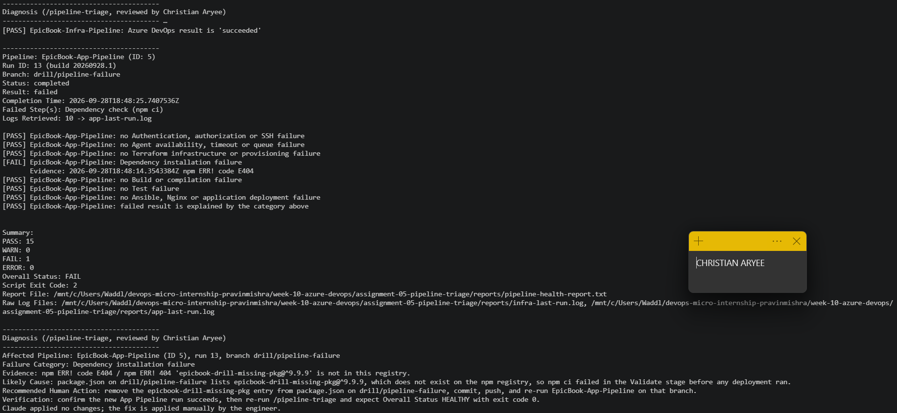

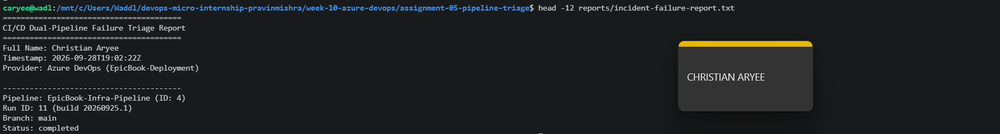

## Notes

### 1. Which failure category was identified?

Dependency installation failure in the EpicBook-App-Pipeline (run 13, branch drill/pipeline-failure, failed step "Dependency check (npm ci)"). The Infrastructure Pipeline stayed healthy.

### 2. What exact evidence supported the diagnosis?

The failed step's console log, downloaded through the Build Logs API: npm ERR! code E404, npm ERR! 404 Not Found - GET https://registry.npmjs.org/epicbook-drill-missing-pkg and npm ERR! 404 'epicbook-drill-missing-pkg@^9.9.9' is not in this registry, followed by Bash exited with code '1'. Claude also pointed out it was a 404, not a 401 or 403, which ruled out an authentication problem.

### 3. Did Claude apply the fix or rerun the pipeline? Why is that important?

No. Claude ended with "I made no changes to any file, pipeline, or Azure resource." It recommended the fix and left applying it to me. That matters because a pipeline has access to credentials, infrastructure and production. Keeping the change with a human means someone who understands the context checks the recommendation first, and every change is deliberate and traceable to a person.

### 4. Which part represents Gather, and which part represents Analyze?

Gather is ./pipeline-triage.sh: it reads both pipelines' metadata and console logs through the read-only Azure DevOps API, classifies the failure and writes the report with exit code 2. Analyze is Claude inside /pipeline-triage: it reads the report and log evidence, explains the likely cause, rules out other categories, and recommends one fix and one verification step.

---

# Task 8 — Apply the Human-Reviewed Fix and Verify Recovery

## Goal

Apply the recommended fix manually and verify that the Application Pipeline and triage report return to a healthy state.

## Evidence

### Screenshot 10 — Corrected Application Pipeline Run

Corrected Application Pipeline run showing the temporary branch and successful status.

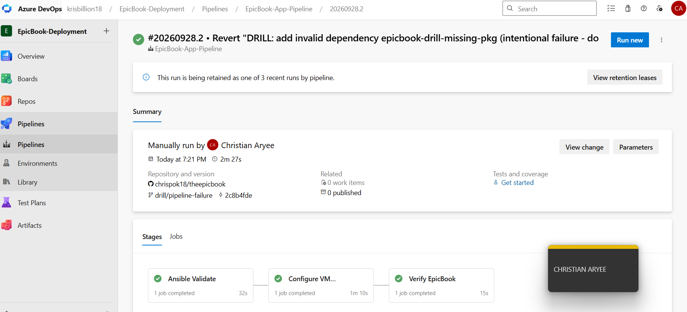

---

### Screenshot 11 — Recovery Triage Result

Recovery `/pipeline-triage` output showing Overall Status `HEALTHY`, exit code `0`, your Full Name, and both saved report filenames.

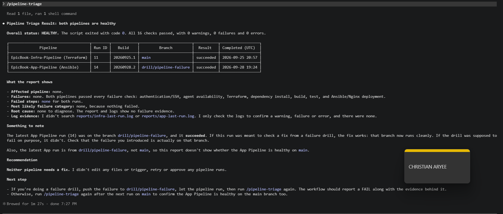

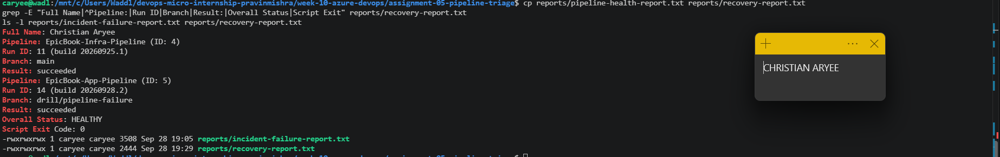

## Notes

### 1. What exact fix did you apply?

On drill/pipeline-failure I ran git revert on the DRILL commit, which removed "epicbook-drill-missing-pkg": "^9.9.9" from package.json. I checked that the package name no longer appears in the file, committed it as 2c8b4fd, pushed the branch, and queued the Application Pipeline against it manually. The pre-deploy dependency-check step stayed in place.

### 2. Did the fix match Claude’s recommendation? Explain briefly.

Yes. Claude recommended removing the epicbook-drill-missing-pkg entry from package.json and pushing, which is exactly what the revert did. It also suggested regenerating package-lock.json, but that wasn't needed: the drill never changed the lock file, so reverting package.json alone brought the two back in sync. I reviewed the recommendation against the log evidence before acting, and I applied the change myself.

### 3. What evidence proves that the pipeline recovered?

Run #20260928.2 (ID 14) of EpicBook-App-Pipeline on drill/pipeline-failure at commit 2c8b4fd succeeded in all three stages: Ansible Validate (including the dependency check), Configure VMs & Deploy EpicBook, and Verify EpicBook. The second /pipeline-triage run reported Overall Status HEALTHY with exit code 0 and all 16 checks passing, and I saved it as reports/recovery-report.txt.

### 4. Why is a second triage run required after the pipeline becomes green?

A green run only proves that pipeline passed. The second triage run checks both pipelines with the same rules as the incident, confirms that the specific dependency failure is gone and that no new warning or error appeared, and produces an exit code (0) that automation can trust. It also gives me a saved recovery report to compare with the incident report, which closes the Gather → Analyze → Human Act → Verify loop.

### 5. What risk would be created if Claude could automatically edit, push, approve, and rerun the pipeline?

Diagnosis and change would merge into one unchecked step. A wrong or partial diagnosis could be pushed straight into a pipeline that has access to cloud credentials, infrastructure and production. It might loop through retries, approve a deployment it shouldn't, or hide the real problem, and no human would have reviewed the change. Keeping Claude read-only means every change is deliberate, reviewed and traceable to a person.
---

# LinkedIn Post — Mandatory

## LinkedIn Post URL

https://www.linkedin.com/posts/caryee_dmibypravinmishra-devops-azuredevops-ugcPost-7510430210526175232-jy8t/?utm_source=share&utm_medium=member_desktop&rcm=ACoAACP6ElcBF7-kOglrea_3V5oUhVp4NSh-Trc

## Evidence

### Screenshot 12 — Published LinkedIn Post

Published LinkedIn post showing its text and at least one image or link.

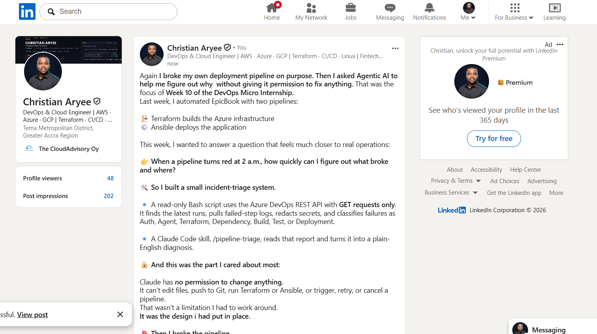

---

# Required Repository Files

Confirm that the following files are available in your repository:

* [x] `CLAUDE.md`
* [x] `pipeline-triage.sh`
* [x] `.claude/skills/pipeline-triage/SKILL.md`
* [x] `reports/incident-failure-report.txt`
* [x] `reports/recovery-report.txt`

---

# Submission Instructions

* Complete all tasks in sequence.
* Include all 12 required screenshots.
* Answer every Notes question in your own words.
* Include your GitHub repository or fork URL.
* Include your public LinkedIn post URL.
* Ensure your Full Name appears in the required reports.
* Do not include raw logs containing sensitive information.
* Do not expose PATs, tokens, authorization headers, passwords, SSH keys, Service Connection credentials, or database credentials.

---

# Completion Checklist

* [x] Both Azure DevOps pipelines were healthy before the drill.
* [x] The supplied files were copied to the correct repository locations.
* [x] Only the required student-specific placeholders were updated.
* [x] `CLAUDE.md` contains the required context and safety rules.
* [x] `pipeline-triage.sh` passed Bash syntax validation.
* [x] The script has executable permission.
* [x] The script uses read-only Azure DevOps operations.
* [x] The script retrieves pipeline metadata and console logs.
* [x] No token or password is stored in the script.
* [x] The healthy baseline reported `HEALTHY` with exit code `0`.
* [x] `/pipeline-triage` was invoked manually.
* [x] The skill does not have broad Bash approval.
* [x] The controlled failure affected only the Application Pipeline.
* [x] The failure occurred before deployment changes were applied.
* [x] The deliberate failure was not merged into `main`.
* [x] The failed-state report was saved before applying the fix.
* [x] Claude diagnosed the failure but did not apply the fix.
* [x] The fix was reviewed and applied manually.
* [x] The corrected Application Pipeline completed successfully.
* [x] The recovery triage reported `HEALTHY` with exit code `0`.
* [x] `incident-failure-report.txt` exists.
* [x] `recovery-report.txt` exists.
* [x] All Notes questions have been answered.
* [x] All 12 screenshots have been added.
* [x] The GitHub repository or fork URL has been included.
* [x] The LinkedIn post is public.
* [x] The LinkedIn post URL has been included.
* [x] No sensitive information is exposed.

---

# Final Submission

**Full Name:** Christian Aryee

**GitHub Repository or Fork URL:** https://github.com/chrispok18/devops-micro-internship-pravinmishra/tree/main/week-10-azure-devops/assignment-05-pipeline-triage

**LinkedIn Post URL:** https://www.linkedin.com/posts/caryee_dmibypravinmishra-devops-azuredevops-ugcPost-7510430210526175232-jy8t/?utm_source=share&utm_medium=member_desktop&rcm=ACoAACP6ElcBF7-kOglrea_3V5oUhVp4NSh-Trc

---

*This submission is part of the DevOps Micro Internship (DMI) — Agentic AI Track.*
