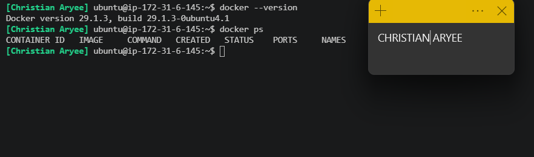
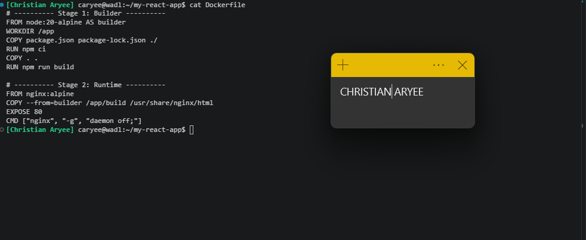
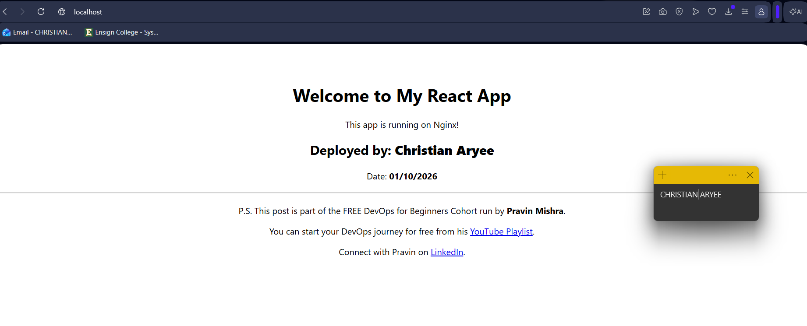
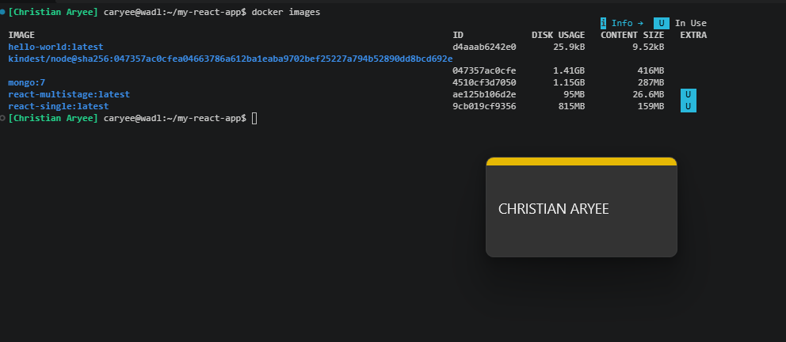
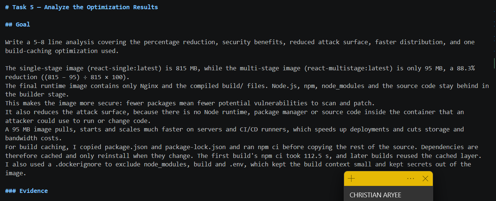
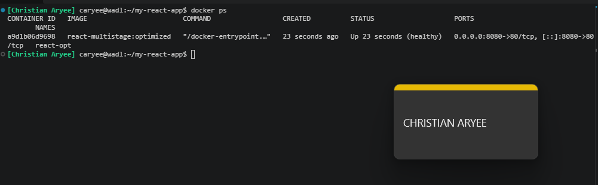
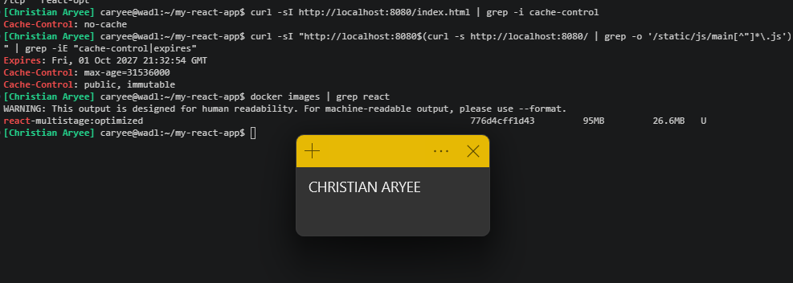
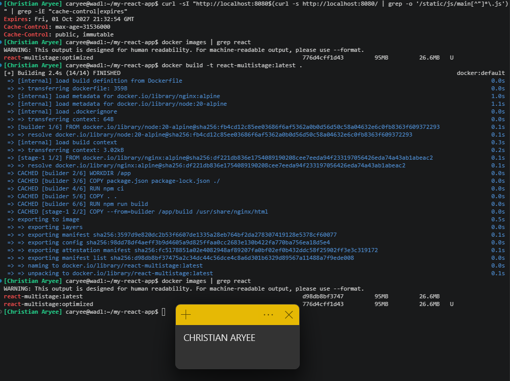
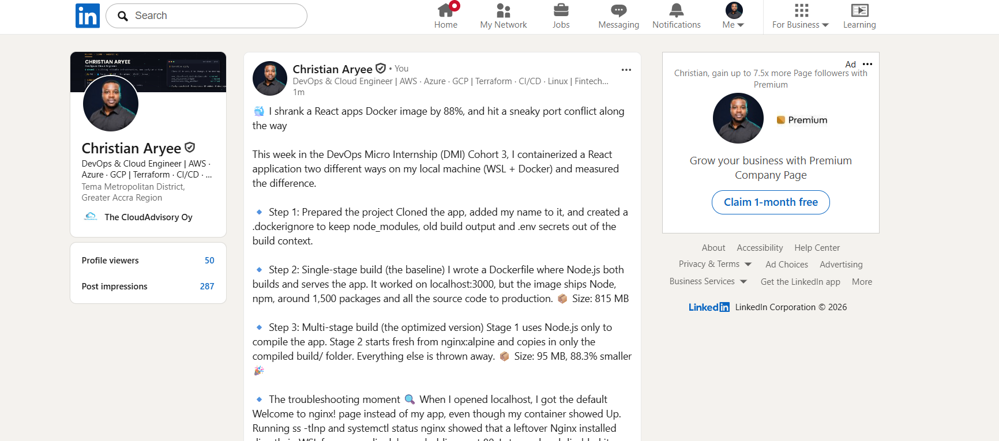

# Assignment 2 — Multi-Stage Docker Build for a React Application

Part of the DevOps Micro Internship (DMI) Cohort 3 with Agentic AI

---

## Purpose

In this assignment, you will build both a single-stage and an optimized multi-stage Docker image for a React application, compare the resulting image sizes, and deploy the optimized version using a production-ready Nginx runtime container.

---

# Task 1 — Prepare the Project

## Goal

Clone `https://github.com/pravinmishraaws/my-react-app.git` and create a `.dockerignore` excluding `node_modules`, `build`, and `.env`.

### Evidence

#### Screenshot 1 — Contents of the `.dockerignore` file

---

# Task 2 — Create a Single-Stage Docker Image

## Goal

Create `Dockerfile.single`, build `react-single`, and run it on port 3000.

### Evidence

#### Screenshot 2 — Contents of `Dockerfile.single`

---

#### Screenshot 3 — Browser displaying the application running from the single-stage container

---

# Task 3 — Create a Multi-Stage Docker Build

## Goal

Create a multi-stage Dockerfile with separate build and Nginx runtime stages, build `react-multistage`, and run it on port 80.

### Evidence

#### Screenshot 4 — Contents of the multi-stage Dockerfile

---

#### Screenshot 5 — Browser displaying the application running from the multi-stage container

---

# Task 4 — Compare Docker Image Sizes

## Goal

Compare the single-stage and multi-stage image sizes and calculate the percentage reduction.

### Evidence

#### Screenshot 6 — Docker image list showing both image sizes

---

# Task 5 — Analyze the Optimization Results

## Goal

Write a 5–8 line analysis covering the percentage reduction, security benefits, reduced attack surface, faster distribution, and one build-caching optimization used.

The single-stage image (react-single:latest) is 815 MB, while the multi-stage image (react-multistage:latest) is only 95 MB, a 88.3% reduction ((815 − 95) ÷ 815 × 100).
The final runtime image contains only Nginx and the compiled build/ files. Node.js, npm, node_modules and the source code stay behind in the builder stage.
This makes the image more secure: fewer packages mean fewer potential vulnerabilities to scan and patch.
It also reduces the attack surface, because there is no Node runtime, package manager or source code inside the container that an attacker could use to run or change code.
A 95 MB image pulls, starts and scales much faster on servers and CI/CD runners, which speeds up deployments and cuts storage and bandwidth costs.
For build caching, I copied package.json and package-lock.json and ran npm ci before copying the rest of the source. Dependencies are therefore cached and only reinstall when they change. The first build's npm ci took 112.5 s, and later builds reused the cached layer.
I also used a .dockerignore to exclude node_modules, build and .env, which kept the build context small and kept secrets out of the image.

### Evidence

#### Screenshot 7 — Analysis included in your submission document

---

### Notes

**Image sizes**

| Image | Size (DISK USAGE) |
|---|---|
| `react-single:latest` | 815 MB |
| `react-multistage:latest` | 95 MB |

**Percentage reduction** = ((815 − 95) ÷ 815) × 100 = (720 ÷ 815) × 100 = **88.3%**

**Analysis**

The single-stage image (`react-single:latest`) is 815 MB, while the multi-stage image (`react-multistage:latest`) is only 95 MB, an 88.3% reduction.
The final runtime image contains only Nginx and the compiled `build/` files; Node.js, npm, `node_modules`, and the source code stay behind in the builder stage.
This makes the image more secure: fewer packages mean fewer potential vulnerabilities to scan and patch.
It also reduces the attack surface, because there is no Node runtime, package manager, or source code inside the container that an attacker could use to run or modify code.
A 95 MB image pulls, starts, and scales much faster on servers and CI/CD runners, which speeds up deployments and cuts storage and bandwidth costs.
For build caching, I copied `package.json` and `package-lock.json` and ran `npm ci` before copying the rest of the source, so dependencies are cached and only reinstall when they change. The first `npm ci` took 112.5 s, while a rebuild with no changes finished in 2.4 s with every layer `CACHED`.
I also used a `.dockerignore` to exclude `node_modules`, `build`, and `.env`, which kept the build context small and kept secrets out of the image.

---

# Task 6 — Explore Additional Production Optimizations (Optional)

## Goal

Optionally configure an Nginx health check, cache headers, parameterized ports via environment variables, or a lighter runtime image, and compare results.

> Screenshot optional.

Additional production optimizations (Task 6)

I created Dockerfile.optimized and a custom nginx.conf, and built react-multistage:optimized.

1. Nginx health check. I added HEALTHCHECK --interval=15s --timeout=3s --retries=3 CMD wget -q --spider http://127.0.0.1/ || exit 1. Docker now probes the site every 15 seconds and reports the container as (healthy) in docker ps. Orchestrators like Docker Swarm and ECS use this signal to restart or replace failing containers automatically. I used 127.0.0.1 instead of localhost because Alpine can resolve localhost to IPv6 while Nginx was listening on IPv4 only.

2. Cache headers for static assets. Hashed files under /static/ are served with Cache-Control: max-age=31536000 and public, immutable (1 year), while index.html uses Cache-Control: no-cache. Repeat visitors load JS and CSS from their browser cache, but always get the latest index.html, and through it the newest bundle, after a deployment. I verified this with curl -I.

3. SPA routing fallback. try_files $uri /index.html prevents 404 errors when users refresh on client-side routes.

Size comparison: react-multistage:latest = 95 MB and react-multistage:optimized = 95 MB. The health check and caching features added production reliability and performance with no measurable increase in image size.

---

# LinkedIn Post (Optional)

## Goal

Create a LinkedIn post describing what you built, what a multi-stage Docker build is, the image size reduction achieved, and key learnings.

## Evidence

#### LinkedIn Post URL

Paste your LinkedIn post URL here:

`https://www.linkedin.com/posts/caryee_multi-stage-docker-build-ugcPost-7511546162202664960-HaZy/?utm_source=share&utm_medium=member_desktop&rcm=ACoAACP6ElcBF7-kOglrea_3V5oUhVp4NSh-Trc`

---

#### Screenshot — Published LinkedIn post

---

# Submission Instructions

- Add all required screenshots in your submission
- Full name must be visible in required screenshots
- Do not expose sensitive information

---

# Completion Checklist

- [x] Task 1: `.dockerignore` created (Screenshot 1)
- [x] Task 2: Single-stage image built and verified (Screenshots 2–3)
- [x] Task 3: Multi-stage image built and verified (Screenshots 4–5)
- [x] Task 4: Image sizes compared (Screenshot 6)
- [x] Task 5: Analysis written (Screenshot 7 & Notes)
- [x] Task 6: Optional production optimizations explored
- [x] No sensitive information exposed

---

## 📌 About DMI & CloudAdvisory

DevOps Micro Internship (DMI) is a project-based DevOps program run by Pravin Mishra (The CloudAdvisory) focused on real-world execution, systems thinking, and career readiness.

It helps learners build strong DevOps foundations with hands-on experience.

---

## 📌 Resources

- 🌐 DMI Official Website: https://dmi.pravinmishra.com?utm_source=github&utm_medium=readme  
- 🎓 University: https://university.pravinmishra.com?utm_source=github&utm_medium=readme  
- 💬 Discord Community: https://discord.pravinmishra.com?utm_source=github&utm_medium=readme  
- 📝 Blog: https://dmi.pravinmishra.com/blog?utm_source=github&utm_medium=readme  
- ▶️ YouTube Playlist: https://www.youtube.com/playlist?list=PLFeSNDtI4Cho  
- 🔗 Pravin Mishra (LinkedIn): https://www.linkedin.com/in/pravin-mishra-aws-trainer/  
- 🏢 CloudAdvisory (LinkedIn): https://www.linkedin.com/company/thecloudadvisory/

---

*This submission is part of DevOps Micro Internship (DMI) Cohort 3 — Agentic AI Track.*
