# Assignment 3 — Docker Networking

Part of the DevOps Micro Internship (DMI) Cohort 3 with Agentic AI

---

## Purpose

In this assignment, you will explore Docker network types and deploy applications using different networking modes: the default bridge network, a custom bridge network for microservices, multiple networks for a multi-tier architecture, and host networking.

---

# Task 1 — Deploy a Standalone Application Using Docker Bridge Network

## Goal

List Docker networks, verify/pull the Nginx image, run an Nginx container (`myweb`) on the default bridge network with port 80 mapped, and verify it's reachable from a browser via the VM's public IP.

### Evidence

#### Screenshot 1 — Output of `docker network ls`

---

#### Screenshot 2 — Output of `docker images`

---

#### Screenshot 3 — Output of `docker search nginx`

---

#### Screenshot 4 — Successful `docker pull nginx` (if applicable)

---

#### Screenshot 5 — Output of `docker ps` showing the running `myweb` container

---

#### Screenshot 6 — Browser displaying the Nginx Welcome Page using the Public IP address

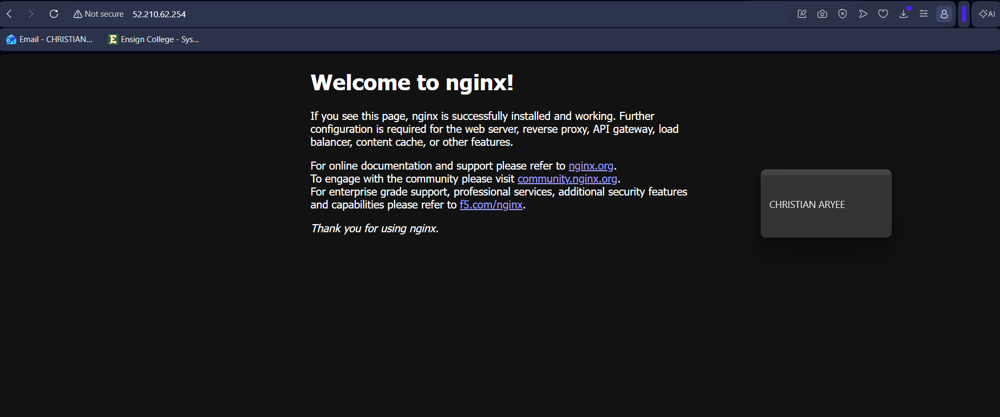

---

# Task 2 — Connect Multiple Containers Using a Custom Bridge Network

## Goal

Create a custom bridge network `mynetwork`, build and run a Node/Express `frontend` container and an Nginx `backend` container on it, and verify they can communicate by container name.

### Evidence

#### Screenshot 1 — Output of `docker network create mynetwork`

---

#### Screenshot 2 — Output of `docker network ls`

---

#### Screenshot 3 — Frontend Dockerfile

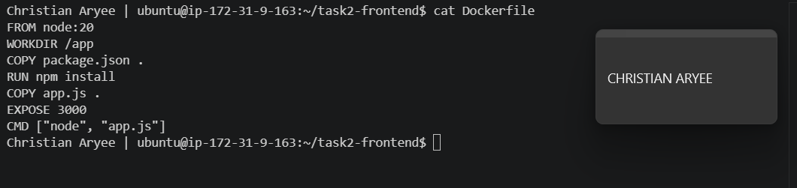

---

#### Screenshot 4 — Successful `docker build` for the frontend

---

#### Screenshot 5 — Output of `docker ps` showing the frontend container

---

#### Screenshot 6 — Output of `docker ps` showing both frontend and backend containers

---

#### Screenshot 7 — Output of `docker network inspect mynetwork`

---

#### Screenshot 8 — Successful `curl http://<Public-IP>` showing "Hello from Frontend"

---

#### Screenshot 9 — Successful `curl backend` output from the frontend container showing the Nginx Welcome Page

---

# Task 3 — Deploy a Multi-Tier Application Using Multiple Docker Networks

## Goal

Build a three-tier app (frontend, backend, MongoDB) across `backend-network` (backend ↔ database) and `frontend-network` (frontend ↔ backend), and verify data flows end to end.

### Evidence

#### Screenshot 1 — Creation of `backend-network`

---

#### Screenshot 2 — Creation of `frontend-network`

---

#### Screenshot 3 — Project folder structure

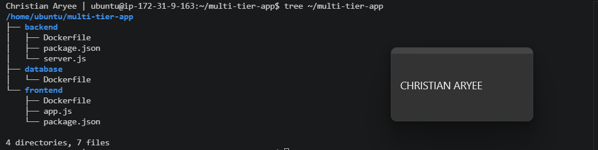

---

#### Screenshot 4 — Database Dockerfile

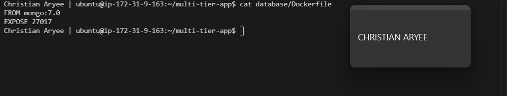

---

#### Screenshot 5 — Backend Dockerfile

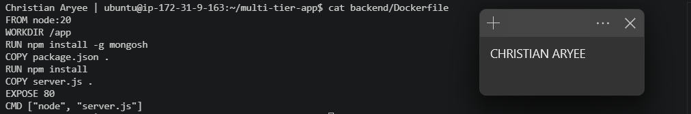

---

#### Screenshot 6 — Frontend Dockerfile

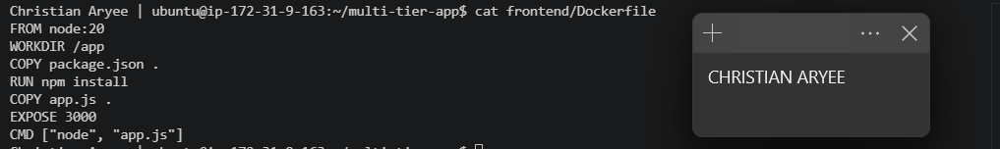

---

#### Screenshot 7 — Successful Docker image builds (database, backend, frontend)

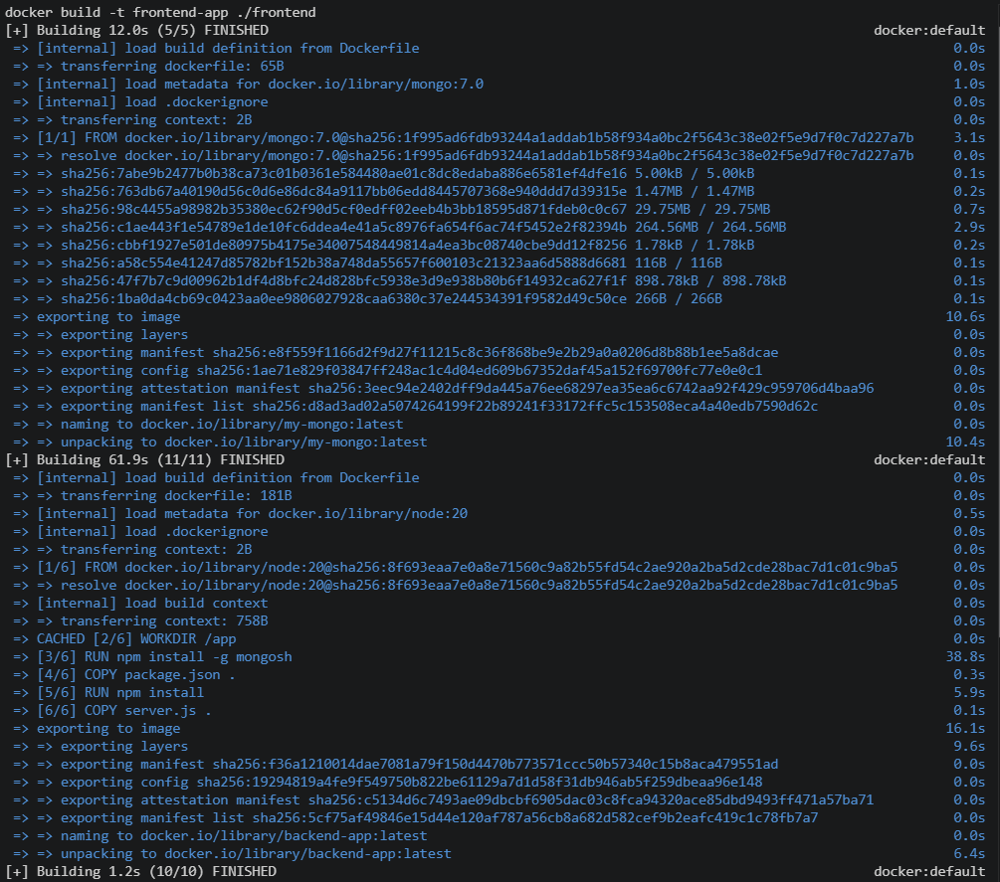

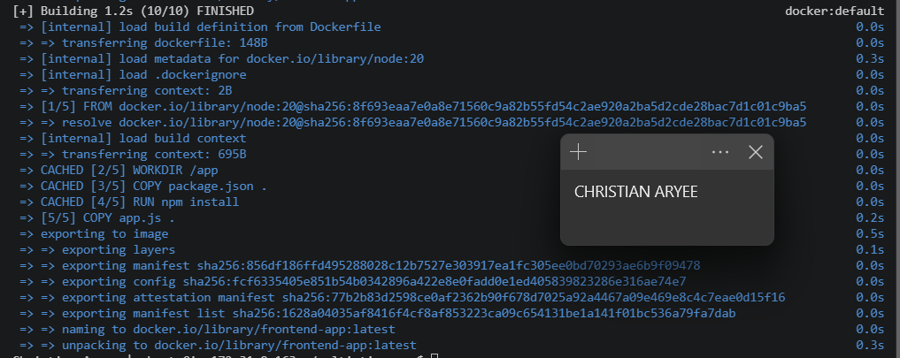

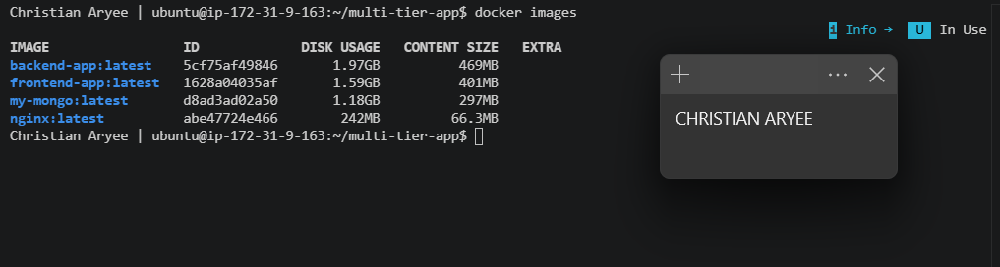

---

#### Screenshot 8 — Running containers (`docker ps`)

---

#### Screenshot 9 — Output of `docker network inspect backend-network`

---

#### Screenshot 10 — Output of `docker network inspect frontend-network`

---

#### Screenshot 11 — Browser showing the frontend application

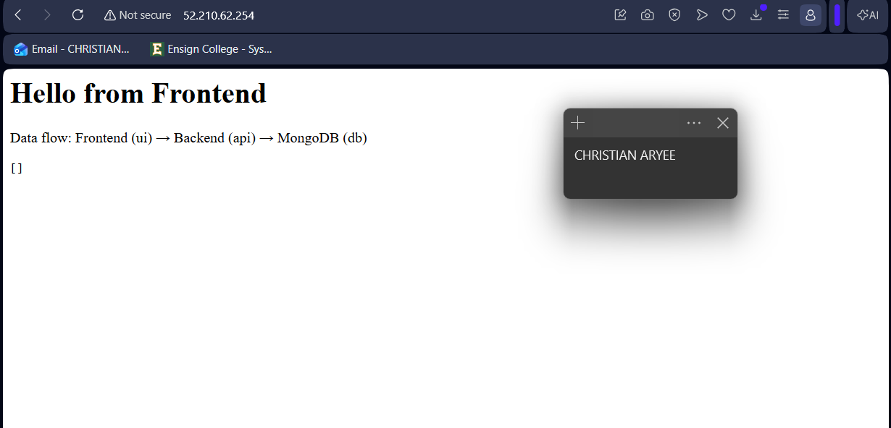

---

#### Screenshot 12 — Successful `curl api` from the frontend container

---

#### Screenshot 13 — MongoDB connection using `mongosh`

---

#### Screenshot 14 — Successful document insertion

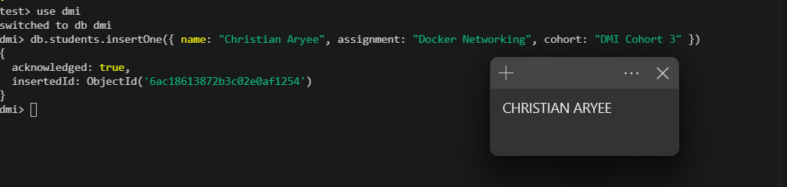

---

#### Screenshot 15 — Successful retrieval of the inserted document

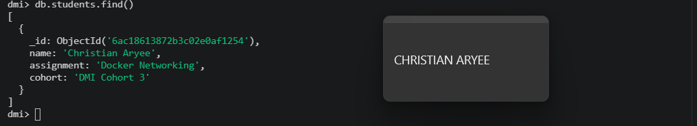

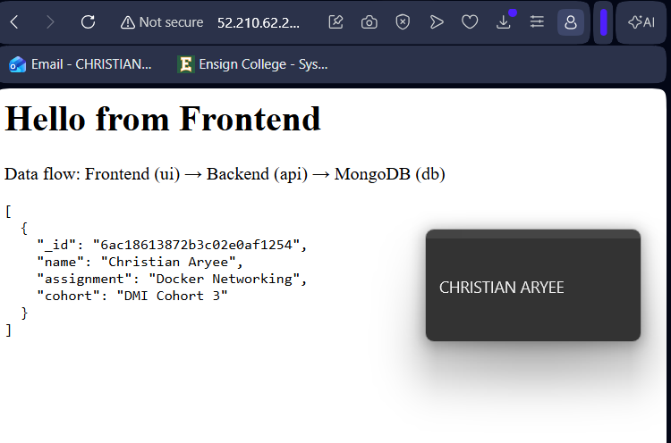

---

# Task 4 — Deploy an Application Using Docker Host Network Mode

## Goal

Deploy an Nginx container (`fastapp`) using Host Network Mode and verify it's reachable without explicit port mapping, then confirm the `NetworkMode` and clean up.

### Evidence

#### Screenshot 1 — Output of `docker run --network host`

---

#### Screenshot 2 — Output of `docker ps` showing the running `fastapp` container

---

#### Screenshot 3 — Browser or terminal displaying the Nginx Welcome Page

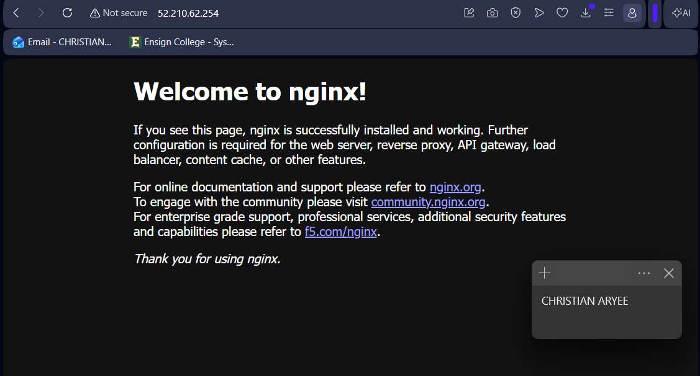

---

#### Screenshot 4 — Output of `docker inspect fastapp | grep "NetworkMode"`

---

#### Screenshot 5 — Successful cleanup showing `docker stop fastapp` and `docker rm fastapp`

---

# LinkedIn Post (Optional)

## Goal

Create a LinkedIn post covering the assignment objective, networking modes explored, key learning outcomes, and a short reflection on Docker networking concepts.

## Evidence

#### LinkedIn Post URL

Paste your LinkedIn post URL here:

`https://www.linkedin.com/posts/caryee_docker-networking-on-aws-ugcPost-7512291653668343808-3H0s/?utm_source=share&utm_medium=member_desktop&rcm=ACoAACP6ElcBF7-kOglrea_3V5oUhVp4NSh-Trc`

---

#### Screenshot — Published LinkedIn post

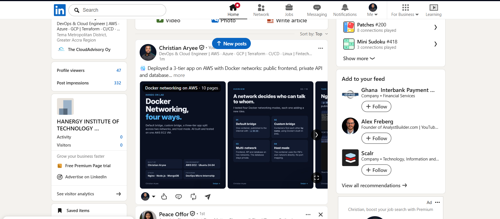

---

# Submission Instructions

- Add all required screenshots in your submission
- Full name must be visible in required screenshots
- Do not expose sensitive information

---

# Completion Checklist

- [x] Task 1: Standalone app on default bridge network deployed and verified (Screenshots 1–6)
- [x] Task 2: Custom bridge network with frontend/backend communication verified (Screenshots 1–9)
- [x] Task 3: Multi-tier app across two networks deployed and verified end to end (Screenshots 1–15)
- [x] Task 4: Host network mode deployment verified and cleaned up (Screenshots 1–5)
- [x] No sensitive information exposed

---

## 📌 About DMI & CloudAdvisory

DevOps Micro Internship (DMI) is a project-based DevOps program run by Pravin Mishra (The CloudAdvisory) focused on real-world execution, systems thinking, and career readiness.

It helps learners build strong DevOps foundations with hands-on experience.

---

## 📌 Resources

- 🌐 DMI Official Website: https://dmi.pravinmishra.com?utm_source=github&utm_medium=readme  
- 🎓 University: https://university.pravinmishra.com?utm_source=github&utm_medium=readme  
- 💬 Discord Community: https://discord.pravinmishra.com?utm_source=github&utm_medium=readme  
- 📝 Blog: https://dmi.pravinmishra.com/blog?utm_source=github&utm_medium=readme  
- ▶️ YouTube Playlist: https://www.youtube.com/playlist?list=PLFeSNDtI4Cho  
- 🔗 Pravin Mishra (LinkedIn): https://www.linkedin.com/in/pravin-mishra-aws-trainer/  
- 🏢 CloudAdvisory (LinkedIn): https://www.linkedin.com/company/thecloudadvisory/

---

*This submission is part of DevOps Micro Internship (DMI) Cohort 3 — Agentic AI Track.*
