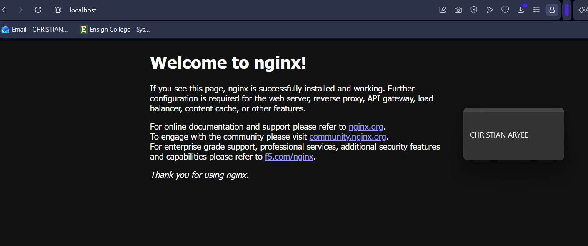
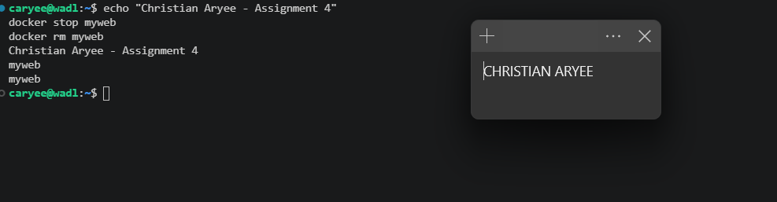
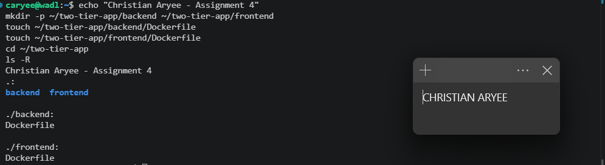
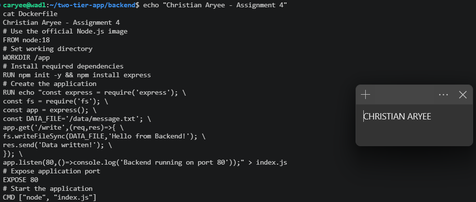
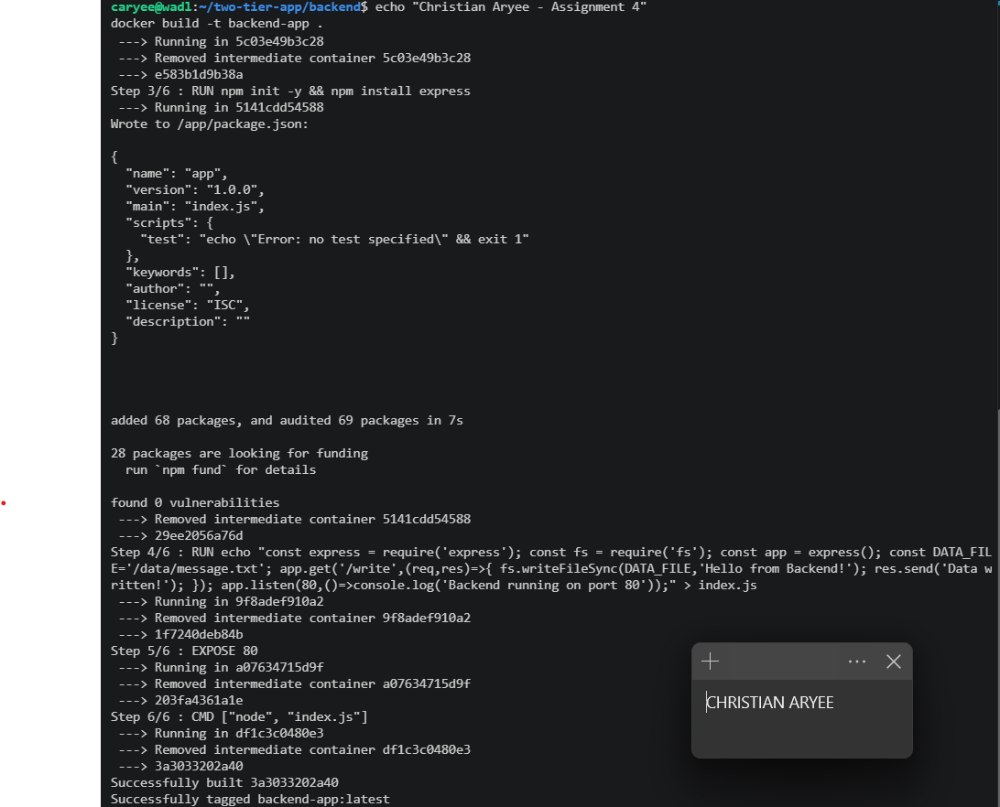
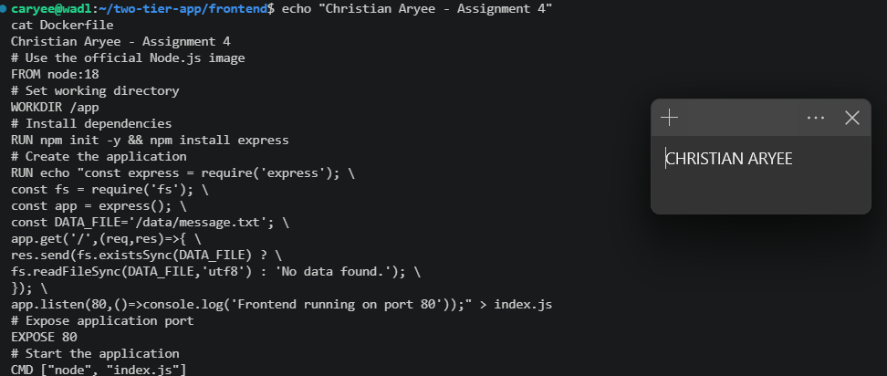
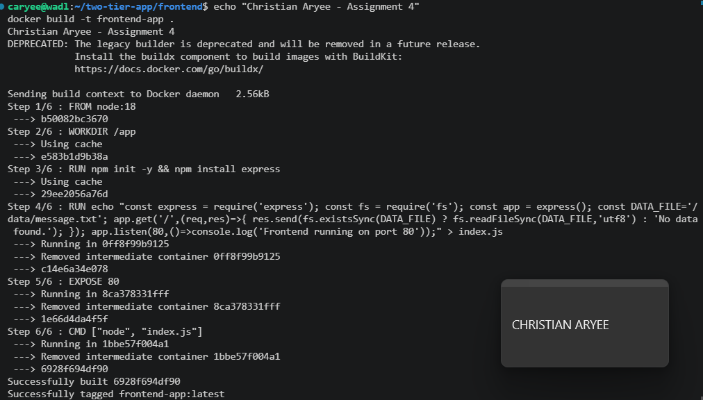
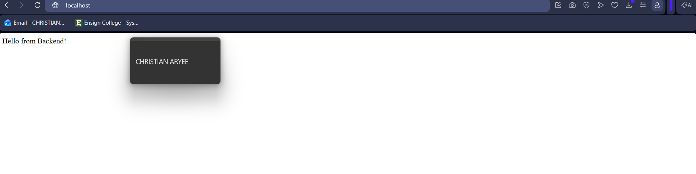
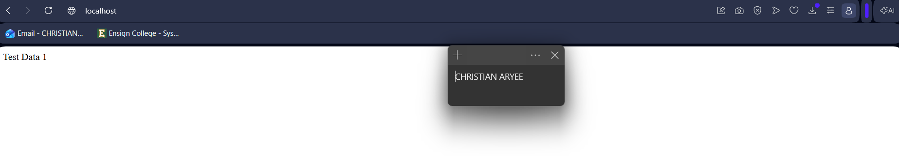
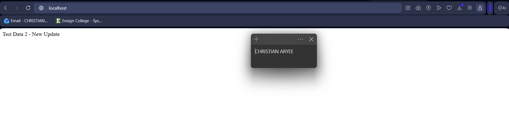

# Assignment 4 — Docker Volumes

Part of the DevOps Micro Internship (DMI) Cohort 3 with Agentic AI

---

## Purpose

In this assignment, you will learn how Docker Volumes and Bind Mounts provide persistent storage for containers, deploying applications that retain logs and data even after containers are stopped or removed.

---

# Task 1 — Deploy a Standalone Application with Persistent Logs Using Bind Mounts

## Goal

Run an Nginx container (`myweb`) with a Bind Mount from `~/nginx-logs` to `/var/log/nginx`, verify the site loads, confirm logs are written, remove the container, and confirm the logs persist on the host.

### Evidence

#### Screenshot 1 — Output of `docker images`

---

#### Screenshot 2 — Output of `docker search nginx`

---

#### Screenshot 3 — Successful `docker pull nginx` (if applicable)

---

#### Screenshot 4 — Creation of the `~/nginx-logs` directory

---

#### Screenshot 5 — Output of `docker run` with the Bind Mount

---

#### Screenshot 6 — Output of `docker ps` showing the running `myweb` container

---

#### Screenshot 7 — Browser displaying the Nginx Welcome Page

---

#### Screenshot 8 — Output of `ls ~/nginx-logs` showing `access.log` and `error.log`

---

#### Screenshot 9 — Successful removal of the container

---

#### Screenshot 10 — Output of `ls ~/nginx-logs` confirming the log files remain after the container has been removed

---

# Task 2 — Deploy Two Containers with Persistent Data Using Docker Volumes

## Goal

Create a custom network `mynetwork` and a Docker volume `shared-data`, build and run a `backend` container that writes to the shared volume and a `frontend` container that reads from it, and confirm updates are reflected immediately.

### Evidence

#### Screenshot 1 — Project folder structure

---

#### Screenshot 2 — Output of `docker network create mynetwork`

---

#### Screenshot 3 — Output of `docker volume create shared-data`

---

#### Screenshot 4 — Backend Dockerfile

---

#### Screenshot 5 — Successful backend image build

---

#### Screenshot 6 — Frontend Dockerfile

---

#### Screenshot 7 — Successful frontend image build

---

#### Screenshot 8 — Output of `docker ps` showing both containers

---

#### Screenshot 9 — Successful execution of `docker exec backend curl http://localhost/write`

---

#### Screenshot 10 — Browser displaying "Hello from Backend!"

---

#### Screenshot 11 — Browser displaying "Test Data 1" after the first update

---

#### Screenshot 12 — Browser displaying "Test Data 2 - New Update" after the second update

---

# LinkedIn Post (Optional)

## Goal

Create a LinkedIn post covering the assignment, Docker Hub repository, steps performed, and key learning outcomes.

## Evidence

#### LinkedIn Post URL

Paste your LinkedIn post URL here:

_Optional — not posted for this assignment._

---

#### Screenshot — Published LinkedIn post

_Optional — not posted for this assignment._

---

# Submission Instructions

- Add all required screenshots in your submission
- Full name must be visible in required screenshots
- Do not expose sensitive information

---

# Completion Checklist

- [x] Task 1: Bind-mounted persistent logs verified before and after container removal (Screenshots 1–10)
- [x] Task 2: Docker volume shared between frontend and backend verified (Screenshots 1–12)
- [x] No sensitive information exposed

---

## 📌 About DMI & CloudAdvisory

DevOps Micro Internship (DMI) is a project-based DevOps program run by Pravin Mishra (The CloudAdvisory) focused on real-world execution, systems thinking, and career readiness.

It helps learners build strong DevOps foundations with hands-on experience.

---

## 📌 Resources

- 🌐 DMI Official Website: https://dmi.pravinmishra.com?utm_source=github&utm_medium=readme  
- 🎓 University: https://university.pravinmishra.com?utm_source=github&utm_medium=readme  
- 💬 Discord Community: https://discord.pravinmishra.com?utm_source=github&utm_medium=readme  
- 📝 Blog: https://dmi.pravinmishra.com/blog?utm_source=github&utm_medium=readme  
- ▶️ YouTube Playlist: https://www.youtube.com/playlist?list=PLFeSNDtI4Cho  
- 🔗 Pravin Mishra (LinkedIn): https://www.linkedin.com/in/pravin-mishra-aws-trainer/  
- 🏢 CloudAdvisory (LinkedIn): https://www.linkedin.com/company/thecloudadvisory/

---

*This submission is part of DevOps Micro Internship (DMI) Cohort 3 — Agentic AI Track.*
